# Заміни рецептів (друге читання)

Тут рецепти, де перше читання описало **не той текст**, що на фото.
Постав `[x]` біля тих, які треба замінити, і запусти `python3 review/replacements.py apply --write`.
Нечіткі місця в новій версії позначені `<!-- ?? -->` і після заміни потраплять у `перевірити`.

## 001. Зеленці з соусом → Зеленці з соусом

📷 `IMG_1660.jpg` · ✅ 3 кг зеленців; «томат кидаємо в кінці»; спосіб уточнено

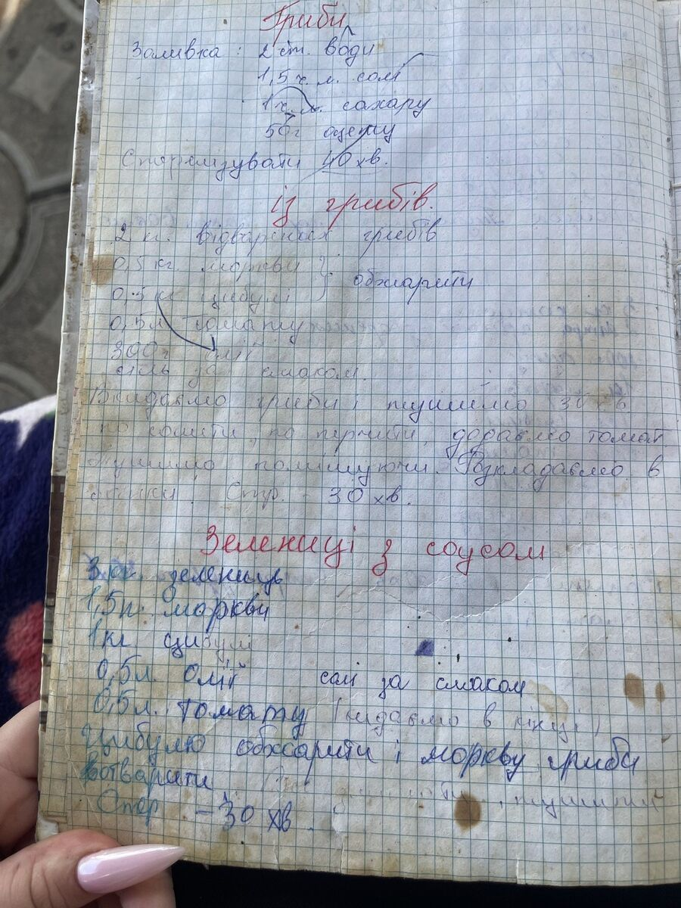

- [ ] замінити 001

<table><tr><th>Зараз</th><th>Пропозиція Claude</th></tr><tr><td>

```
## Інгредієнти
- зеленці — 3 кг
- морква — 1,5 кг
- цибуля — 1 кг
- олія — 0,5 л
- томат — 0,5 л

## Приготування
Сіль — за смаком. Цибулю обсмажити, додати моркву. Томат додати наприкінці. Стерилізувати 30 хв.
```

</td><td>

```
# Зеленці з соусом

## Інгредієнти
- зеленці — 3 кг
- морква — 1,5 кг
- цибуля — 1 кг
- олія — 0,5 л
- томат — 0,5 л (кидаємо в кінці)
- сіль за смаком

## Приготування
Цибулю обжарити і моркву, гриби <!-- ?? Claude: «грибы/зеленці» — слово «гриби» тут дивне --> відварити … тушити. <!-- ?? Claude: рядок бліді --> Стер. — 30 хв.
```

</td></tr></table>

## 015. Помідори домашні → Помідори дольками

📷 `IMG_1651.jpg` · ✅ назва на фото — «Помідори дольками» (є ще 014 з такою ж назвою — порівняти); олія — «… ст. л.», цифра відірвана

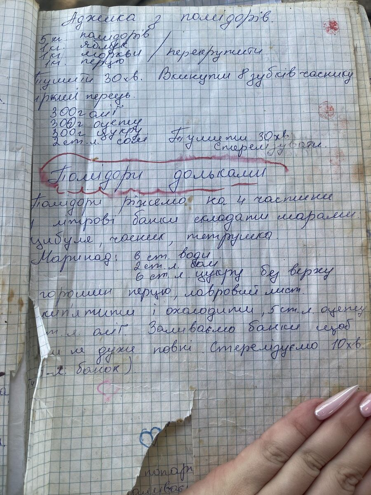

- [ ] замінити 015

<table><tr><th>Зараз</th><th>Пропозиція Claude</th></tr><tr><td>

```
## Підготовка
Помідори різати на 4 частини і складати в літрові банки. Додати цибулю кільцями та петрушку.

## Маринад
- вода — 6 склянок
- сіль — 2 столові ложки
- цукор — 6 столових ложок без верху
- перець горошком
- лавровий лист
- оцет — 5 столових ложок
- олія — 1 столова ложка в кожну банку

## Приготування
1. Маринад прокип'ятити й охолодити.
2. Залити банки.
3. Стерилізувати 10 хв (для 1-літрових банок).
```

</td><td>

```
# Помідори дольками

## Підготовка
Помідори ріжемо на 4 частини, в літрові банки складати шарами: цибуля, часник, петрушка.

## Маринад
- вода — 6 ст.
- сіль — 2 ст. л.
- цукор — 6 ст. л. без верху
- горошок перцю, лавровий лист

Кип'ятити і охолодити, 5 ст. л. оцту, … ст. л. олії. <!-- ?? Claude: цифра перед «ст. л. олії» на відірваному краю сторінки --> Заливаємо банки, щоб були не дуже повні. Стерилізуємо 10 хв (1-л банок).
```

</td></tr></table>

## 016. Помідори з морквинами → Помідори з морковинням

📷 `IMG_1650.jpg` · ✅ маринад на 4 трилітрові банки; рецепт закінчується на цій сторінці

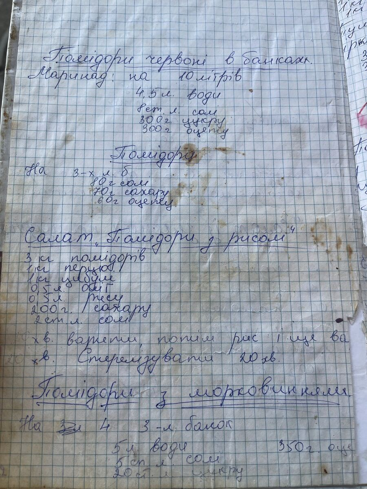

- [ ] замінити 016

<table><tr><th>Зараз</th><th>Пропозиція Claude</th></tr><tr><td>

```
## Маринад
- вода — 5 л
- сіль — 5 столових ложок
- цукор — 20 столових ложок
- оцет — 350 г
```

</td><td>

```
# Помідори з морковинням

## Маринад (на 4 3-л банки)
- вода — 5 л
- сіль — 5 ст. л.
- цукор — 20 ст. л.
- оцет — 350 г

<!-- ?? Claude: на фото «На 3 4 3-л банок» — 3 закреслено; далі, можливо, продовження на іншій сторінці -->
```

</td></tr></table>

## 019. Торт «Мішка» → Торт «Мішка»

📷 `IMG_1691.jpg` · ⚠️ ⚠️ на IMG_1691 немає жодного лічо: сторінка з розділу «Торти». Перший рецепт — торт (7 яєць, какао, мед); розділ Консервація → Випічка/Торти

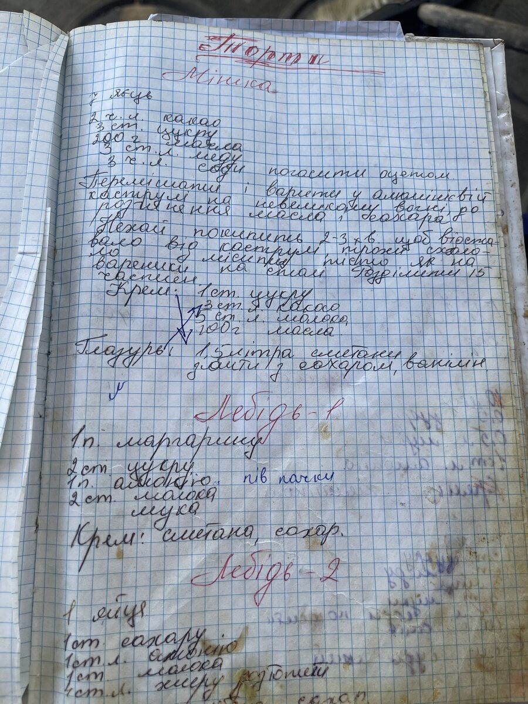

- [ ] замінити 019

<table><tr><th>Зараз</th><th>Пропозиція Claude</th></tr><tr><td>

```
## Тісто
- яйця — 7 шт.
- какао — 2 чайні ложки
- цукор — 3 склянки
- масло — 200 г
- мед — 3 столові ложки
- сода — 3 чайні ложки, погасити оцтом

## Приготування
Перемішати й варити в алюмінієвій каструлі на малому вогні, поки розтопляться масло й цукор. Покип'ятити 2–3 хв., щоб маса відставала від каструлі. Трохи охолодити, вимісити тісто як на вареники. Розділити на 15 частин.

## Крем
- цукор — 1 склянка
- какао — 3 столові ложки
- молоко — 5 столових ложок
- масло — 100 г

## Глазур
Сметану — 1,5 л — збити з цукром і ваніліном.
```

</td><td>

```
# Торт «Мішка»

<!-- ?? Claude: назва червоним — «Мішка»/«Мінка»? -->

## Інгредієнти
- яйця — 7 шт.
- какао — 2 ч. л.
- цукор — 3 ст.
- масло — 200 г
- мед — 3 ст. л.
- сода — 3 ч. л., погасити оцтом

## Приготування
Перемішати і варити у алюмінієвій каструлі на невеликому вогні до розм'якшення масла і сахару. Нехай покипить 2–3 хв, щоб відставало від каструлі, трохи охолодимо і місимо тісто як на вареники на столі. Розділити на 15 частин.

## Крем
- цукор — 1 ст.
- какао — 3 ст. л.
- молоко — 5 ст. л.
- масло — 100 г

## Глазур
1,5 літра сметани збити з сахаром, ванілін. <!-- ?? Claude: стрілки між кремом і глазур'ю — можливо, крем і глазур поміняні місцями -->
```

</td></tr></table>

## 020. Торт «Лебідь-1» → Торт «Лебідь-1»

📷 `IMG_1691.jpg` · ✅ не лічо — торт «Лебідь-1»; розділ Консервація → Випічка/Торти


- [ ] замінити 020

<table><tr><th>Зараз</th><th>Пропозиція Claude</th></tr><tr><td>

```
## Інгредієнти
- маргарин — 1 пачка
- цукор — 2 склянки
- амоній — 1/2 пачки
- молоко — 2 склянки
- мука

## Крем
Сметана, цукор.
```

</td><td>

```
# Торт «Лебідь-1»

## Інгредієнти
- маргарин — 1 п.
- цукор — 2 ст.
- амоній — 1 п. (дописано: «пів пачки»)
- молоко — 2 ст.
- мука

## Крем
Сметана, сахар.
```

</td></tr></table>

## 021. Торт «Лебідь-2» → Торт «Лебідь-2»

📷 `IMG_1691.jpg` · ✅ не лічо — торт «Лебідь-2»; кінець рецепта — на наступній сторінці


- [ ] замінити 021

<table><tr><th>Зараз</th><th>Пропозиція Claude</th></tr><tr><td>

```
## Інгредієнти
- яйця — 1 шт.
- цукор — 1 склянка
- амоній — 1 столова ложка
- молоко — 1 склянка
- масло — 4 столові ложки

<!-- ?? Рецепт продовжується на наступній сторінці. -->
```

</td><td>

```
# Торт «Лебідь-2»

## Інгредієнти
- яйця — 1 шт.
- цукор — 1 ст.
- амоній — 1 ст. л.
- молоко — 1 ст.
- жир (розтопити) — 4 ст. л.

<!-- ?? Claude: рецепт продовжується на наступній сторінці («…сахар») — потрібне фото наступної сторінки -->
```

</td></tr></table>

## 022. Перець — варіант 3 → З перцю (повтор)

📷 `IMG_1659.jpg` · ✅ той самий рецепт, що 023 на IMG_1657 («З перцю», 200 г оцту, 200 г цукру, 2 ст. л. солі, 1 ст. л. олії, стер. 20 хв) — мама записала двічі. У книзі можна лишити один

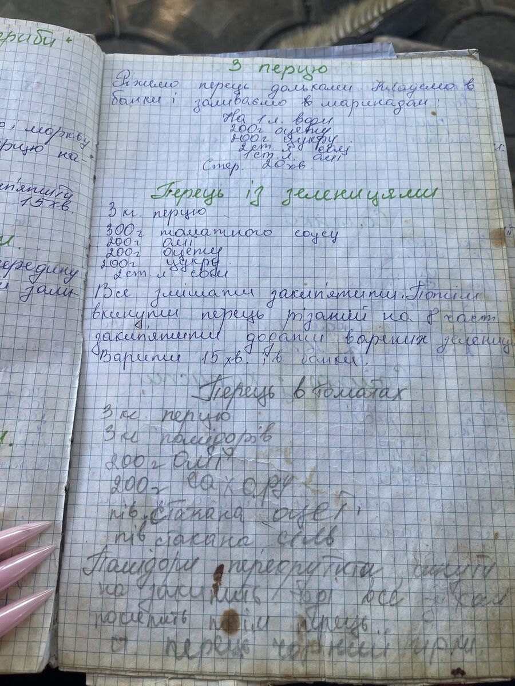

- [ ] замінити 022

<table><tr><th>Зараз</th><th>Пропозиція Claude</th></tr><tr><td>

```
## Приготування
1. Перець почистити та скласти в банки.
2. Залити маринадом.

## Маринад на 1 л води
- оцет — 200 г
- цукор — 200 г
- сіль — 2 столові ложки
- олія — 1 столова ложка

Стерилізувати 20 хв.
```

</td><td>

```
# З перцю (повтор)

<!-- ?? Claude: дубль рецепта 023 — лишити обидва чи один? -->

## Приготування
Ріжемо перець дольками, кладемо в банки і заливаємо маринадом.

## Маринад (на 1 л води)
- оцет — 200 г
- цукор — 200 г
- сіль — 2 ст. л.
- олія — 1 ст. л.

Стер. 20 хв.
```

</td></tr></table>

## 024. Перець гіркий у олії → Перець гіркий цілий

📷 `IMG_1667.jpg` · ✅ на 1 л банку заливаємо оцтом, 2 ст. л. сахару — більше нічого немає

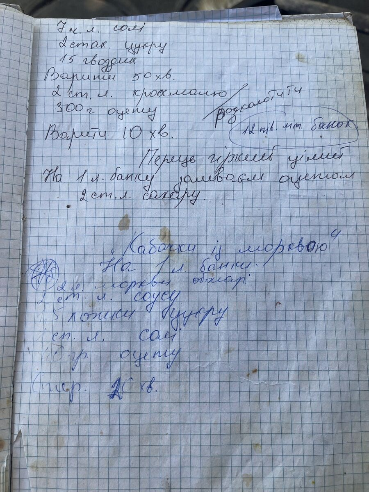

- [ ] замінити 024

<table><tr><th>Зараз</th><th>Пропозиція Claude</th></tr><tr><td>

```
## На 1 л банку
- олія — долити в банку
- цукор — 2 столові ложки

На фото є примітка «перець гіркий у олії». Частина рецепта, ймовірно, починається на попередній сторінці.
```

</td><td>

```
# Перець гіркий цілий

## На 1 л банку
Заливаєм оцтом, 2 ст. л. сахару.
```

</td></tr></table>

## 025. Перець для начинки → Перець для начинки

📷 `IMG_1658.jpg` · ✅ спосіб — залити окропом на 1 год, потім маринадом; лавровий лист; «має бути м'яким» на фото немає

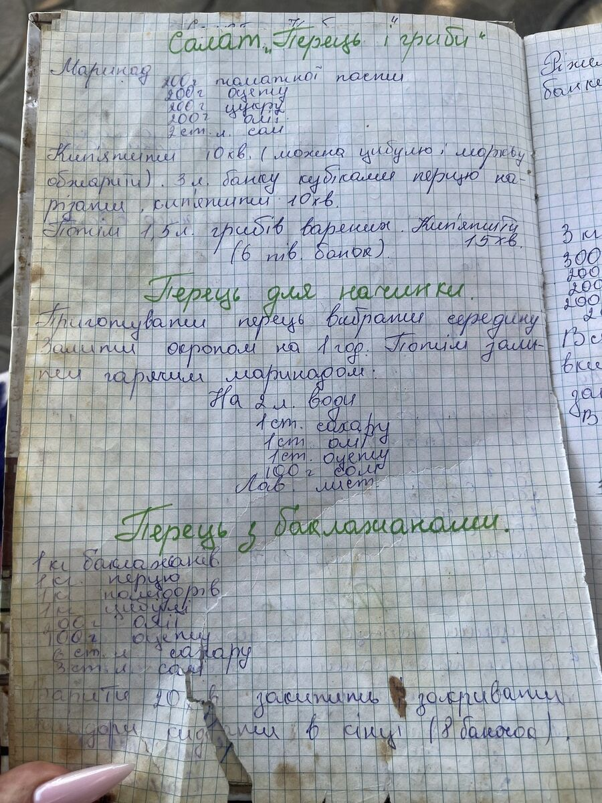

- [ ] замінити 025

<table><tr><th>Зараз</th><th>Пропозиція Claude</th></tr><tr><td>

```
## Приготування
Підготувати перець для начинювання та залити гарячим маринадом.

## Маринад на 2 л води
- цукор — 1 склянка
- олія — 1 склянка
- оцет — 1 склянка
- сіль — 100 г

Має бути м'яким. <!-- примітка з оригіналу -->
```

</td><td>

```
# Перець для начинки

## Приготування
Приготувати перець: вибрати середину. Залити окропом на 1 год. Потім залити гарячим маринадом.

## Маринад (на 2 л води)
- сахар — 1 ст.
- олія — 1 ст.
- оцет — 1 ст.
- сіль — 100 г
- лавр. лист
```

</td></tr></table>

## 026. Перець з баклажанами → Перець з баклажанами

📷 `IMG_1658.jpg` · ⚠️ уточнено склад і спосіб; сторінка відірвана знизу


- [ ] замінити 026

<table><tr><th>Зараз</th><th>Пропозиція Claude</th></tr><tr><td>

```
## Інгредієнти
- баклажани — 1 кг
- перець — 1 кг
- помідори — 1 кг
- цибуля — 1 кг
- олія — 200 г
- цукор — 100 г
- сіль — 3 столові ложки

## Приготування
```

</td><td>

```
# Перець з баклажанами

## Інгредієнти
- баклажани — 1 кг
- перець — 1 кг
- помідори — 1 кг
- цибуля — 1 кг
- олія — 100 г <!-- ?? Claude: перша цифра відірвана — 100/200/400 -->
- оцет — 100 г
- сахар — 6 ст. л. <!-- ?? Claude: 6 чи 8 -->
- сіль — 3 ст. л.

## Приготування
Варити 20 хв, закипить — закривати. Помідори <!-- ?? Claude: «помідори сидять/скидати в сік»? рядок частково відірваний --> … в сік (18 баночок).
```

</td></tr></table>

## 028. Перець у томаті — варіант 2 → Перець в томатах

📷 `IMG_1659.jpg` · ⚠️ склад читається; спосіб блідий


- [ ] замінити 028

<table><tr><th>Зараз</th><th>Пропозиція Claude</th></tr><tr><td>

```
## Інгредієнти
- перець — 3 кг
- помідори — 3 кг
- олія — 200 г
- цукор — 200 г
- оцет — 1/2 склянки
- сіль — 1/2 склянки
```

</td><td>

```
# Перець в томатах

## Інгредієнти
- перець — 3 кг
- помідори — 3 кг
- олія — 200 г
- сахар — 200 г
- оцет — пів стакана
- сіль — пів стакана

## Приготування
Помідори перекрутити, … на закипить, … все … хай покипить, потім перець. <!-- ?? Claude: рядки дуже бліді --> 
Перець чорний, гірк… <!-- ?? Claude: останній рядок — «перець чорний, гіркий»? -->
```

</td></tr></table>

## 029. Перець із зеленню → Перець із зеленцями

📷 `IMG_1659.jpg` · ✅ олія 200 г (не 400); «зеленці» — варені зелені помідори? «перець різаний на 8 част.»


- [ ] замінити 029

<table><tr><th>Зараз</th><th>Пропозиція Claude</th></tr><tr><td>

```
## Інгредієнти
- перець — 3 кг
- томатний соус — 300 г
- олія — 400 г
- оцет — 200 г
- цукор — 200 г
- сіль — 2 столові ложки

## Приготування
1. Усе змішати та закип'ятити.
2. Додати перець.
3. Додати варену зелень.
4. Варити приблизно 15 хв.
```

</td><td>

```
# Перець із зеленцями

<!-- ?? Claude: «зеленці» — зелені помідори чи огірки? -->

## Інгредієнти
- перець — 3 кг
- томатний соус — 300 г
- олія — 200 г
- оцет — 200 г
- цукор — 200 г
- сіль — 2 ст. л.

## Приготування
Все змішати, закип'ятити. Потім вкинути перець, різаний на 8 част., закип'ятити, додати варених зеленців. Варити 15 хв, і в банки.
```

</td></tr></table>

## 032. Салат «Перець і гриби» → Салат «Перець і гриби»

📷 `IMG_1658.jpg` · ✅ томатна паста 200 г (не 40); грибів 1,5 л; примітка про цибулю/моркву


- [ ] замінити 032

<table><tr><th>Зараз</th><th>Пропозиція Claude</th></tr><tr><td>

```
## Маринад
- томатна паста — 400 г
- оцет — 200 г
- цукор — 200 г
- олія — 200 г
- сіль — 2 столові ложки

## Приготування
1. Кип'ятити маринад 10 хв.
2. Додати 3 кг перцю, нарізаного кубиками.
3. Кип'ятити 10 хв.
4. Додати 1,5 кг варених грибів.
5. Кип'ятити ще 15 хв.
6. Вихід — приблизно 6 півлітрових банок.
```

</td><td>

```
# Салат «Перець і гриби»

## Маринад
- томатна паста — 200 г
- оцет — 200 г
- цукор — 200 г
- олія — 200 г
- сіль — 2 ст. л.

## Приготування
Кип'ятити 10 хв (можна цибулю і моркву обжарити). 3-л банку кубиками перцю нарізати, кип'ятити 10 хв. Потім 1,5 л грибів варених. Кип'ятити 15 хв.

(6 пів. банок)
```

</td></tr></table>

## 033. Кабачки — варіант із томатним соусом → З кабачків

📷 `IMG_1663.jpg` · ✅ спосіб: півгодини стоїть, різати продовгувато, 35 хв варити, банки в рушник

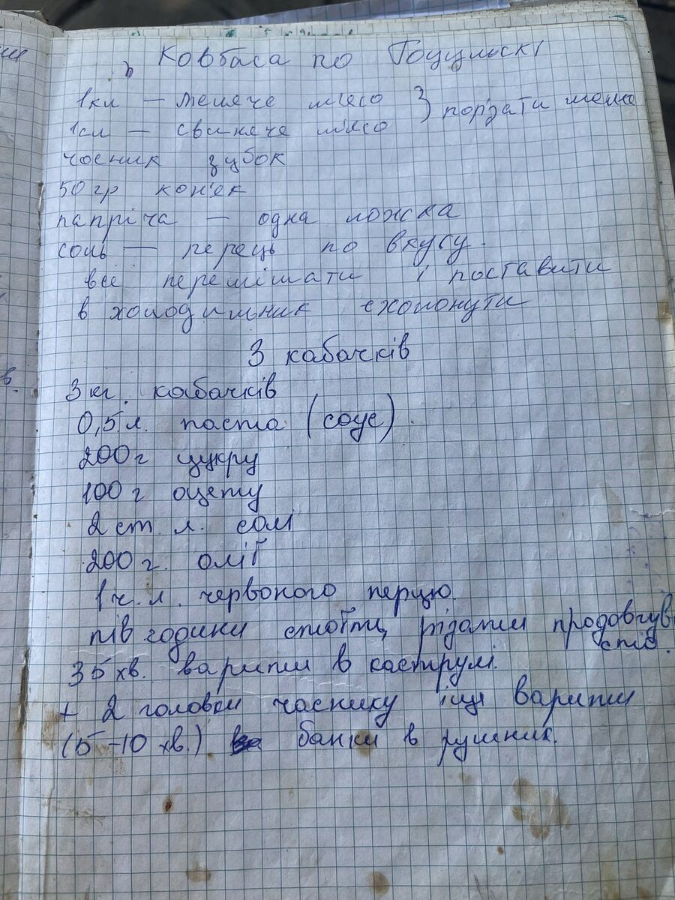

- [ ] замінити 033

<table><tr><th>Зараз</th><th>Пропозиція Claude</th></tr><tr><td>

```
## Інгредієнти
- кабачки — 3 кг
- томатний соус / паста — 0,5 л
- цукор — 200 г
- оцет — 100 г
- сіль — 2 столові ложки
- олія — 200 г
- червоний перець — 1 чайна ложка

## Приготування
Пів години тушити. Додати приблизно 2 головки часнику й варити ще 5–10 хв. Розкласти в банки.
```

</td><td>

```
# З кабачків

## Інгредієнти
- кабачки — 3 кг
- паста (соус) — 0,5 л
- цукор — 200 г
- оцет — 100 г
- сіль — 2 ст. л.
- олія — 200 г
- червоний перець — 1 ч. л.

## Приготування
Півгодини стоїть, різати продовгувато. 35 хв варити в каструлі. + 2 головки часнику і ще варити (5–10 хв). Банки в рушник.
```

</td></tr></table>

## 034. Кабачки з сардинами → Кабачки з сардиною

📷 `IMG_1670.jpg` · ✅ назва — «Кабачки з сардиною», пропущено 2 б. сардин; цукор 100 г (не 2 склянки); перець червоний

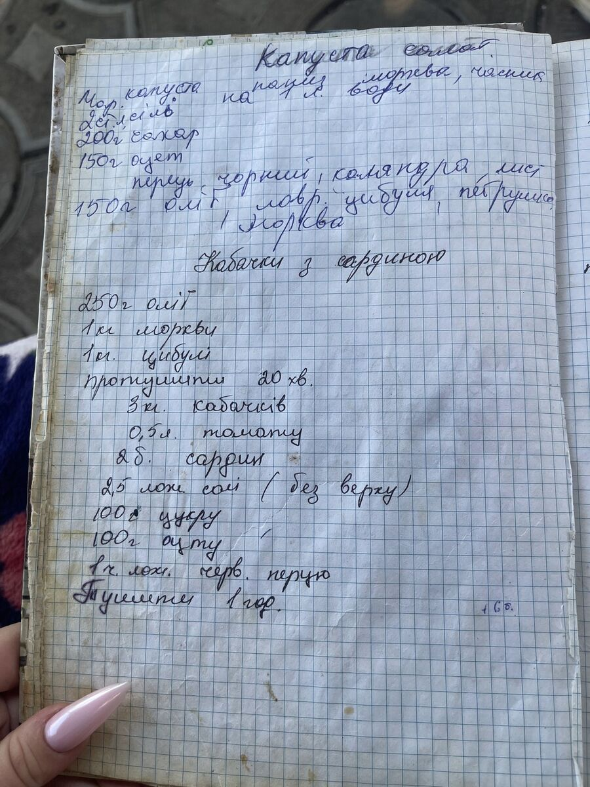

- [ ] замінити 034

<table><tr><th>Зараз</th><th>Пропозиція Claude</th></tr><tr><td>

```
## Інгредієнти
- олія — 250 г
- морква — 1 кг
- цибуля — 1 кг
- кабачки — 3 кг
- томат — 0,5 л
- сардини — 2 банки
- сіль — 2,5 ложки без верху
- цукор — 100 г
- оцет — 100 г
- червоний перець — 1 чайна ложка

## Приготування
1. Моркву й цибулю тушити 20 хв.
2. Додати кабачки та решту інгредієнтів.
3. Тушити 1 год.
```

</td><td>

```
# Кабачки з сардиною

## Інгредієнти
- олія — 250 г
- морква — 1 кг
- цибуля — 1 кг

Протушити 20 хв.

- кабачки — 3 кг
- томат — 0,5 л
- сардини — 2 б.
- сіль — 2,5 лож. (без верху)
- цукор — 100 г
- оцет — 100 г
- червоний перець — 1 ч. лож.

Тушити 1 год.

(16 б.) <!-- ?? Claude: «16 б.» на полях — вихід? -->
```

</td></tr></table>

## 035. Кабачки «Салат» → Кабачки «Салат»

📷 `IMG_1656.jpg` · ✅ перець чорний 3 ст. л. (не гіркий); додано примітку «на 2 порції»

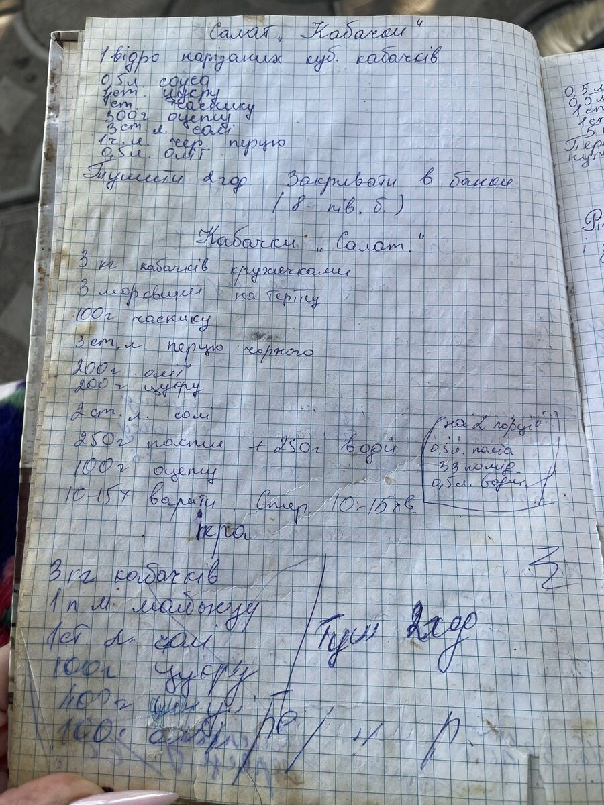

- [ ] замінити 035

<table><tr><th>Зараз</th><th>Пропозиція Claude</th></tr><tr><td>

```
## Інгредієнти
- кабачки — 3 кг, кружальцями
- морква — 3 шт., натерти
- часник — 100 г
- чорний перець — 3 столові ложки
- олія — 200 г
- цукор — 200 г
- сіль — 2 столові ложки
- томатна паста — 250 г + 250 г води
- оцет — 100 г

## Приготування
Варити 10–15 хв. Стерилізувати 10–15 хв.
```

</td><td>

```
# Кабачки «Салат»

## Інгредієнти
- кабачки — 3 кг, кружечками
- морква — 3 шт., на тертку
- часник — 100 г
- перець чорний — 3 ст. л.
- олія — 200 г
- цукор — 200 г
- сіль — 2 ст. л.
- паста — 250 г + 250 г води
- оцет — 100 г

## Приготування
10–15 хв варити. Стер. 10–15 хв.

(На 2 порції: 0,5 л пасти, 3 з помід. <!-- ?? Claude: «33 помід.»? нечітко -->, 0,5 л води.)
```

</td></tr></table>

## 036. Кабачки із морквою → Кабачки із морквою

📷 `IMG_1667.jpg` · ⚠️ 2 л. моркви обжар., 2 ст. л. соусу, 1,5 ложки цукру, 1 ст. л. солі, 100 гр. оцту, стер. 20 хв


- [ ] замінити 036

<table><tr><th>Зараз</th><th>Пропозиція Claude</th></tr><tr><td>

```
## На 1 л банку
- морква — 2 шт., обсмажити
- соус — 1 столова ложка
- цукор — 3 столові ложки
- сіль — 1 столова ложка
- оцет — 100 г

Стерилізувати 20 хв.
```

</td><td>

```
# Кабачки із морквою

## На 1 л банки
- морква — 2 л. <!-- ?? Claude: «2 л.» — ложки? --> (обжар.)
- соус — 2 ст. л.
- цукор — 1,5 ложки
- сіль — 1 ст. л.
- оцет — 100 гр. <!-- ?? Claude: цифра бліда -->

Стер. 20 хв.
```

</td></tr></table>

## 037. Кабачкова ікра → Кабачкова ікра

📷 `IMG_1655.jpg` · ✅ пів склянки часнику; порядок тушіння уточнено

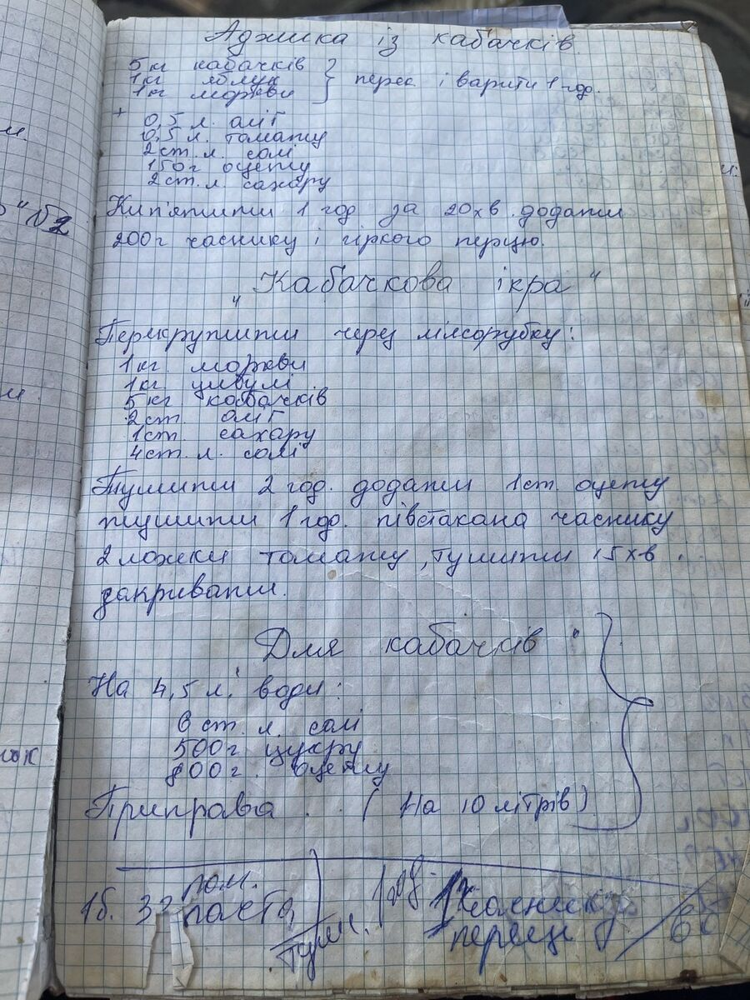

- [ ] замінити 037

<table><tr><th>Зараз</th><th>Пропозиція Claude</th></tr><tr><td>

```
## Інгредієнти
- морква — 1 кг
- цибуля — 1 кг
- кабачки — 5 кг
- олія — 2 склянки
- цукор — 1 склянка
- сіль — 4 столові ложки

## Приготування
1. Перекрутити через м'ясорубку.
2. Тушити 2 год.
3. Додати 1 склянку оцту й тушити 1 год.
4. Додати 1/2 склянки часнику.
5. Додати 2 ложки томату.
6. Тушити ще 15 хв.
```

</td><td>

```
# Кабачкова ікра

## Перекрутити через м'ясорубку
- морква — 1 кг
- цибуля — 1 кг
- кабачки — 5 кг
- олія — 2 ст.
- сахар — 1 ст.
- сіль — 4 ст. л.

## Приготування
Тушити 2 год, додати 1 ст. оцту, тушити 1 год. Півстакана часнику, 2 ложки томату, тушити 15 хв. Закривати.
```

</td></tr></table>

## 038. Кабачкові «ананаси» → Кабачкові ананаси

📷 `IMG_1664.jpg` · ⚠️ уточнено спосіб: вода 2 год, лимонна кислота, 1 л цукру, ананасова есенція; кінець блідий

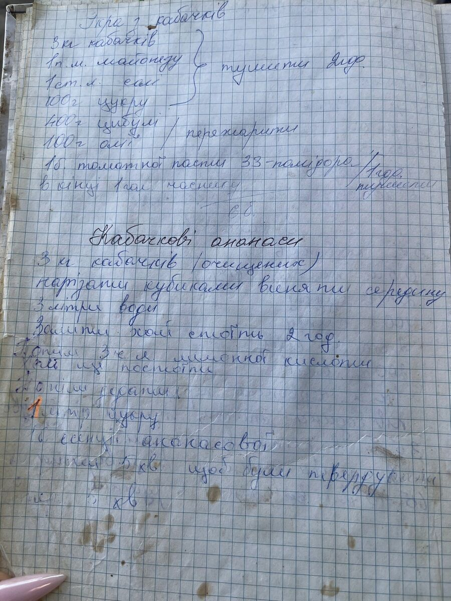

- [ ] замінити 038

<table><tr><th>Зараз</th><th>Пропозиція Claude</th></tr><tr><td>

```
## Інгредієнти
- кабачки — 3 кг, очищені
- ананасовий сік / напій <!-- ?? --> — 3 л води з добавкою <!-- ?? -->
- цукор — 1 кг <!-- ?? -->
- лимонна кислота — 1 столова ложка <!-- ?? -->

## Приготування
Залити, варити приблизно 2 години.
```

</td><td>

```
# Кабачкові ананаси

## Інгредієнти
- кабачки — 3 кг (очищених), нарізати кубиками, вийняти середину
- вода — 3 літри
- лимонна кислота — 3 ч. л.
- цукор — 1 літр
- есенція ананасова — 1 б. <!-- ?? Claude: «1 б.» — бутилочка? -->

## Приготування
Залити холодною <!-- ?? Claude: «холодною/такою»? --> і стоїть 2 год. Потім 3 ч. л. лимонної кислоти і ще постоїть. Потім додати 1 літр цукру, есенцію ананасову. Кип'ятити 5 хв, щоб були прозорі <!-- ?? Claude: «щоб були п…руваті/прозорі» -->, і … 5 хв. <!-- ?? Claude: останній рядок вицвілий -->
```

</td></tr></table>

## 040. Салат із кабачків → Салат «Кабачки»

📷 `IMG_1656.jpg` · ✅ перець — чорний; вихід 8 пів. банок


- [ ] замінити 040

<table><tr><th>Зараз</th><th>Пропозиція Claude</th></tr><tr><td>

```
## Інгредієнти
- кабачки, нарізані кубиками — 1 відро
- соус — 0,5 л
- цукор — 1 склянка
- часник — 1 склянка
- оцет — 300 г
- сіль — 3 столові ложки
- перець гіркий — 1 чайна ложка
- олія — 0,5 л

## Приготування
Тушити 2 год. Закривати в банки. Вихід: 8 півлітрових банок.
```

</td><td>

```
# Салат «Кабачки»

## Інгредієнти
- кабачки, нарізані кубиками — 1 відро
- соус — 0,5 л
- цукор — 1 ст.
- часник — 1 ст.
- оцет — 300 г
- сіль — 3 ст. л.
- чорний перець — 1 ч. л.
- олія — 0,5 л

## Приготування
Тушити 2 год. Закривати в банки (8 пів. б.).
```

</td></tr></table>

## 041. Ікра з кабачків — варіант → Ікра

📷 `IMG_1656.jpg` · ✅ 1 п. м. майонезу (не 1 л); 100 г цибулі + 100 г олії; тушити 2 год. Рецепт на фото перекреслений — мама могла його відкинути


- [ ] замінити 041

<table><tr><th>Зараз</th><th>Пропозиція Claude</th></tr><tr><td>

```
## Інгредієнти
- кабачки — 3 кг
- майонез — 1 л <!-- ?? -->
- сіль — 1 столова ложка
- цукор — 100 г
- олія — 100 г <!-- ?? -->
- оцет — 100 г <!-- ?? -->
```

</td><td>

```
# Ікра

<!-- ?? Claude: на фото весь рецепт перекреслений навскіс — лишати в книзі? -->

## Інгредієнти
- кабачки — 3 кг
- майонез — 1 п. м.
- сіль — 1 ст. л.
- цукор — 100 г
- цибуля — 100 г
- олія — 100 г

Тушити 2 год.
```

</td></tr></table>

## 042. Ікра з кабачків — варіант 2 → Ікра з кабачків

📷 `IMG_1664.jpg` · ✅ 1 п. м. майонезу (не 1 л); тушити 2 год; 1 б. томатної пасти (33 помідоро); 1 гол. часнику; 6 б.


- [ ] замінити 042

<table><tr><th>Зараз</th><th>Пропозиція Claude</th></tr><tr><td>

```
## Інгредієнти
- кабачки — 3 кг
- майонез — 1 л
- сіль — 1 столова ложка
- цукор — 100 г
- цибуля — 400 г
- олія — 100 г

## Приготування
Перекрутити. Додати 10 ст. л. томатної пасти та тушити. У кінці додати часник.
```

</td><td>

```
# Ікра з кабачків

## Інгредієнти
- кабачки — 3 кг
- майонез — 1 п. м.
- сіль — 1 ст. л.
- цукор — 100 г

Тушити 2 год.

- цибуля — 400 г } пережарити
- олія — 100 г }
- томатна паста — 1 б. (33 — помідоро) <!-- ?? Claude: «33 помідоро» — назва пасти? -->

Тушити 1 год.

В кінці 1 гол. часнику.

(6 б.)
```

</td></tr></table>

## 043. Баклажани з майонезом → Баклажани (з грибною приправою)

📷 `IMG_1665.jpg` · ✅ без назви в блокноті; «гриби» — це «1 п. грибної приправи»; вихід 10 пів-літ. банок

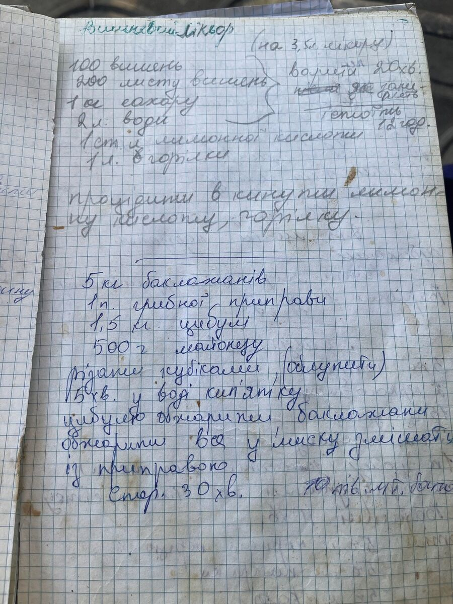

- [ ] замінити 043

<table><tr><th>Зараз</th><th>Пропозиція Claude</th></tr><tr><td>

```
## Інгредієнти
- баклажани — 5 кг
- грибкова приправа — 1 пачка
- цибуля — 1,5 кг
- майонез — 500 г

## Приготування
1. Баклажани різати кубиками та варити у воді приблизно 5 хв.
2. Цибулю обсмажити.
3. Баклажани обсмажити.
4. Усе змішати з приправою та майонезом.
5. Стерилізувати 30 хв.
```

</td><td>

```
# Баклажани (з грибною приправою)

<!-- ?? Claude: назва — у блокноті без назви -->

## Інгредієнти
- баклажани — 5 кг
- грибна приправа — 1 п.
- цибуля — 1,5 кг
- майонез — 500 г

## Приготування
Різати кубиками (обчистити), 5 хв у воді кип'ятку. Цибулю обжарити, баклажани обжарити. Все у миску, змішати із приправою.

Стер. 30 хв. (10 пів-літ. банок)
```

</td></tr></table>

## 045. Буряки червоні → Буряки червоні

📷 `IMG_1661.jpg` · ✅ олія 200 г (не 300); спосіб: кидати в сироп, щоб були м'якими; тушити, стер. 20 хв; 11 б. пів. л.

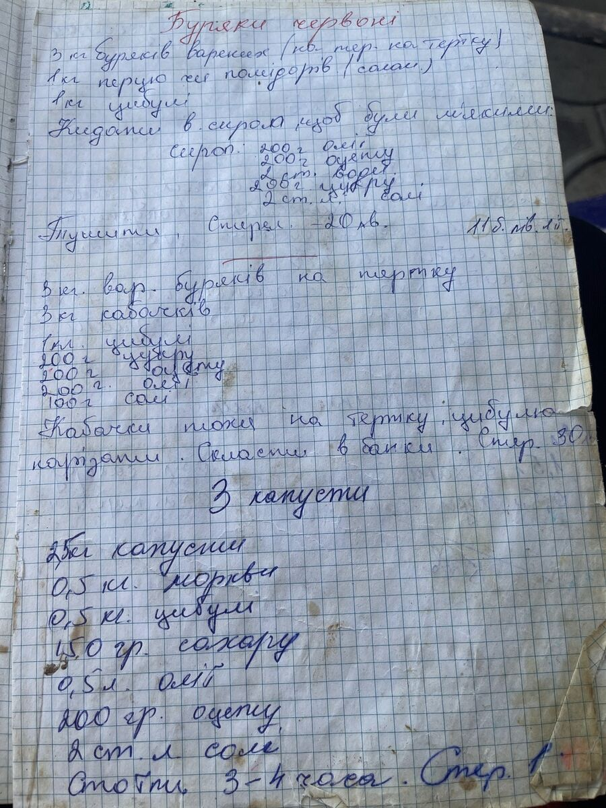

- [ ] замінити 045

<table><tr><th>Зараз</th><th>Пропозиція Claude</th></tr><tr><td>

```
## Інгредієнти
- буряк варений — 3 кг
- перець або помідори — 1 кг
- цибуля — 1 кг

## Сироп
- олія — 200 г
- оцет — 200 г
- вода — 2 склянки
- цукор — 200 г
- сіль — 2 столові ложки

## Приготування
Тушити приблизно 20 хв.
```

</td><td>

```
# Буряки червоні

## Інгредієнти
- буряк варений — 3 кг (на тертку)
- перець чи помідори — 1 кг (солом.)
- цибуля — 1 кг

Кидати в сироп, щоб були м'якими.

## Сироп
- олія — 200 г
- оцет — 200 г
- вода — 2 ст.
- цукор — 200 г
- сіль — 2 ст. л.

## Приготування
Тушити. Стерил. — 20 хв.

(11 б. пів. л.)
```

</td></tr></table>

## 047. Закуска з капусти → З капусти

📷 `IMG_1661.jpg` · ✅ капуста 2,5 кг, цукор 150 г (не 450); стер. 1 …


- [ ] замінити 047

<table><tr><th>Зараз</th><th>Пропозиція Claude</th></tr><tr><td>

```
## Інгредієнти
- капуста — 2 кг
- морква — 0,5 кг
- цибуля — 0,5 кг
- цукор — 450 г
- олія — 0,5 л
- оцет — 200 г
- сіль — 2 столові ложки

## Приготування
Дати постояти 3–4 години.
```

</td><td>

```
# З капусти

## Інгредієнти
- капуста — 2,5 кг
- морква — 0,5 кг
- цибуля — 0,5 кг
- цукор — 150 гр. <!-- ?? Claude: 150 чи 450 — перша цифра як «1» з хвостиком -->
- олія — 0,5 л
- оцет — 200 гр.
- сіль — 2 ст. л.

## Приготування
Стоїть 3–4 часа. Стер. 1… <!-- ?? Claude: час стерилізації обрізаний краєм — «1 год»? -->
```

</td></tr></table>

## 048. Гриби мариновані → Із грибів

📷 `IMG_1660.jpg` · ✅ томат 0,5 л, олія 300 г (у старому переплутано); спосіб уточнено


- [ ] замінити 048

<table><tr><th>Зараз</th><th>Пропозиція Claude</th></tr><tr><td>

```
## Інгредієнти
- гриби відварені — 2 л
- морква — 0,5 кг
- цибуля — 0,5 кг
- олія — 0,5 л
- томат — 300 г

## Приготування
1. Відварити гриби й тушити 30 хв.
2. Цибулю та моркву обсмажити, додати томат.
3. Тушити 10 хв., розкласти в банки.
4. Стерилізувати 30 хв.
```

</td><td>

```
# Із грибів

## Інгредієнти
- відварені гриби — 2 кг
- морква — 0,5 кг } обжарити
- цибуля — 0,5 кг }
- томат — 0,5 л
- олія — 300 г
- сіль за смаком

## Приготування
Вкладаємо гриби і тушимо 30 хв, посолити, поперчити, додаємо томат, тушимо помішуючи. Розкладаємо в банки. Стер. 30 хв.
```

</td></tr></table>

## 049. Гриби із сацебелі → Гриби із сацебелі

📷 `IMG_1671.jpg` · ✅ назва — «із сацебелі»; соус = 1 б. сацебелі; олія 1,5 ст. разом із цибулею — обжарити; 6 б.

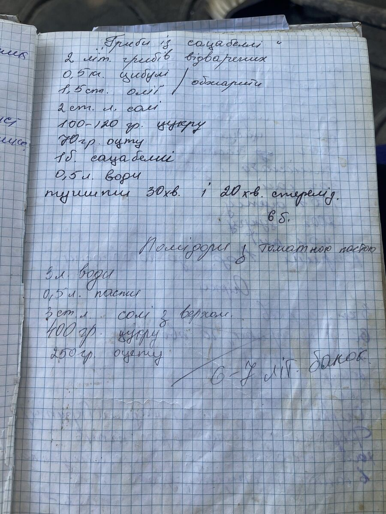

- [ ] замінити 049

<table><tr><th>Зараз</th><th>Пропозиція Claude</th></tr><tr><td>

```
## Інгредієнти
- гриби відварені — 2 л
- цибуля — 0,5 кг
- олія — 1,5 склянки
- сіль — 2 столові ложки
- цукор — 100–120 г
- оцет — 70 г
- соус сацебелі — 1 банка
- вода — 0,5 л

## Приготування
1. Цибулю обсмажити.
2. Тушити все 30 хв.
3. Стерилізувати 20 хв.
```

</td><td>

```
# Гриби із сацебелі

## Інгредієнти
- гриби відварені — 2 літ.
- цибуля — 0,5 кг } обжарити
- олія — 1,5 ст. }
- сіль — 2 ст. л.
- цукор — 100–120 гр.
- оцет — 70 гр.
- сацебелі — 1 б.
- вода — 0,5 л

## Приготування
Тушити 30 хв і 20 хв стериліз.

(6 б.)
```

</td></tr></table>

## 054. Салат із помідорів з рисом → Салат «Помідори з рисом»

📷 `IMG_1650.jpg` · ✅ «морква 200 г» насправді «200 г сахару»; уточнено час


- [ ] замінити 054

<table><tr><th>Зараз</th><th>Пропозиція Claude</th></tr><tr><td>

```
## Інгредієнти
- помідори — 3 кг
- перець — 1 кг
- цибуля — 1 кг
- олія — 0,5 л
- рис — 0,5 л
- томат — 200 г
- сіль — 2 столові ложки

## Приготування
- Варити 1 годину, потім додати рис і варити ще 40 хвилин.
- Стерилізувати 20 хв.
```

</td><td>

```
# Салат «Помідори з рисом»

## Інгредієнти
- помідори — 3 кг
- перець — 1 кг
- цибуля — 1 кг
- олія — 0,5 л
- рис — 0,5 л
- сахар — 200 г
- сіль — 2 ст. л.

## Приготування
10 хв варити, потім рис і ще варити 20 хв. <!-- ?? Claude: цифри «10»/«20» на полях бліді --> Стерилізувати 20 хв.
```

</td></tr></table>

## 055. Борщова приправа → Борщова приправа

📷 `IMG_1672.jpg` · ✅ помідорів 1,5 кг (цифра переписана); порядок як у блокноті

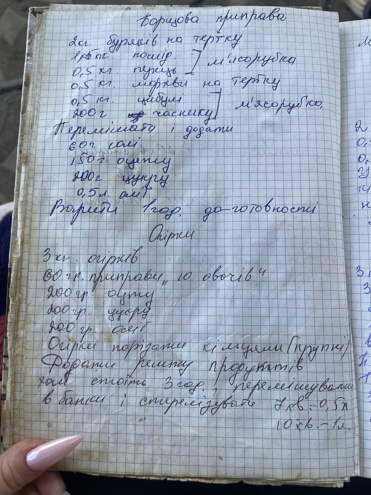

- [ ] замінити 055

<table><tr><th>Зараз</th><th>Пропозиція Claude</th></tr><tr><td>

```
## Інгредієнти
- буряк — 2 кг, натерти
- помідори — 1,5 кг, пропустити через м'ясорубку
- перець — 0,5 кг
- морква — 0,5 кг, натерти
- цибуля — 0,5 кг
- часник — 200 г
- сіль — 60 г
- оцет — 150 г
- цукор — 200 г
- олія — 0,5 л

## Приготування
1. Овочі перемішати.
2. Додати сіль, оцет, цукор та олію.
3. Варити 1 годину до готовності.
```

</td><td>

```
# Борщова приправа

## Інгредієнти
- буряки — 2 кг, на тертку
- помідори — 1,5 кг <!-- ?? Claude: цифра переписана — 1,5 чи 1,6 --> } м'ясорубка
- перець — 0,5 кг }
- морква — 0,5 кг, на тертку
- цибуля — 0,5 кг } м'ясорубка
- часник — 200 г }

Перемішати і додати:
- сіль — 60 г
- оцет — 150 г
- цукор — 200 г
- олія — 0,5 л

Варити 1 год до готовності.
```

</td></tr></table>

## 056. Аджика з помідорів → Аджика з помідорів

📷 `IMG_1651.jpg` · ✅ цукор 300 г (не 200); пропущено 8 зубків часнику і гіркий перець


- [ ] замінити 056

<table><tr><th>Зараз</th><th>Пропозиція Claude</th></tr><tr><td>

```
## Інгредієнти
- помідори — 5 кг
- яблука — 1 кг
- морква — 1 кг
- перець — 1 кг
- олія — 300 г
- оцет — 300 г
- цукор — 200 г
- сіль — 2 столові ложки

## Приготування
1. Помідори, яблука, моркву і перець перекрутити.
2. Тушити 30 хв.
3. Додати олію, оцет, цукор та сіль.
4. Тушити ще 30 хв.
5. Стерилізувати банки.
```

</td><td>

```
# Аджика з помідорів

## Інгредієнти
- помідори — 5 кг
- яблука — 1 кг
- морква — 1 кг
- перець — 1 кг
- часник — 8 зубків
- гіркий перець
- олія — 300 г
- оцет — 300 г
- цукор — 300 г
- сіль — 2 ст. л.

## Приготування
Помідори, яблука, моркву, перець перекрутити. Тушити 30 хв. Вкинути 8 зубків часнику, гіркий перець, олію, оцет, цукор, сіль. Тушити 30 хв. Стерилізувати.
```

</td></tr></table>

## 057. Аджика із кабачків → Аджика із кабачків

📷 `IMG_1655.jpg` · ✅ яблука 1 кг, не цибуля; час: 1 год + 20 хв


- [ ] замінити 057

<table><tr><th>Зараз</th><th>Пропозиція Claude</th></tr><tr><td>

```
## Інгредієнти
- кабачки — 5 кг
- цибуля — 1 кг
- морква — 1 кг
- олія — 0,5 л
- помідори — 0,5 л
- сіль — 2 столові ложки
- оцет — 150 г
- цукор — 2 столові ложки

## Приготування
Кабачки, цибулю та моркву перекрутити. Додати решту інгредієнтів і кип'ятити 1 год. За 20 хв до кінця додати 200 г часнику й гіркий перець.
```

</td><td>

```
# Аджика із кабачків

## Інгредієнти
- кабачки — 5 кг
- яблука — 1 кг
- морква — 1 кг

Перекрутити і варити 1 год.

- олія — 0,5 л
- томат — 0,5 л
- сіль — 2 ст. л.
- оцет — 150 г
- сахар — 2 ст. л.

## Приготування
Кип'ятити 1 год. За 20 хв додати 200 г часнику і гіркого перцю.
```

</td></tr></table>

## 058. Салат «Гороскоп» → Салат «Горошок»

📷 `IMG_1677.jpg` · ✅ назва — «Горошок» (червоним), не «Гороскоп»; поруч «на рудо»

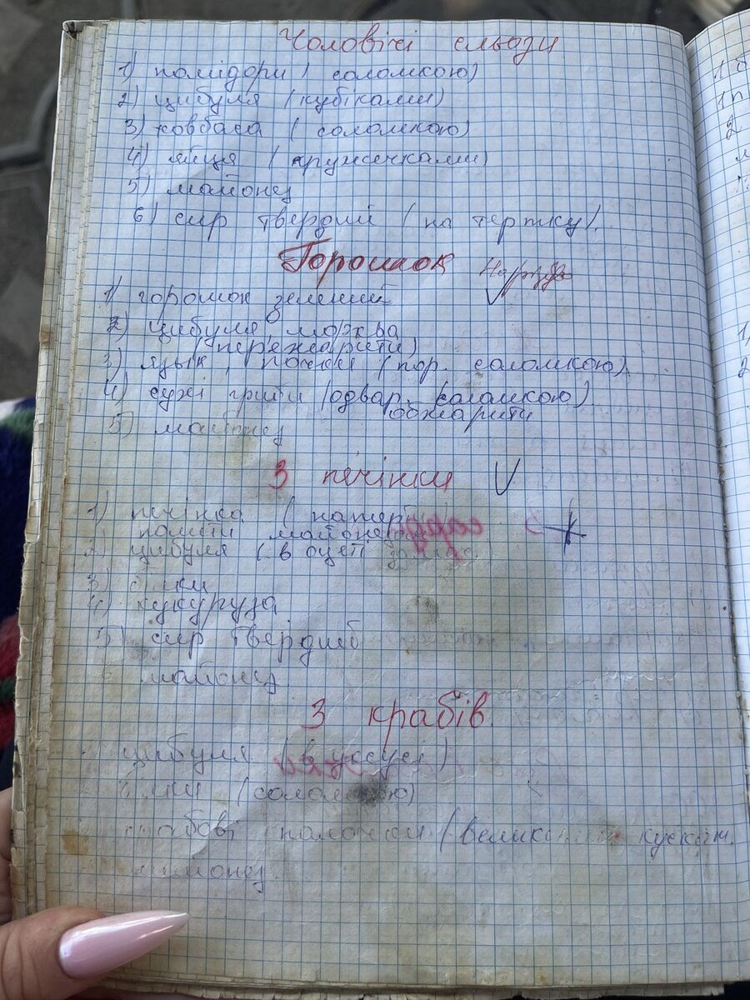

- [ ] замінити 058

<table><tr><th>Зараз</th><th>Пропозиція Claude</th></tr><tr><td>

```
## Інгредієнти
1. горошок зелений
2. цибуля маринована
3. яйця
4. огірки свіжі
5. майонез
```

</td><td>

```
# Салат «Горошок»

<!-- ?? Claude: поруч з назвою червоним «На руду»/«На рудо» і галочка — що це? -->

## Інгредієнти
1. горошок зелений
2. цибуля, морква (пережарити)
3. язик, печеня (пор. соломкою)
4. сухі гриби (відвар., соломкою), обжарити
5. майонез
```

</td></tr></table>

## 059. Салат «Зелений крокодил» → Салат «Зелений крокодил»

📷 `IMG_1683.jpg` · ✅ пропущено виноград і моркву; «матки» — це маслини; «огірок — 1» у списку насправді «1 огурок»

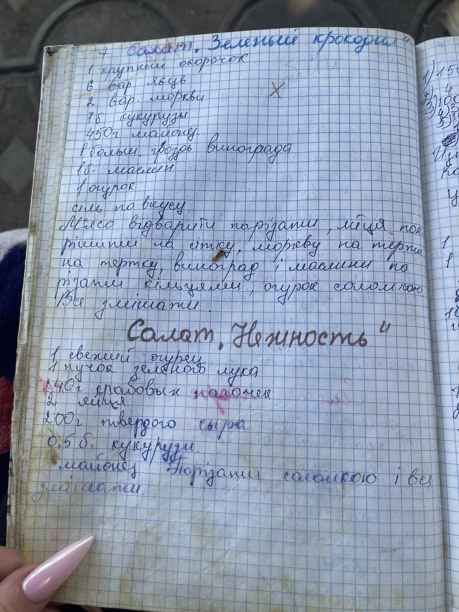

- [ ] замінити 059

<table><tr><th>Зараз</th><th>Пропозиція Claude</th></tr><tr><td>

```
## Інгредієнти
- свіжий огірок — 1 крупний
- яйця — 6 варених
- варена морква — 2 шт.
- кукурудза — 1 б.
- майонез — 450 г
- твердий сир — 100 г
- куряча грудка та виноград
- сіль — на смак

## Приготування
М'ясо відварити й порізати, яйця та моркву потерти на тертці, огірок нарізати соломкою. Усе змішати.
```

</td><td>

```
# Салат «Зелений крокодил»

## Інгредієнти
- огірочок крупний — 1 шт.
- варені яйця — 6 шт.
- варена морква — 2 шт.
- кукурудза — 1 б.
- майонез — 450 г
- виноград — 1 великий гроздь
- маслини — 1 б.
- огурок — 1 шт. <!-- ?? Claude: ще один огірок у списку — можливо, солоний -->
- сіль по вкусу

## Приготування
М'ясо відварити, порізати, яйця порізати на сітку, моркву на терці — на тертку, виноград і маслини порізати кільцями, огірок соломкою. Все змішати. <!-- ?? Claude: «м'ясо» в тексті є, але в списку його немає -->
```

</td></tr></table>

## 060. Салат із капусти → Капуста салат

📷 `IMG_1670.jpg` · ✅ назва — «Капуста салат»; маринад на 1 л води: 2 ст. л. солі (не 200 г), 200 г сахару; часник, лавр. лист. Це консервація, не свіжий салат


- [ ] замінити 060

<table><tr><th>Зараз</th><th>Пропозиція Claude</th></tr><tr><td>

```
## Інгредієнти
- капуста
- морква
- сіль — 200 г <!-- ?? -->
- цукор — 200 г
- оцет — 150 г
- чорний перець
- коріандр
- олія — 150 г
- цибуля
- петрушка

Кількість капусти та моркви в записі нечітка. <!-- ?? -->
```

</td><td>

```
# Капуста салат

Мар. капуста, нарізана: морква, часник.

## На 1 л води
- сіль — 2 ст. л.
- сахар — 200 г
- оцет — 150 г
- олія — 150 г
- перець чорний, коляндра, лист лавр.
- цибуля, петрушка і морква
```

</td></tr></table>

## 061. Салат «Вінницький» → Салат «Вишуканий»

📷 `IMG_1678.jpg` · ⚠️ назва — «Вишуканий», не «Вінницький»; печінки на фото немає

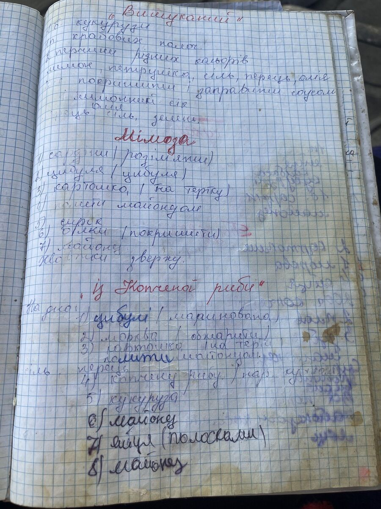

- [ ] замінити 061

<table><tr><th>Зараз</th><th>Пропозиція Claude</th></tr><tr><td>

```
## Приготування / склад
У записі згадуються:
- печінка <!-- ?? -->
- крабові палички
- перець
- олія
- майонез
- сік лимона
- сіль
- зелень

Інгредієнти порізати й заправити соусом із майонезу і соку лимона.
```

</td><td>

```
# Салат «Вишуканий»

<!-- ?? Claude: назва — «Вишуканий»? -->

## Інгредієнти
- кукурудза — 1 б.
- крабові палочки — 1 п.
- перець різних кольорів — 2 шт.
- лимон, петрушка, сіль, перець, олія

## Приготування
Покришити і заправити соусом: лимонний сік, олія, перець, сіль, зелень.
```

</td></tr></table>

## 062. Салат «Гніздечко» → Салат «Гніздечко»

📷 `IMG_1679.jpg` · ✅ копчена ковбаса 200 г (не кукурудза 200 г), часник, повний спосіб

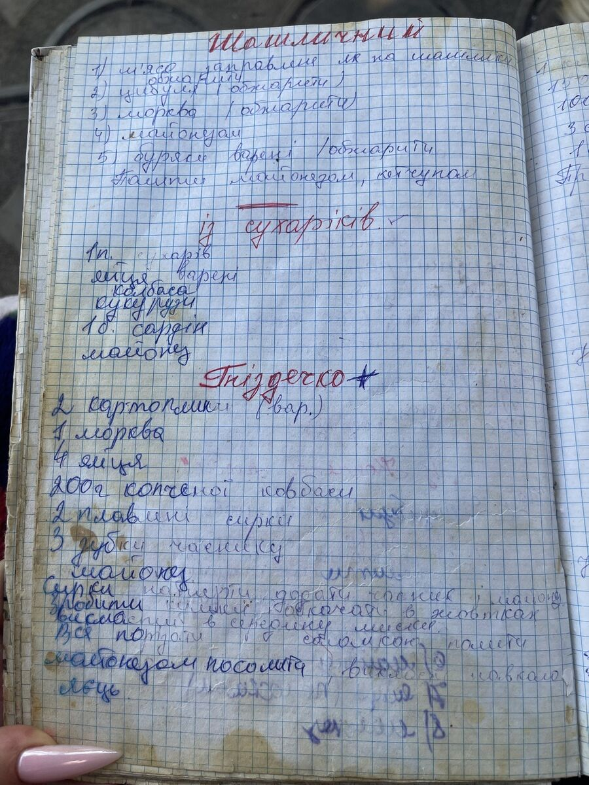

- [ ] замінити 062

<table><tr><th>Зараз</th><th>Пропозиція Claude</th></tr><tr><td>

```
## Інгредієнти
- картопля — 2 шт., варена
- морква — 1 шт.
- яйця — 4 шт.
- ковбаса варена — 200 г
- кукурудза — 200 г
- плавлений сирок — 2 шт.
- часник — 3 зубчики
- майонез

## Приготування
Сирки потерти. Решту інгредієнтів нарізати й перемішати з майонезом.
```

</td><td>

```
# Салат «Гніздечко»

## Інгредієнти
- картопля — 2 шт. (вар.)
- морква — 1 шт.
- яйця — 4 шт.
- копчена ковбаса — 200 г
- плавлені сирки — 2 шт.
- часник — 3 зубки
- майонез

## Приготування
Сирки натерти, додати часник і майонез, зробити кульки, обкачати в жовтках, викласти в середину миски. Все порізати соломкою, полити майонезом, посолити. <!-- ?? Claude: кінець рядка — «(виклас… ковбасою…)» нечітко -->
```

</td></tr></table>

## 063. Салат «Любимый» → Салат «Любимый»

📷 `IMG_1684.jpg` · ✅ основа — чорнослив, картопля, ізюм, гранат (не м'ясо, огірки, яблуко)

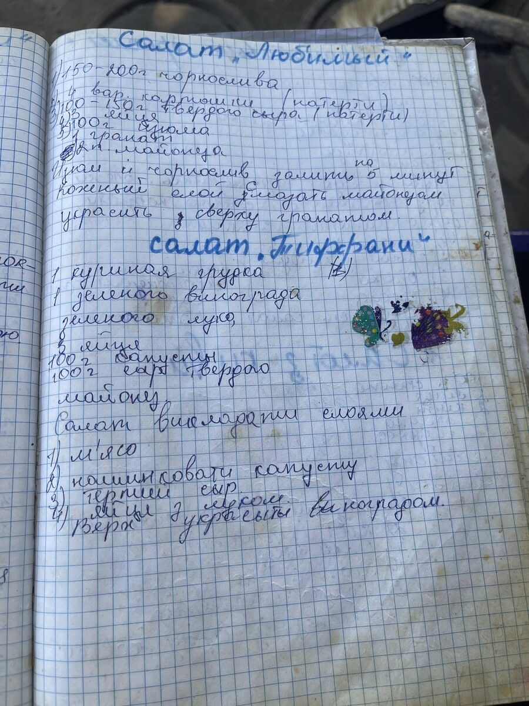

- [ ] замінити 063

<table><tr><th>Зараз</th><th>Пропозиція Claude</th></tr><tr><td>

```
## Інгредієнти
- свинина — 150–200 г
- консервовані печериці — 1 банка
- твердий сир — 100–150 г
- майонез
- яйця — 2 шт.
- гранат — 1 шт.

## Приготування
Свинину й печериці обсмажити. Викласти шарами, кожен шар змастити майонезом. Зверху прикрасити гранатом.
```

</td><td>

```
# Салат «Любимый»

## Інгредієнти
1. чорнослив — 150–200 г
2. варена картопля — 4 шт. (натерти)
3. твердий сир — 100–150 г (натерти)
4. яйця — 3 шт.
5. ізюм — 100 г
6. гранат — 1 шт.
- майонез — 1 п. <!-- ?? Claude: «1 п.»/«2 п.» — цифра перекреслена -->

## Приготування
Ізюм і чорнослив залити на 5 хвилин. Кожний слой змазати майонезом. Украсити зверху гранатом.
```

</td></tr></table>

## 064. Салат «Ніжність» → Салат «Нежность»

📷 `IMG_1683.jpg` · ✅ крабові палички 140 г (не 100); спосіб: порізати соломкою і змішати


- [ ] замінити 064

<table><tr><th>Зараз</th><th>Пропозиція Claude</th></tr><tr><td>

```
## Інгредієнти
- свіжий огірок — 1
- зелена цибуля — 1 пучок
- крабові палички — 100 г
- яйця — 2
- твердий сир — 200 г
- кукурудза — 0,5 банки
- майонез

## Приготування
Усе порізати соломкою й змішати з майонезом.
```

</td><td>

```
# Салат «Нежность»

## Інгредієнти
- свіжий огірок — 1
- зелена цибуля — 1 пучок
- крабові палочки — 140 г <!-- ?? Claude: 140 чи 240 -->
- яйця — 2
- твердий сир — 200 г
- кукурудза — 0,5 б.
- майонез

## Приготування
Порізати соломкою і все змішати.
```

</td></tr></table>

## 066. Салат із сухарів → Салат «Із сухариків»

📷 `IMG_1679.jpg` · ✅ «1 б. сардин», не «сирки 10»


- [ ] замінити 066

<table><tr><th>Зараз</th><th>Пропозиція Claude</th></tr><tr><td>

```
## Інгредієнти
- сухарики — 1 п.
- яйця варені <!-- ?? кількість -->
- ковбаса
- огірки
- сирки — 10? <!-- ?? -->
- майонез
```

</td><td>

```
# Салат «Із сухариків»

## Інгредієнти
- сухарики — 1 п.
- яйця варені
- ковбаса
- кукурудза
- сардини — 1 б.
- майонез
```

</td></tr></table>

## 067. Гранатовий браслет → Салат «Гранатовый браслет»

📷 `IMG_1685.jpg` · ✅ «помідори 300 г» насправді шампіньйони; «яблуко» — горіхи; «картопля 4» — куряче стегно

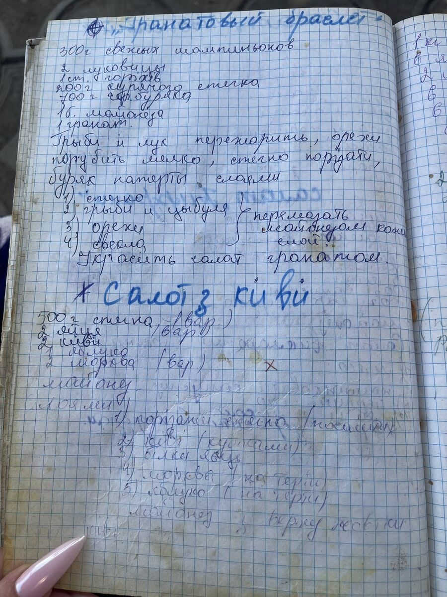

- [ ] замінити 067

<table><tr><th>Зараз</th><th>Пропозиція Claude</th></tr><tr><td>

```
## Інгредієнти
- свіжі шампіньйони — 300 г
- цибуля — 2
- морква — 1 шт.
- куряче філе — 400 г
- буряк — 700 г
- майонез
- гранат — 1

## Приготування
1. Гриби з цибулею обсмажити, філе відварити, буряк відварити.
2. Викласти шарами: філе, гриби з цибулею, морква, буряк.
3. Кожен шар змастити майонезом.
4. Прикрасити гранатом.
```

</td><td>

```
# Салат «Гранатовый браслет»

## Інгредієнти
- свіжі шампіньйони — 300 г
- цибуля — 2 шт.
- горіхи — 1 ст.
- куряче стегно — 200 г <!-- ?? Claude: перша цифра 2 чи 4 -->
- варений буряк — 700 г <!-- ?? Claude: 700 чи 400 -->
- майонез — 1 б.
- гранат — 1 шт.

## Приготування
Гриби і цибулю пережарити, горіхи порубити мілко, стегно порізати, буряк натерти.

Шарами (перемазати майонезом кожен шар):
1. стегно
2. гриби і цибуля
3. горіхи
4. буряк

Украсити салат гранатом.
```

</td></tr></table>

## 068. Мадонна → Ладки (м'ясні)

📷 `IMG_1686.jpg` · ⚠️ на IMG_1686 першим — не «Мадонна», а м'ясна страва (1 кг м'яса, крохмаль, майонез) — зелена назва «Ладки»/«Жабки»; варто перенести в «Основні страви»

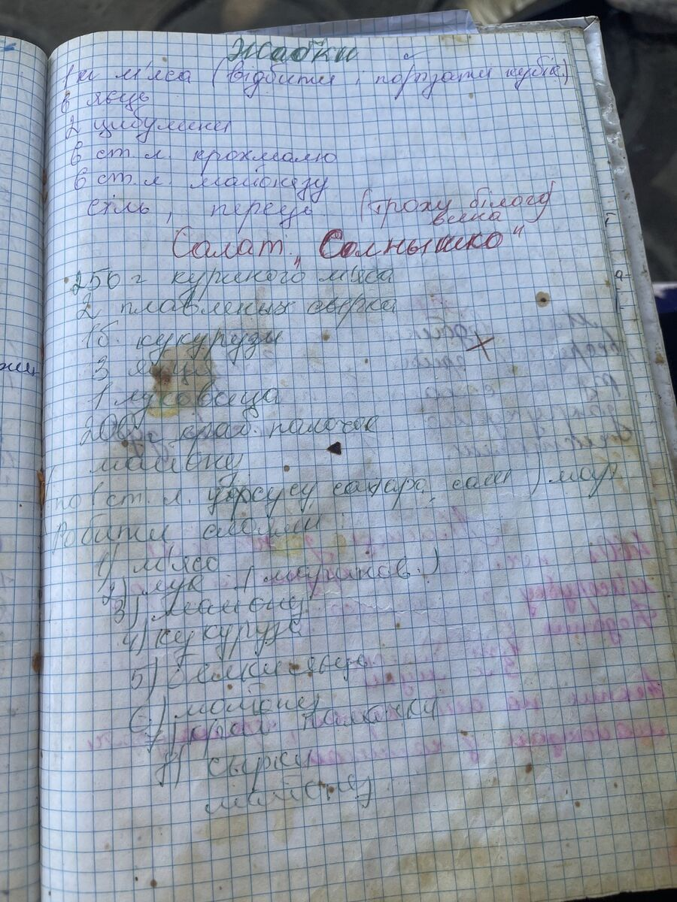

- [ ] замінити 068

<table><tr><th>Зараз</th><th>Пропозиція Claude</th></tr><tr><td>

```
## Інгредієнти
1. м'ясо — 1 кг
2. яйця — 6 шт.
3. огірки — 2 шт.
4. крохмаль — 6 столових ложок
5. майонез — 6 столових ложок
6. сіль і перець — на смак

## Приготування
М'ясо порізати кубиками й посмажити. Яйця, крохмаль і майонез змішати, посмажити млинці, нарізати їх соломкою. Змішати з м'ясом та огірками.
```

</td><td>

```
# Ладки (м'ясні)

<!-- ?? Claude: назва зеленим — «Ладки»? «Жабки»? -->

## Інгредієнти
- м'ясо — 1 кг (відбити і порізати кубиками)
- яйця — 6 шт. <!-- ?? Claude: 6 чи 8 -->
- цибулинки — 2 шт.
- крохмаль — 6 ст. л.
- майонез — 6 ст. л.
- сіль, перець
- трохи білого вина (дописано червоним)
```

</td></tr></table>

## 069. Салат «3 граната» → Салат «З граната»

📷 `IMG_1688.jpg` · ✅ шари: крабові, яйця, сир голланд., кукурудза, сир, майонез, гранат — цибулі немає; збоку «Н. Журба»?

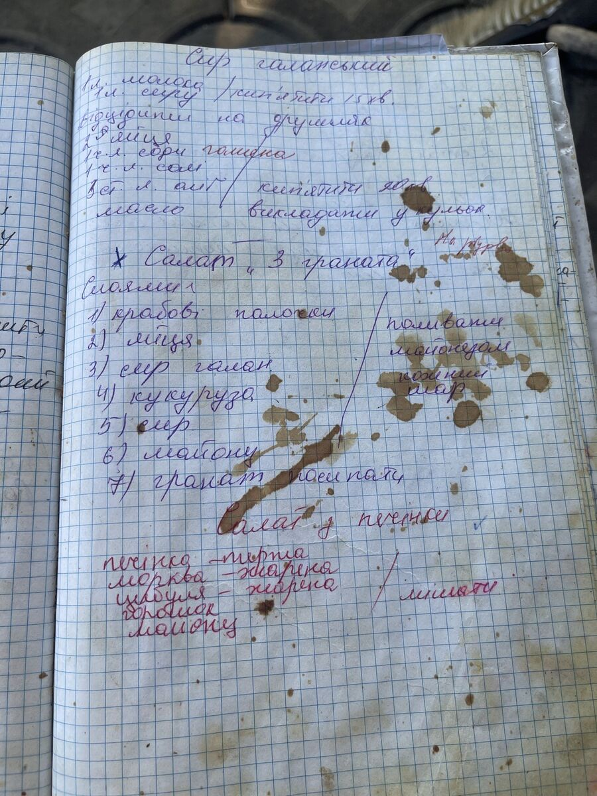

- [ ] замінити 069

<table><tr><th>Зараз</th><th>Пропозиція Claude</th></tr><tr><td>

```
## Шари
1. крабові палички
2. цибуля
3. сир гауда
4. кукурудза
5. сир
6. майонез
7. гранат

Кожен шар змастити майонезом.
```

</td><td>

```
# Салат «З граната»

<!-- ?? Claude: біля назви червоним підпис «Н. Журба»? — чий рецепт -->

## Шари
1. крабові палочки
2. яйця
3. сир голланд.
4. кукурудза
5. сир
6. майонез
7. гранат посипати

Поливати майонезом кожний шар.
```

</td></tr></table>

## 070. Салат «3 сардини» → Салат «З сардин»

📷 `IMG_1676.jpg` · ✅ назва на фото — «З сардин» (червоним), не «3 серця»

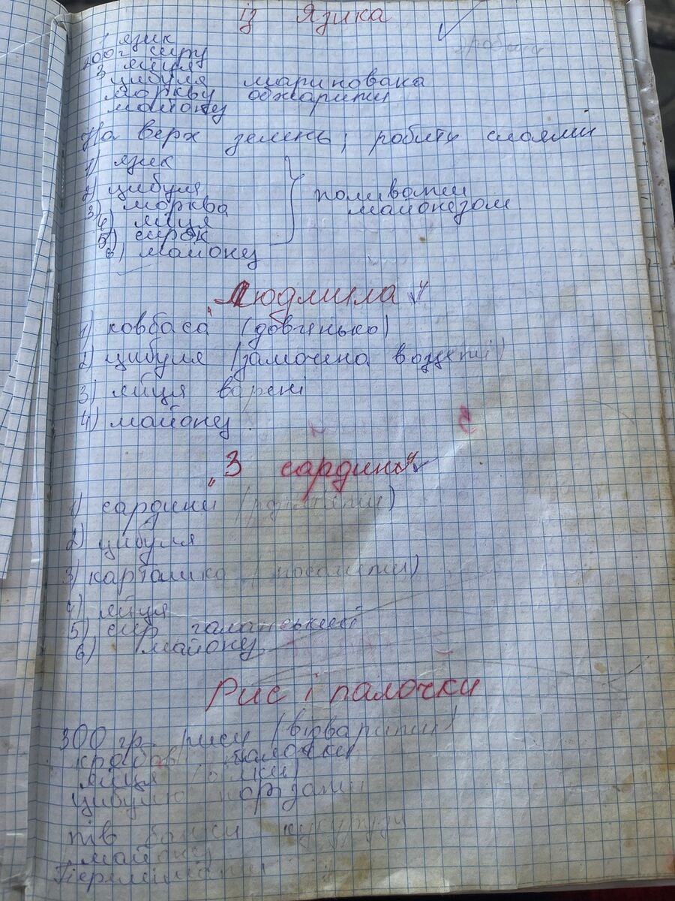

- [ ] замінити 070

<table><tr><th>Зараз</th><th>Пропозиція Claude</th></tr><tr><td>

```
## Інгредієнти
1. сардини
2. цибуля
3. картопля
4. яйця
5. сир твердий
6. майонез
```

</td><td>

```
# Салат «З сардин»

## Інгредієнти (шарами)
1. сардини (рибні консерви) <!-- ?? Claude: слово в дужках вицвіло -->
2. цибуля
3. картопля (посолити)
4. яйця
5. сир голландський
6. майонез
```

</td></tr></table>

## 071. Салат з печінки → Салат «З печінки»

📷 `IMG_1677.jpg` · ⚠️ уточнено з фото; частина рядків бліда


- [ ] замінити 071

<table><tr><th>Зараз</th><th>Пропозиція Claude</th></tr><tr><td>

```
## Інгредієнти
1. печінка
2. цибуля маринована
3. яйця
4. кукурудза
5. сир твердий
6. майонез
```

</td><td>

```
# Салат «З печінки»

## Інгредієнти
1. печінка (натерти <!-- ?? Claude: «(натерти) полити майонезом» — нечітко -->), полити майонезом
2. цибуля (в оцеті замар.)
3. білки
4. кукурудза
5. сир твердий
6. майонез
```

</td></tr></table>

## 072. Салат «З язика» → Салат «Із язика»

📷 `IMG_1676.jpg` · ✅ уточнено склад і порядок шарів з фото


- [ ] замінити 072

<table><tr><th>Зараз</th><th>Пропозиція Claude</th></tr><tr><td>

```
## Інгредієнти
- язик
- сир
- цибуля маринована
- морква варена
- яйця
- майонез
```

</td><td>

```
# Салат «Із язика»

## Інгредієнти
- язик — 1 шт.
- сир — 200 г
- яйця — 3 шт.
- цибуля маринована
- морква обжарена
- майонез

На верх — зелень. Робити шарами:
1. язик
2. цибуля
3. морква
4. яйця
5. сирок
6. майонез

Поливати майонезом.
```

</td></tr></table>

## 074. Салат «Чоловічі сльози» → Салат «Чоловічі сльози»

📷 `IMG_1677.jpg` · ✅ уточнено нарізку з фото (помідори соломкою, не з часником)


- [ ] замінити 074

<table><tr><th>Зараз</th><th>Пропозиція Claude</th></tr><tr><td>

```
## Шари / інгредієнти
1. помідори з часником
2. цибуля кільцями
3. ковбаса соломкою
4. яйця кружечками
5. майонез
6. сир твердий, натертий
```

</td><td>

```
# Салат «Чоловічі сльози»

## Шари
1. помідори (соломкою)
2. цибуля (кубиками)
3. ковбаса (соломкою)
4. яйця (кружечками)
5. майонез
6. сир твердий (на тертку)
```

</td></tr></table>

## 075. Шашличний салат → Шашличний салат

📷 `IMG_1679.jpg` · ✅ уточнено з фото: заправити майонезом і кетчупом


- [ ] замінити 075

<table><tr><th>Зараз</th><th>Пропозиція Claude</th></tr><tr><td>

```
## Інгредієнти
1. м'ясо, заправлене як на шашлик
2. цибуля, обсмажити
3. морква — 1, обсмажити
4. майонез
5. буряк варений — 1, обсмажити

## Приготування
Натерти або нарізати інгредієнти та скласти шарами.
```

</td><td>

```
# Шашличний салат

## Інгредієнти
1. м'ясо, заправлене як на шашлик (обжарити)
2. цибуля (обжарити)
3. морква (обжарити)
4. майонез
5. буряк варений (обжарити)

Полити майонезом, кетчупом.
```

</td></tr></table>

## 076. Грецький салат з куркою → Грибной салат з курицей

📷 `IMG_1681.jpg` · ✅ назва — «Грибной салат з курицей», не «Грецький»; поруч «На здоров'я»

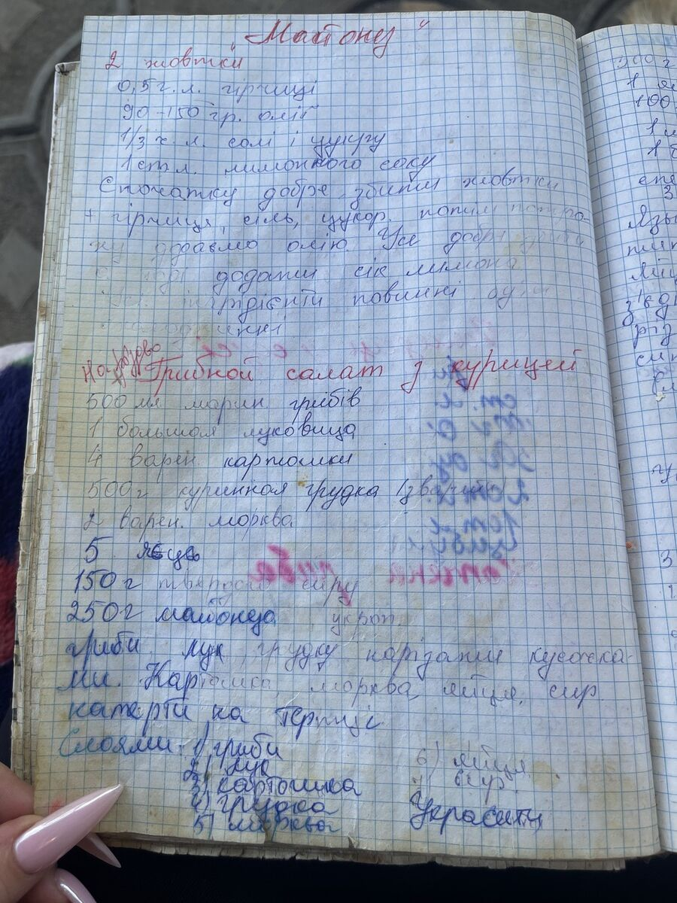

- [ ] замінити 076

<table><tr><th>Зараз</th><th>Пропозиція Claude</th></tr><tr><td>

```
## Інгредієнти
- мариновані гриби — 500 мл
- цибуля — 1 велика
- картопля — 4 варені
- куряча грудка — 500 г
- морква — 2 варені
- яйця — 5 шт.
- твердий сир — 150 г
- майонез — 250 г

## Приготування
Укласти шарами: гриби, цибуля, картопля, куряча грудка, морква, яйця, сир. Перемазати майонезом.
```

</td><td>

```
# Грибной салат з курицей

<!-- ?? Claude: перед назвою червоним «На здоров'я»? -->

## Інгредієнти
- мариновані гриби — 500 мл
- цибуля — 1 велика
- картопля — 4 варені
- куряча грудка — 500 г (зварити)
- морква — 2 варені
- яйця — 5 шт.
- твердий сир — 150 г
- майонез — 250 г
- укроп

## Приготування
Гриби, цибулю, грудку нарізати кусочками. Картоплю, моркву, яйця, сир натерти на терці.

Шарами:
1. гриби
2. цибуля
3. картопля
4. грудка
5. морква
6. яйця
7. сир

Украсити.
```

</td></tr></table>

## 077. Женский каприз → Салат «Женский каприз»

📷 `IMG_1682.jpg` · ✅ основа — язик 300 г, не курка; оливки, лимон; повний спосіб

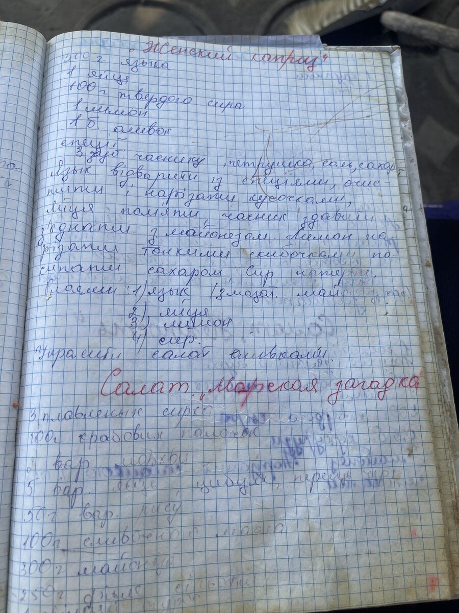

- [ ] замінити 077

<table><tr><th>Зараз</th><th>Пропозиція Claude</th></tr><tr><td>

```
## Інгредієнти
- курка — 500 г
- яйця — 2 шт.
- твердий сир — 100 г
- маслини — 1 банка
- часник — 3 зубчики
- петрушка
- сіль і цукор — на смак

## Приготування
Курку відварити, порізати. Яйця потерти на тертці, моркву потерти на тертці, виноград і маслини порізати, огірок нарізати соломкою. Усе змішати.
```

</td><td>

```
# Салат «Женский каприз»

## Інгредієнти
- язик — 300 г
- яйця — 1 шт. <!-- ?? Claude: так записано «1 яйця» — можливо, ще цифра стерта -->
- твердий сир — 100 г
- лимон — 1 шт.
- оливки — 1 б.
- спеції
- часник — 3 зуб.
- петрушка, сіль, сахар

## Приготування
Язик відварити із спеціями, очистити і нарізати кусочками. Яйця помняти, часник здавити, з'єднати з майонезом. Лимон нарізати тонкими скибочками, посипати сахаром. Сир натерти.

Шарами:
1. язик (змазати майонезом)
2. яйця
3. лимон
4. сир

Украсити салат оливками.
```

</td></tr></table>

## 078. Салат «Сонечко» → Салат «Солнышко»

📷 `IMG_1686.jpg` · ⚠️ уточнено склад і шари; частина рядків бліда


- [ ] замінити 078

<table><tr><th>Зараз</th><th>Пропозиція Claude</th></tr><tr><td>

```
## Інгредієнти
- куряче м'ясо — 250 г
- плавлений сирок — 2 шт.
- кукурудза — 1 б.
- яйця — 3
- майонез
- крабові палички — 200 г

Викладати шарами, змащуючи майонезом: м'ясо, яйця, плавлений сирок, крабові палички, кукурудза.
```

</td><td>

```
# Салат «Солнышко»

## Інгредієнти
- куряче м'ясо — 250 г
- плавлені сирки — 2 шт.
- кукурудза — 1 б.
- яйця — 3 шт.
- цибулина — 1 шт.
- крабові палочки — 200 г
- майонез

(по 1 ст. л. уксусу, сахару, солі) — маринад для цибулі <!-- ?? Claude: початок рядка вицвілий -->

## Шари
1. м'ясо
2. цибуля (маринов.)
3. майонез
4. кукурудза
5. білки <!-- ?? Claude: «білки»/«жовтки» — бліде -->
6. майонез
7. крабові палочки
8. сирки

Майонез.
```

</td></tr></table>

## 079. Салат «Тиффани» → Салат «Тиффани»

📷 `IMG_1684.jpg` · ✅ «мед 100 г» насправді «капуста 100 г» (пекінська/маринована); горіхів на фото немає


- [ ] замінити 079

<table><tr><th>Зараз</th><th>Пропозиція Claude</th></tr><tr><td>

```
## Інгредієнти
- куряча грудка — 1
- зелений виноград
- яйця — 6
- твердий сир
- волоські горіхи — 100 г
- майонез
- майонез

## Шари
1. м'ясо
2. половина тертого сиру
3. твердий сир
4. яйця з майонезом; повторити шари

Зверху прикрасити виноградом.
```

</td><td>

```
# Салат «Тиффани»

## Інгредієнти
- куряча грудка — 1
- зелений виноград — 1 гроно
- зелена цибуля
- яйця — 3 шт.
- капуста — 100 г
- сир твердий — 100 г
- майонез

## Шари
1. м'ясо
2. нашинкувати капусту
3. тертий сир
4. яйця з майонезом

Верх украсити виноградом.
```

</td></tr></table>

## 080. Салат «Мімоза» → Салат «Мімоза»

📷 `IMG_1678.jpg` · ✅ уточнено з фото


- [ ] замінити 080

<table><tr><th>Зараз</th><th>Пропозиція Claude</th></tr><tr><td>

```
## Шари / інгредієнти
1. сардини, розім'яти
2. цибуля кубиками
3. картопля, натерта
4. майонез
5. сирок
6. білки, потерти
7. майонез
8. жовтки зверху

Між шарами — майонез.
```

</td><td>

```
# Салат «Мімоза»

## Шари
1. сардини (розім'яти)
2. цибуля
3. картопля (на тертку)
4. полити майонезом
5. сирок
6. білки (покришити)
7. майонез

Жовтки — зверху.
```

</td></tr></table>

## 081. Салат із копченої риби → Салат «Із копченої риби»

📷 `IMG_1678.jpg` · ✅ шар 4 — копчена риба, не перець/огірок


- [ ] замінити 081

<table><tr><th>Зараз</th><th>Пропозиція Claude</th></tr><tr><td>

```
## Шари / інгредієнти
1. цибуля маринована
2. морква, обсмажена
3. картопля, натерта — змастити майонезом
4. копчена риба
5. кукурудза
6. майонез
7. яйця, нарізані полосками
8. майонез
```

</td><td>

```
# Салат «Із копченої риби»

## Шари (на дно)
1. цибуля (маринована)
2. морква (обжарити)
3. картопля (на терці), полити майонезом, сіль, перець
4. копчена риба (нар. кубиками)
5. кукурудза
6. майонез
7. яйця (полосками)
8. майонез
```

</td></tr></table>

## 082. Салат «Колібрі» → Салат «З крабів»

📷 `IMG_1677.jpg` · ⚠️ назва «З крабів»; склад бліді, але читаються


- [ ] замінити 082

<table><tr><th>Зараз</th><th>Пропозиція Claude</th></tr><tr><td>

```
## Інгредієнти
1. помідори
2. курка
3. ковбаса
4. яйця
5. майонез
6. сир твердий
```

</td><td>

```
# Салат «З крабів»

## Інгредієнти
1. цибуля (в уксусі)
2. білки (соломкою)
3. крабові палочки (великими кусками)
4. майонез
```

</td></tr></table>

## 083. Салат «Рис і палочки» → Салат «Рис і палочки»

📷 `IMG_1676.jpg` · ⚠️ нижні рядки бліді, але читаються: цибуля, пів банки кукурудзи, перемішати


- [ ] замінити 083

<table><tr><th>Зараз</th><th>Пропозиція Claude</th></tr><tr><td>

```
## Інгредієнти
- рис — 300 г, відварити
- крабові палички
- яйця
- кукурудза
- майонез
```

</td><td>

```
# Салат «Рис і палочки»

## Інгредієнти
- рис — 300 гр. (відварити)
- крабові палочки
- яйця <!-- ?? Claude: у дужках кількість — «5 шт.»? -->
- цибуля — порізати
- кукурудза — пів банки
- майонез

Перемішати.
```

</td></tr></table>

## 084. Салат «Морская загадка» → Салат «Морская загадка»

📷 `IMG_1682.jpg` · ⚠️ склад читається краще, ніж у першому записі; нижні рядки вицвілі


- [ ] замінити 084

<table><tr><th>Зараз</th><th>Пропозиція Claude</th></tr><tr><td>

```
## Інгредієнти
- крабові палички — 3 п.
- кальмари / морепродукти <!-- ?? -->
- яйця <!-- ?? -->
- огірки <!-- ?? -->
- майонез

Нижня частина рецепта дуже бліда.
```

</td><td>

```
# Салат «Морская загадка»

## Інгредієнти
- плавлені сирки — 3 шт.
- крабові палочки — 100 г
- варена морква — 2 шт. <!-- ?? Claude: цифра бліда -->
- варені яйця — 5 шт., цибуля, перець чер.
- варений рис — 50 г
- вершкове масло — 100 г
- майонез — 300 г
- 250 г … <!-- ?? Claude: останні рядки вицвілі («250 г … ікри?») -->
```

</td></tr></table>

## 086. Салат з ківі → Салат з ківі

📷 `IMG_1685.jpg` · ⚠️ основа — стегно, не шинка; 1 яблуко; шари уточнено


- [ ] замінити 086

<table><tr><th>Зараз</th><th>Пропозиція Claude</th></tr><tr><td>

```
## Інгредієнти
- свинина — 500 г
- яйця — 2 варені
- ківі — 2
- морква — 1 варена
- варена картопля
- яблуко
- майонез

## Шари
1. терта картопля з майонезом
2. ківі, нарізане кубиками
3. білок яйця
4. морква
5. терте яблуко
6. тертий жовток

Частина списку дуже бліда.
```

</td><td>

```
# Салат з ківі

## Інгредієнти
- стегно — 500 г (вар.) <!-- ?? Claude: «стегна»/«шинка» — слово бліде, читається як «стегна» -->
- яйця — 2 шт. (вар.)
- ківі — 2 шт.
- яблуко — 1 шт.
- морква — 2 шт. (вар.)
- майонез

## Шари
1. порізати м'ясо (посолити)
2. ківі (кубиками)
3. білки яєць
4. морква (на терці)
5. яблуко (на терці)

Майонез, зверху жовтки.
```

</td></tr></table>

## 087. Салат із печінки → Салат з печінки

📷 `IMG_1688.jpg` · ✅ додано горошок; печінка — терта; «мішати»


- [ ] замінити 087

<table><tr><th>Зараз</th><th>Пропозиція Claude</th></tr><tr><td>

```
## Інгредієнти
- печінка
- морква — смажена
- цибуля — смажена
- огірок
- майонез

Короткий запис без пропорцій.
```

</td><td>

```
# Салат з печінки

## Інгредієнти
- печінка — терта
- морква — жарена
- цибуля — жарена
- горошок
- майонез

Мішати.
```

</td></tr></table>

## 088. Салат з мойви → Салат з мойви

📷 `IMG_1666.jpg` · ✅ цукор 1 ст. (не 100 г), оцет 100 г; порядок: варити 1 год, потім сахар/олія/оцет/мойва/лавр/перець, ще 1 год

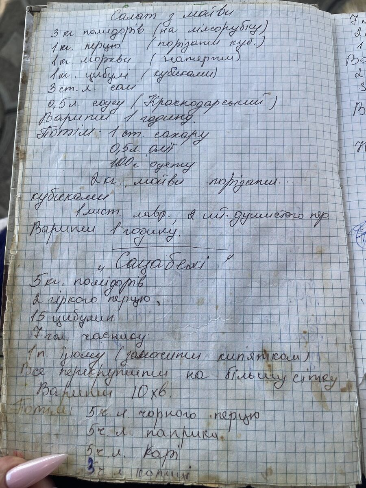

- [ ] замінити 088

<table><tr><th>Зараз</th><th>Пропозиція Claude</th></tr><tr><td>

```
## Інгредієнти
- помідори — 3 кг (на м'ясорубку)
- перець — 1 кг (порізати)
- морква — 1 кг (натерти)
- цибуля — 1 кг (кубиками)
- сіль — 3 столові ложки
- соус «Краснодарський» — 0,5 л
- цукор — 1 склянка
- олія — 0,5 л
- оцет — 100 г
- мойва — 2 кг, порізати
- лавровий лист — 1 шт.
- духмяний перець — 2 шт.

## Приготування
Варити 1 год. Додати цукор, олію, оцет, мойву, лавровий лист і духмяний перець. Варити ще 1 год.
```

</td><td>

```
# Салат з мойви

## Інгредієнти
- помідори — 3 кг (на м'ясорубку)
- перець — 1 кг (порізати куб.)
- морква — 1 кг (натерти)
- цибуля — 1 кг (кубиками)
- сіль — 3 ст. л.
- соус «Краснодарський» — 0,5 л

Варити 1 годину.

Потім:
- сахар — 1 ст.
- олія — 0,5 л
- оцет — 100 г
- мойва — 2 кг, порізати кубиками
- 1 лист. лавр., 2 шт. духмяного пер.

Варити 1 годину.
```

</td></tr></table>

## 089. Тефтелі → Їжаки

📷 `IMG_1687.jpg` · ✅ назва — «Їжаки», не «Гуляш»; 5 п. — рис (не морква), 5 яєць, 4 цибулинки

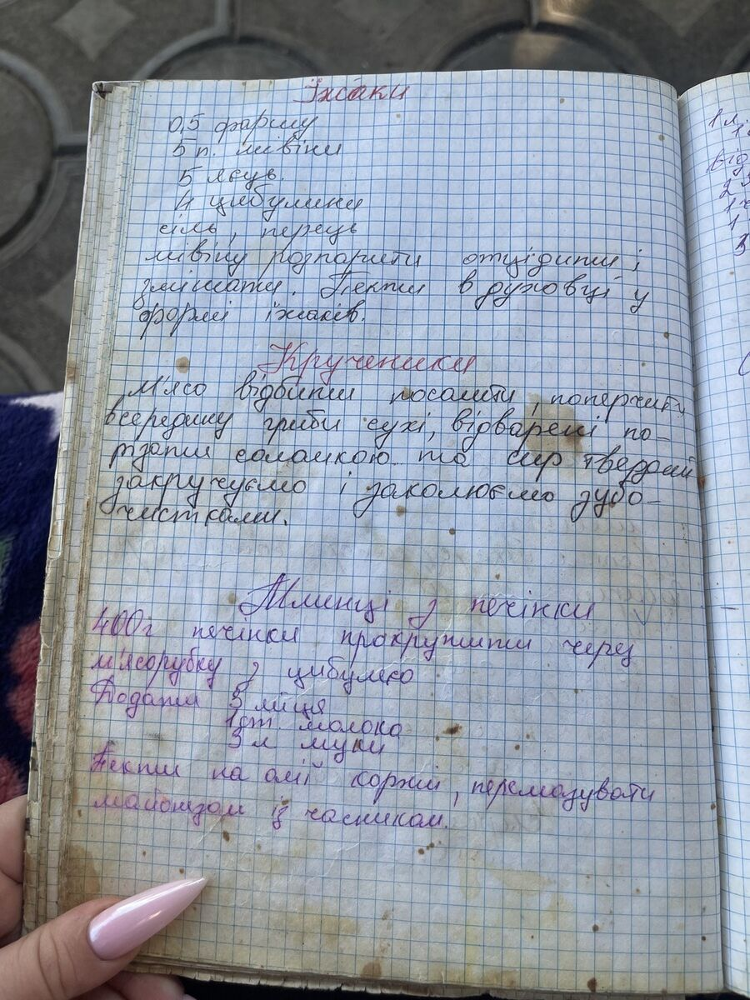

- [ ] замінити 089

<table><tr><th>Зараз</th><th>Пропозиція Claude</th></tr><tr><td>

```
## Інгредієнти
- фарш — 0,5 кг
- морква — 5 шт.
- цибуля — 5 шт.
- часник — 4 зубчики
- сіль, перець

## Приготування
Моркву натерти, цибулю порізати. Тефтелі готувати в духовці у формі.
```

</td><td>

```
# Їжаки

## Інгредієнти
- фарш — 0,5 <!-- ?? Claude: одиниця не вказана (кг?) -->
- рис — 5 п. <!-- ?? Claude: «5 п. рису»? слово «ривіни»/«рисини» нечітке -->
- яйця — 5 шт.
- цибулинки — 4 шт.
- сіль, перець

## Приготування
Рис розпарити, остудити і змішати. Пекти в духовці у формі їжаків.
```

</td></tr></table>

## 090. Ковбаса → Ковбаса по-гуцульськи

📷 `IMG_1663.jpg` · ⚠️ назва — «по Гоцульскі» (гуцульськи), не «по-полинськи»; паприка — ложка; спосіб: «поставити в холодильник схопнути»


- [ ] замінити 090

<table><tr><th>Зараз</th><th>Пропозиція Claude</th></tr><tr><td>

```
## Інгредієнти
- теляче м'ясо — 1 кг
- свиняче м'ясо — 1 кг
- часник — 8 зубчиків
- коньяк — 50 г
- паприка — 1 чайна ложка
- сіль і перець — за смаком

## Приготування
Усе перемішати й поставити в холодильник охолонути.
```

</td><td>

```
# Ковбаса по-гуцульськи

<!-- ?? Claude: назва на фото «по Гоцульскі» — лишити як в оригіналі? -->

## Інгредієнти
- теляче м'ясо — 1 кг } порізати тонко
- свиняче м'ясо — 1 кг }
- часник — зубок
- коньяк — 50 гр.
- паприка — одна ложка
- сіль, перець по вкусу

## Приготування
Все перемішати і поставити в холодильник схопнути.
```

</td></tr></table>

## 091. Крученики → Крученики

📷 `IMG_1687.jpg` · ✅ начинка — сухі гриби і твердий сир, не картопля із засмажкою


- [ ] замінити 091

<table><tr><th>Зараз</th><th>Пропозиція Claude</th></tr><tr><td>

```
## Приготування
М'ясо відбити, посолити, поперчити. Усередину класти начинку, закрутити й заколоти зубочистками.

Запис містить опис способу без чітких пропорцій.
```

</td><td>

```
# Крученики

## Приготування
М'ясо відбити, посолити, поперчити. Всередину — гриби сухі, відварені, порізані соломкою, та сир твердий. Закручуємо і заколюємо зубочистками.
```

</td></tr></table>

## 092. Майонез → Майонез (з жовтками)

📷 `IMG_1681.jpg` · ✅ назва — «Майонез» (червоним), а не «Мабоцу»; це соус, не м'ясо. Варто перенести в «Соуси» поруч з 101


- [ ] замінити 092

<table><tr><th>Зараз</th><th>Пропозиція Claude</th></tr><tr><td>

```
## Інгредієнти
- жовтки — 2 шт.
- гірчиця — 0,5 чайної ложки
- олія — 90–150 г
- сіль і цукор — по 1/3 чайної ложки
- лимонний сік — 1 столова ложка

## Приготування
Добре збити жовтки, гірчицю, сіль і цукор. Поступово додавати олію, потім лимонний сік.
```

</td><td>

```
# Майонез (з жовтками)

## Інгредієнти
- жовтки — 2 шт.
- гірчиця — 0,5 ч. л.
- олія — 90–150 гр.
- сіль і цукор — по 1/3 ч. л.
- лимонний сік — 1 ст. л.

## Приготування
Спочатку добре збити жовтки + гірчиця, сіль, цукор. Потім поступово додавати олію. Усе добре збити. Потім додати сік лимона. Усі інгредієнти повинні бути однакової температури. <!-- ?? Claude: кінець абзацу вицвілий — «однакової/одної температури» -->
```

</td></tr></table>

## 093. Млинці з печінки → Млинці з печінки

📷 `IMG_1687.jpg` · ✅ 3 яйця (не 2), з цибулькою


- [ ] замінити 093

<table><tr><th>Зараз</th><th>Пропозиція Claude</th></tr><tr><td>

```
## Інгредієнти
- печінка — 400 г, пропустити через м'ясорубку
- яйця — 2 шт.
- молоко — 1 склянка
- мука — 3 столові ложки

## Приготування
Жарити на олії. Коржі перемазувати майонезом із часником.
```

</td><td>

```
# Млинці з печінки

## Інгредієнти
- печінка — 400 г, прокрутити через м'ясорубку з цибулькою
- яйця — 3 шт.
- молоко — 1 ст.
- мука — 3 л. <!-- ?? Claude: «3 л.» — ложки -->

## Приготування
Пекти на олії коржі, перемазувати майонезом із часником.
```

</td></tr></table>

## 094. Оселедець у соусі → Оселедець у соусі

📷 `IMG_1680.jpg` · ✅ склад збігається; «змішати і залити» на фото немає

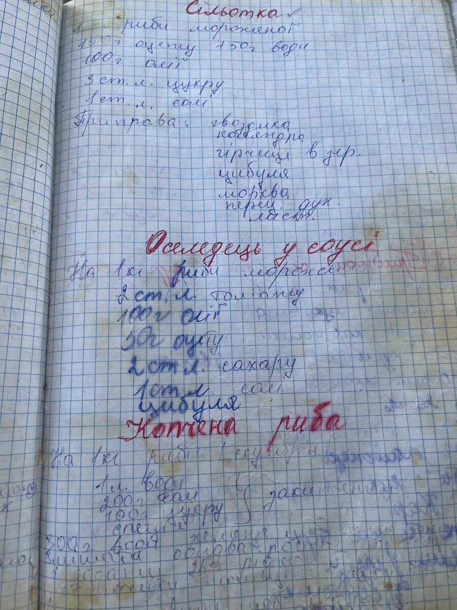

- [ ] замінити 094

<table><tr><th>Зараз</th><th>Пропозиція Claude</th></tr><tr><td>

```
## На 1 кг риби
- томат — 2 столові ложки
- олія — 100 г
- оцет — 50 г
- цукор — 2 столові ложки
- сіль — 1 столова ложка
- цибуля

Змішати компоненти соусу та залити рибу.
```

</td><td>

```
# Оселедець у соусі

## На 1 кг риби мороженої
- томат — 2 ст. л.
- олія — 100 г
- оцет — 50 г
- цукор — 2 ст. л.
- сіль — 1 ст. л.
- цибуля
```

</td></tr></table>

## 095. Сільотка / оселедець → Сільотка

📷 `IMG_1680.jpg` · ✅ додано приправу з фото; кроків приготування на фото немає


- [ ] замінити 095

<table><tr><th>Зараз</th><th>Пропозиція Claude</th></tr><tr><td>

```
## Інгредієнти
- оселедець морожений — 1 кг
- оцет — 170 г + 50 г води
- олія — 100 г
- цукор — 3 столові ложки
- сіль — 1 столова ложка

## Приготування
1. Рибу розморозити.
2. Порізати.
3. Додати маринад.
4. Цибулю та моркву перекласти шарами.
```

</td><td>

```
# Сільотка

## Інгредієнти
- риба морожена — 1 кг <!-- ?? Claude: кількість риби вицвіла, «1 …» -->
- оцет — 150 г + 50 г води <!-- ?? Claude: 150 чи 170 -->
- олія — 100 г
- цукор — 3 ст. л.
- сіль — 1 ст. л.

## Приправа
- гвоздика
- коляндра
- гірчиця в зер.
- цибуля
- морква
- перец. душ.
- лавр. лист
```

</td></tr></table>

## 096. Копчена риба → Копчена риба

📷 `IMG_1680.jpg` · ⚠️ нижня частина бліда; розшифрував що зміг, решту позначив


- [ ] замінити 096

<table><tr><th>Зараз</th><th>Пропозиція Claude</th></tr><tr><td>

```
## На 1 кг риби
- вода — 1 л
- сіль — 200 г
- цукор — 100 г
- спеції

Запис у нижній частині сторінки дуже блідий; точні пропорції потребують перевірки.
```

</td><td>

```
# Копчена риба

## На 1 кг риби (скумбрія)
- вода — 1 л
- сіль — 200 г
- цукор — 100 г
- спеції

Закип'ятити.

300 г води, жменя цибулевого лушпиння <!-- ?? Claude: «жменя цибул…» --> — змішати, обидва розчини <!-- ?? Claude: рядки вицвілі, далі «25 … рідкого диму?» — прочитати не вдалося -->
```

</td></tr></table>

## 097. Скумбрія копчена → Скумбрія копчена

📷 `IMG_1690.jpg` · ✅ це копчена скумбрія на рідкому димі (не «олія 6 ст. л.», не стерилізація 5 год)

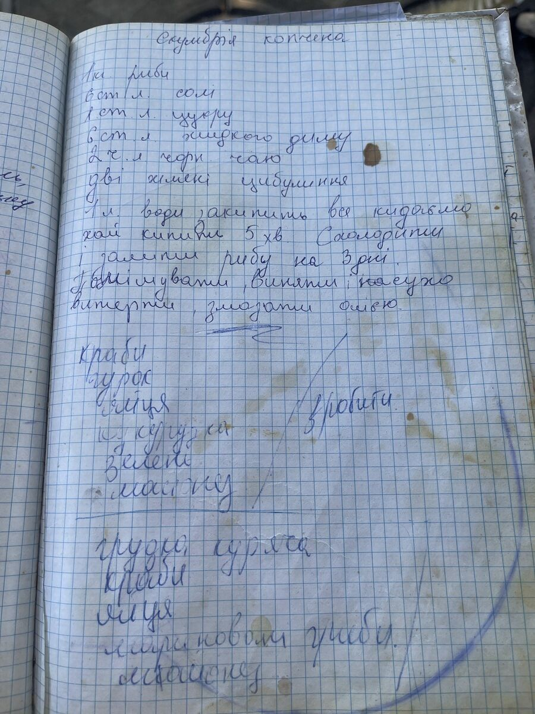

- [ ] замінити 097

<table><tr><th>Зараз</th><th>Пропозиція Claude</th></tr><tr><td>

```
## Інгредієнти
- риба — 1 кг
- сіль — 6 столових ложок
- цукор — 1 столова ложка
- рідкий дим — 6 столових ложок
- чорний перець — 2 чайні ложки
- цибулина — 2 шт.

## Приготування
1. У 1 л води змішати всі інгредієнти, кип'ятити 5 хвилин.
2. Охолодити, залити рибу на 3 дні.
3. Вийняти, висушити й змазати олією.
```

</td><td>

```
# Скумбрія копчена

## Інгредієнти
- риба — 1 кг
- сіль — 6 ст. л.
- цукор — 1 ст. л.
- рідкий дим — 6 ст. л.
- чорний чай — 2 ч. л.
- цибулиння (лушпиння) — дві жмені
- вода — 1 л

## Приготування
1 л води закип'ятити, все кидаємо, хай кипить 5 хв. Охолодити і залити рибу на 3 дні. Помішувати. Вийняти і насухо витерти, змазати олією.
```

</td></tr></table>

## 098. Сир «Галицький» → Сир голландський

📷 `IMG_1688.jpg` · ✅ назва — «Сир голандський»; це домашній сир з молока (1 л молока, 1 кг сиру, яйця, сода), а не намазка з кетчупом. Варто перенести в «Десерти/Сирні» або «Закуски»


- [ ] замінити 098

<table><tr><th>Зараз</th><th>Пропозиція Claude</th></tr><tr><td>

```
## Інгредієнти
- м'який сир — 1 кг
- сода — 1 чайна ложка <!-- ?? уточнити рядок після соди -->
- приправи — на смак
- яйце — 1 шт.
- сода погашена — 1 чайна ложка <!-- ?? написано невиразно -->
- сіль — 1 чайна ложка
- олія — 3 столові ложки
- масло

## Приготування
Усе перемішати до однорідної маси, викласти у форму.
```

</td><td>

```
# Сир голландський

## Інгредієнти
- молоко — 1 л
- сир — 1 кг
- яйця — 2 шт. <!-- ?? Claude: 2 чи 3 — цифра виправлена -->
- сода гашена — 1 ч. л.
- сіль — 1 ч. л.
- олія — 3 ст. л.
- масло

## Приготування
Молоко і сир кип'ятити 15 хв. Відцідити на друшляк. Додати яйця, соду, сіль, олію, масло — кип'ятити 3 хв. Викладати у кульок.
```

</td></tr></table>

## 099. Сир галатський → Халва

📷 `IMG_1698.jpg` · ⚠️ IMG_1698 = та сама сторінка, що IMG_1699; старий запис не відповідає фото

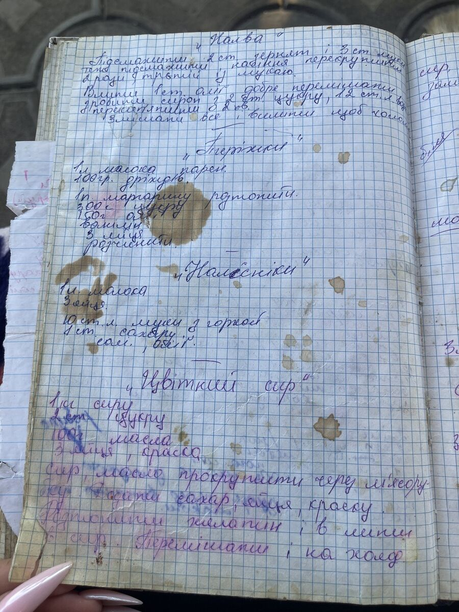

- [ ] замінити 099

<table><tr><th>Зараз</th><th>Пропозиція Claude</th></tr><tr><td>

```
## Інгредієнти
- яйце — 1 шт.
- масло — 1 чайна ложка
- сир — 200 г <!-- ?? -->
- сіль — 1 чайна ложка

Запис дуже блідий і частково перекривається слідами сторінки.
```

</td><td>

```
# Халва

## Приготування
1. Підсмажити 2 ст. зернят <!-- ?? Claude: «зернят»? --> і 3 ст. муки.
2. Тоді підсмажити, насіння перекрутити 2 рази з тертими <!-- ?? Claude: слово нечітке --> у мукою.
3. Влити 1 ст. олії, добре перемішати.
4. Зробити сироп з 2 ст. цукру, 12 ст. л. води, перекип'ятити 2 хв.
5. Змішати все, всипати, щоб холол<!-- ?? Claude: кінець рядка обрізаний -->.
```

</td></tr></table>

## 100. Сирна маса / плавлений сир → Пиріжки

📷 `IMG_1698.jpg` · ✅ IMG_1698 = та сама сторінка, що IMG_1699; старий запис не відповідає фото


- [ ] замінити 100

<table><tr><th>Зараз</th><th>Пропозиція Claude</th></tr><tr><td>

```
## Інгредієнти
- молоко — 0,5 л
- сир — 1 кг <!-- ?? -->
- яйця — 3
- масло — 250 г
- сода — 1 чайна ложка
- сіль — 1 чайна ложка

## Приготування
Змішати та плавити до однорідної маси.
```

</td><td>

```
# Пиріжки

## Інгредієнти
- молоко — 1 л, парене <!-- ?? Claude: «парен.» -->
- дріжджі — 100 г
- маргарин — 1 п., розтопити
- цукор — 300 г
- олія — 150 г
- ванілін
- яйця — 3 шт.

## Приготування
Розчинити. <!-- ?? Claude: останнє слово під плямою, ймовірно «розчинити» -->
```

</td></tr></table>

## 102. Сацебелі → Соус «Сацебелі»

📷 `IMG_1666.jpg` · ✅ назва — «Сацебелі», не «Соус білий»; 5 кг помідорів; ізюм замість зелені; спеції по 5 ч. л.; продовження рецепта — на верху IMG_1667


- [ ] замінити 102

<table><tr><th>Зараз</th><th>Пропозиція Claude</th></tr><tr><td>

```
## Інгредієнти
- помідори — 5 кг
- гострий перець — 2 шт.
- цибуля — 15 шт.
- часник — 7 гол.
- петрушка — 1 пучок
- сіль — за смаком

## Приготування
Все перекрутити на велику сітку. Варити 10 хв.
```

</td><td>

```
# Соус «Сацебелі»

## Інгредієнти
- помідори — 5 кг
- гіркий перець — 2 шт.
- цибулин — 15 шт.
- часник — 7 гол.
- ізюм — 1 п. (замочити кип'ятком)

## Приготування
Все перекрутити на більшу сітку. Варити 10 хв.

Потім:
- чорний перець — 5 ч. л.
- паприка — 5 ч. л.
- карі — 5 ч. л.
- кориця — 3 ч. л. <!-- ?? Claude: цифра переписана синім — 3 чи 5 -->

<!-- ?? Claude: далі — з верху IMG_1667 (продовження, найімовірніше, цього рецепта) -->
- сіль — 7 ч. л.
- цукор — 2 стак.
- гвоздика — 15 шт.

Варити 50 хв.
- крохмаль — 2 ст. л. (розколотити)
- оцет — 300 г

Варити 10 хв.

(12 пів-літ. банок)
```

</td></tr></table>

## 103. Пиріжки → Пташки

📷 `IMG_1692.jpg` · ⚠️ не аджика — випічка (сахар, какао, сметана, мука), крем зі згущонки; розділ Соуси → Випічка

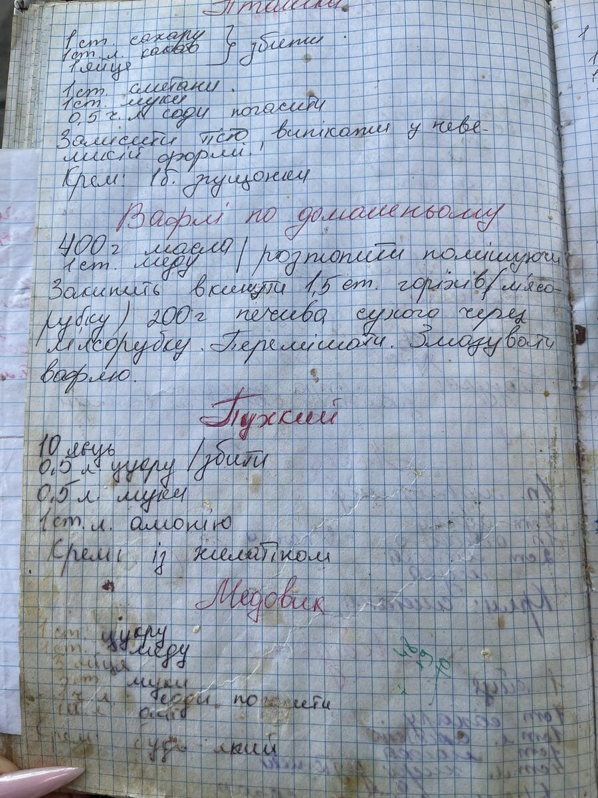

- [ ] замінити 103

<table><tr><th>Зараз</th><th>Пропозиція Claude</th></tr><tr><td>

```
## Інгредієнти
- цукор — 1 склянка
- какао — 1 столова ложка
- яйце — 1 шт.
- сметана — 1 склянка
- молоко — 1 склянка
- сода — 0,5 чайні ложки

## Приготування
Замісити тісто й випікати у формах.
```

</td><td>

```
# Пташки

<!-- ?? Claude: назва обрізана краєм фото — «Пташки»? -->

## Інгредієнти
- сахар — 1 ст.
- какао — 1 ст. л.
- яйце — 1 шт.

Збити.

- сметана — 1 ст.
- мука — 1 ст.
- сода — 0,5 ч. л., погасити

## Приготування
Замісити тісто, випікати у невеликій формі.

## Крем
- згущонка — 1 б.
```

</td></tr></table>

## 104. Кетчуп → Кетчуп (від кума)

📷 `IMG_1673.jpg` · `IMG_1674.jpg` · ✅ старий запис переплутав склад (гіркий перець, кориця, 3 ст. цукру — на фото немає; пропущено буряк, часник, паприку)

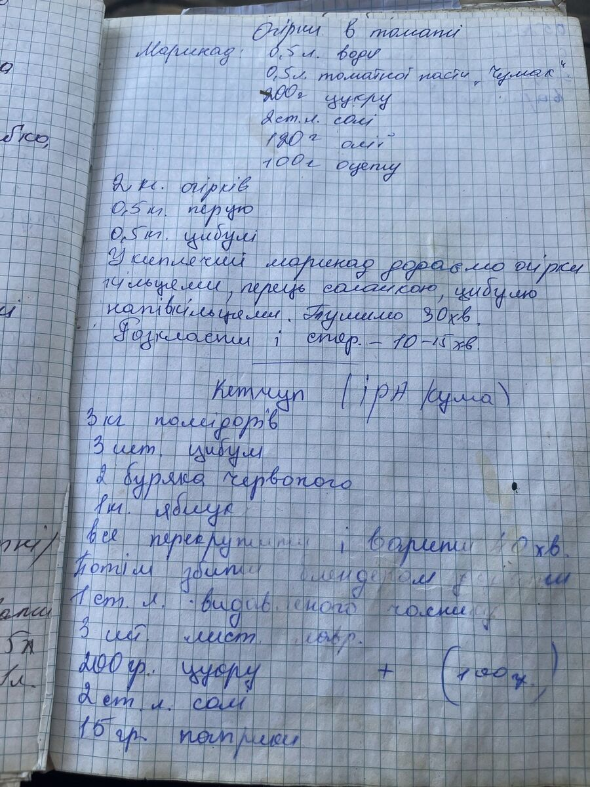

- [ ] замінити 104

<table><tr><th>Зараз</th><th>Пропозиція Claude</th></tr><tr><td>

```
## Інгредієнти
- помідори — 3 кг
- цибуля — 3 шт.
- гіркий перець — 2 шт.
- яблука — 1 кг
- сіль — 2 столові ложки
- цукор — 200 г
- лавровий лист — 3 шт.
- кориця мелена — 0,5 чайні ложки
- чорний мелений перець — 0,5 чайні ложки
- оцет — 50 г

## Приготування
1. Усе перекрутити / подрібнити.
2. Варити.
3. Після додавання спецій варити ще 15 хв.
```

</td><td>

```
# Кетчуп (від кума)

<!-- ?? Claude: у дужках після назви «ірн кума»/«від кума»? -->

## Інгредієнти
- помідори — 3 кг
- цибуля — 3 шт.
- буряк червоний — 2 шт.
- яблука — 1 кг
- часник видавлений — 1 ст. л.
- лавровий лист — 3 шт.
- цукор — 200 гр. (+ збоку «100 г»)
- сіль — 2 ст. л.
- паприка — 15 гр.
- перець чилі — 0,5 ч. л.
- перець чорний мелений — 0,5 ч. л.
- оцет — 50 гр.

## Приготування
Все перекрутити і варити 40 хв. <!-- ?? Claude: 40 чи 10 хв — цифра бліда --> Потім збити блендером, додати решту <!-- ?? Claude: кінець рядка вицвів -->. Варити 15 хв.

(Вихід — 8,5 пів. <!-- ?? Claude: «вихід 8,5 пів.» — півлітрових банок? -->)
```

</td></tr></table>

## 105. Гостра приправа з перцю → Гостра приправа з перцю

📷 `IMG_1669.jpg` · ✅ у блокноті без назви; 1 п. коляндри (не «1 л»), 100 г пасти; сіль «70 г — менше»

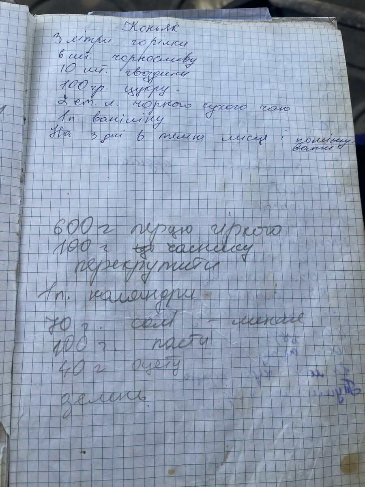

- [ ] замінити 105

<table><tr><th>Зараз</th><th>Пропозиція Claude</th></tr><tr><td>

```
## Інгредієнти
- гіркий перець — 600 г
- часник — 100 г
- помідори — 1 л
- сіль — 70 г
- томатна паста — 100 г
- оцет — 40 г

## Приготування
Усе перемолоти.
```

</td><td>

```
# Гостра приправа з перцю

<!-- ?? Claude: назва — у блокноті без назви -->

## Інгредієнти
- перець гіркий — 600 г
- часник — 100 г

Перекрутити.

- коляндра — 1 п.
- сіль — 70 г (менше)
- паста — 100 г
- оцет — 40 г
- зелень
```

</td></tr></table>

## 106. Медовик → Медовик

📷 `IMG_1692.jpg` · ⚠️ рецепт блідий, але більшість читається


- [ ] замінити 106

<table><tr><th>Зараз</th><th>Пропозиція Claude</th></tr><tr><td>

```
## Інгредієнти
- цукор — <!-- ?? -->
- мед — <!-- ?? -->
- яйця — <!-- ?? -->
- мука — <!-- ?? -->
- сода — <!-- ?? -->
```

</td><td>

```
# Медовик

## Інгредієнти
- цукор — 1 ст.
- мед — 1 ст.
- яйця — 3 шт.
- мука — 3 ст. <!-- ?? Claude: цифра бліда -->
- сода — 1 ч. л., погасити <!-- ?? Claude: цифра бліда -->
- олія — 1 ст. л. <!-- ?? Claude: «1 ст. л. олії» — бліде -->

## Крем
Суфлейний. <!-- ?? Claude: «крем суфлейний»? рядок вицвів -->
```

</td></tr></table>

## 107. Супер-торт «Колосок» → Сирні кульки

📷 `IMG_1700.jpg` · ✅ на фото першим — «Сирні кульки»; «Колоска» на сторінці немає

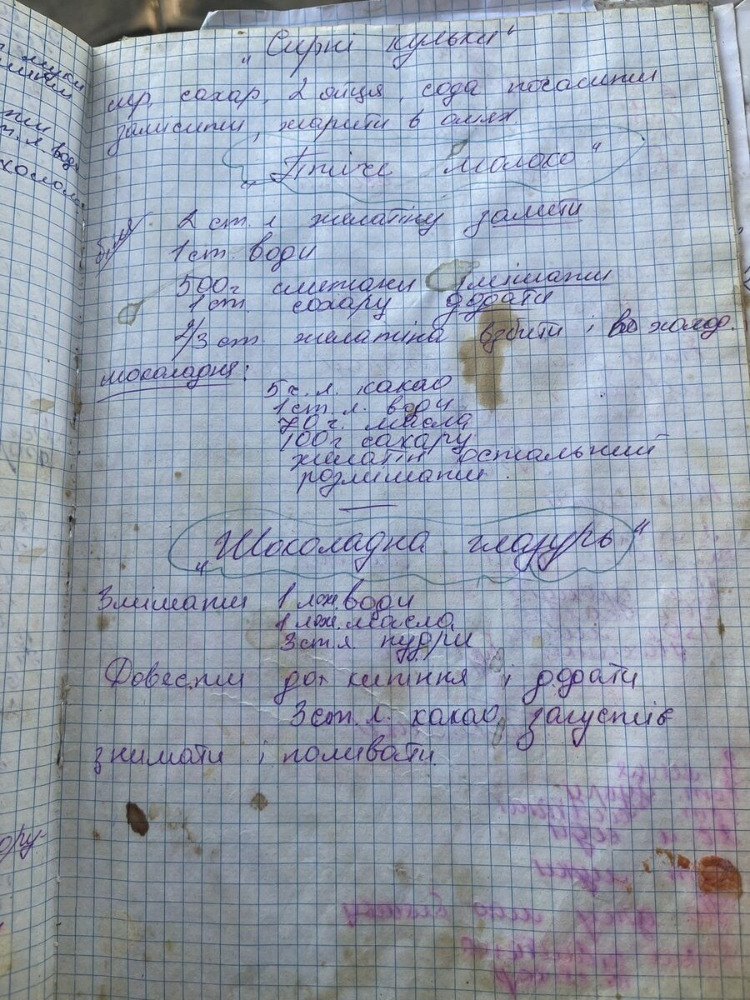

- [ ] замінити 107

<table><tr><th>Зараз</th><th>Пропозиція Claude</th></tr><tr><td>

```
## Коржі
- яйця — 1 шт.
- маргарин — 1 склянка <!-- ?? -->
- мука — 500 г

## Крем
- масло — 1 пачка
```

</td><td>

```
# Сирні кульки

## Інгредієнти
- сир
- сахар
- яйця — 2 шт.
- сода (погасити)

## Приготування
Замісити, жарити в олії.
```

</td></tr></table>

## 108. Торт / крем із какао → Рулет з медом

📷 `IMG_1701.jpg` · ✅ розділ «Рулети» → «З медом»; у старому записі какао 20 г / цукор 300 г — на фото немає

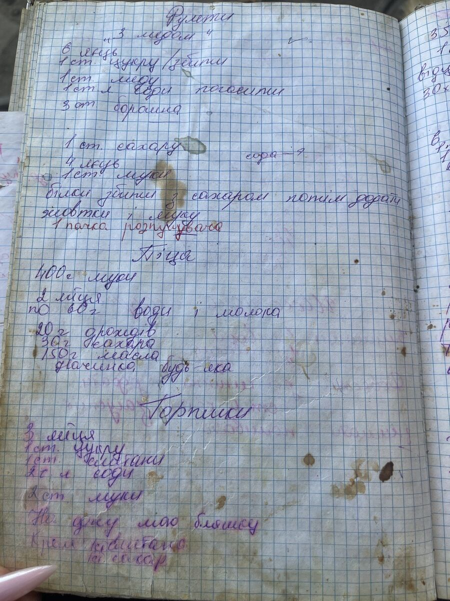

- [ ] замінити 108

<table><tr><th>Зараз</th><th>Пропозиція Claude</th></tr><tr><td>

```
## Інгредієнти
- какао — 20 г <!-- ?? -->
- цукор — 300 г <!-- ?? -->
- молоко — 150 г <!-- ?? -->

## Приготування
Зварити / збити крем. <!-- ?? -->
```

</td><td>

```
# Рулет з медом

## Інгредієнти
- яйця — 6 шт.
- цукор — 1 ст. (збити)
- мед — 1 ст.
- сода — 1 ст. л. (погасити)
- борошно — 3 ст.
```

</td></tr></table>

## 109. Торт / кремовий десерт → Налисники

📷 `IMG_1698.jpg` · ✅ IMG_1698 = та сама сторінка, що IMG_1699; старий запис не відповідає фото


- [ ] замінити 109

<table><tr><th>Зараз</th><th>Пропозиція Claude</th></tr><tr><td>

```
## Інгредієнти
- яйця — 3
- цукор — 1 склянка
- мука — 1 склянка
- масло — <!-- ?? -->
- сметана — <!-- ?? -->
```

</td><td>

```
# Налисники

## Інгредієнти
- молоко — 1 л
- яйця — 3 шт.
- мука — 10 ст. л. з гіркою
- сахар — 1 ст.
- сіль
- олія
```

</td></tr></table>

## 110. Торт «Наполеон» → Рулет (без назви)

📷 `IMG_1701.jpg` · ✅ другий рулет на сторінці, без назви; «Наполеона» на фото немає


- [ ] замінити 110

<table><tr><th>Зараз</th><th>Пропозиція Claude</th></tr><tr><td>

```
## Інгредієнти
- маргарин / масло — <!-- ?? -->
- мука — <!-- ?? -->
- вода — <!-- ?? -->
```

</td><td>

```
# Рулет (без назви)

<!-- ?? Claude: назва — у блокноті без назви, під заголовком «Рулети» -->

## Інгредієнти
- сахар — 1 ст.
- яйця — 4 шт.
- мука — 1 ст.
- розпушувач — 1 пачка (дописано червоним)

Сбоку: «сода — ?»

## Приготування
Білки збити з сахаром, потім додати жовтки і муку.
```

</td></tr></table>

## 112. Торт «Подарунок» → Піца

📷 `IMG_1701.jpg` · ✅ третій рецепт — «Піца»; «Подарунка» на фото немає


- [ ] замінити 112

<table><tr><th>Зараз</th><th>Пропозиція Claude</th></tr><tr><td>

```
## Інгредієнти
- маргарин — 1 пачка
- мука — <!-- ?? -->
- цукор — <!-- ?? -->
- яйця — <!-- ?? -->
- сода — <!-- ?? -->

## Приготування
Замісити тісто. <!-- ?? точний спосіб -->
```

</td><td>

```
# Піца

## Інгредієнти
- мука — 400 г
- яйця — 2 шт.
- вода і молоко — по 60 г
- дріжджі — 20 г
- сахар — 30 г
- масло — 150 г
- начинка — будь-яка
```

</td></tr></table>

## 113. Торт «Кучерявий» → Торт «Кручений»

📷 `IMG_1704.jpg` · ⚠️ єдиний рецепт на IMG_1704; назва читається як «Кручений» (перша літера К/Х)

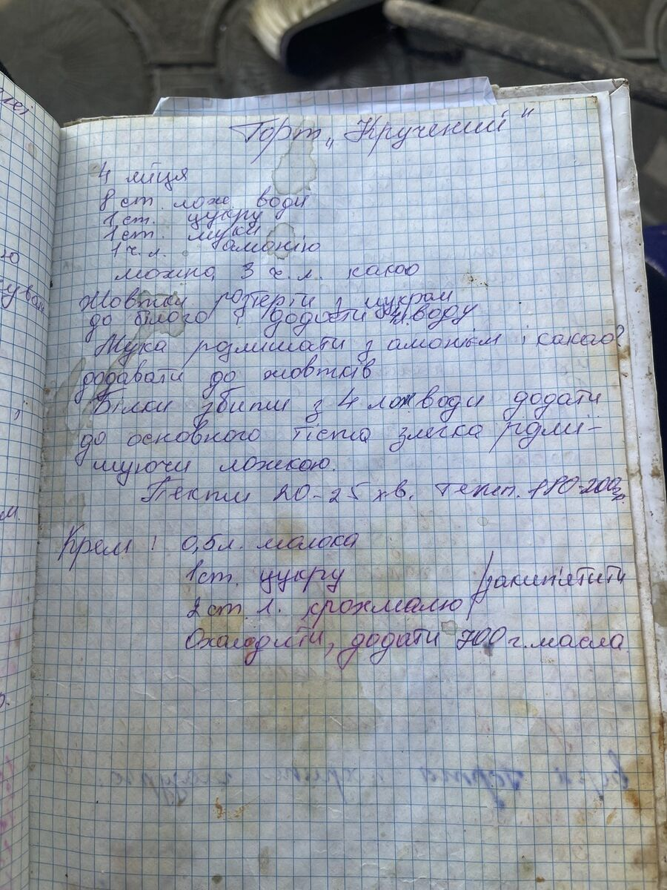

- [ ] замінити 113

<table><tr><th>Зараз</th><th>Пропозиція Claude</th></tr><tr><td>

```
## Інгредієнти
- яйця — 4 шт.
- вода — 8 столових ложок
- цукор — 1 склянка
- мука — 1 склянка
- амоній — 1 чайна ложка
- какао — 3 столові ложки

## Крем
- молоко — 0,5 л
- цукор — 1 склянка
- крохмаль — 2 столові ложки
- масло — 200 г

Білки збити з цукром, додати решту складників. Крем охолодити й додати масло.
```

</td><td>

```
# Торт «Кручений»

<!-- ?? Claude: назва — «Кручений»? перша літера схожа на К або Х -->

## Інгредієнти
- яйця — 4 шт.
- вода — 8 ст. лож.
- цукор — 1 ст.
- мука — 1 ст.
- амоній — 1 ч. л.
- какао — можна 3 ч. л.

## Приготування
Жовтки розтерти з цукром до білого і додати 4 л. воду. Муку розмішати з амонієм і какао, додавати до жовтків. Білки збити з 4 лож. води, додати до основного тіста злегка розмішуючи ложкою.

Пекти 20–25 хв, темп. 180–200°.

## Крем
- молоко — 0,5 л
- цукор — 1 ст.
- крохмаль — 2 ст. л.

Закип'ятити. Охолодити, додати 400 г масла. <!-- ?? Claude: 400 чи 700 г -->
```

</td></tr></table>

## 115. Торт із сиром → Кекс

📷 `IMG_1707.jpg` · ✅ на IMG_1707 другий рецепт — «Кекс» (4 яйця, 1,5 ст. сахару), «Торта із сиром» немає

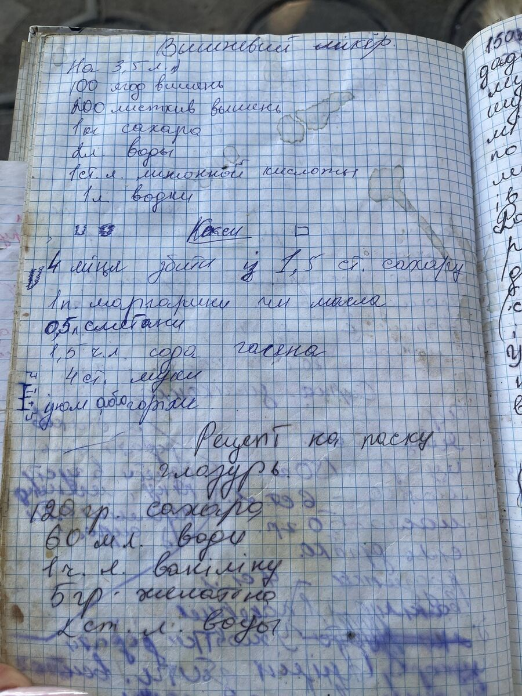

- [ ] замінити 115

<table><tr><th>Зараз</th><th>Пропозиція Claude</th></tr><tr><td>

```
## Інгредієнти
- яйця — 4 шт. <!-- ?? -->
- цукор — 1,5 склянки
- мука — <!-- ?? -->
- сир — <!-- ?? -->

## Крем
- масло
- згущене молоко <!-- ?? -->
```

</td><td>

```
# Кекс

## Інгредієнти
- яйця — 4 шт., збити з 1,5 ст. сахару
- маргарин чи масло — 1 п.
- сметана — 0,5 л
- сода гасяна — 1,5 ч. л.
- мука — 4 ст.
- родзинки або горіхи <!-- ?? Claude: «ізюм або горіхи» -->
```

</td></tr></table>

## 116. Зебра → Зефірка

📷 `IMG_1693.jpg` · ⚠️ на фото перший рецепт — не «Зебра» (вона нижче, це 117); назва червоним схожа на «Зозефіка»/«Зефірка»

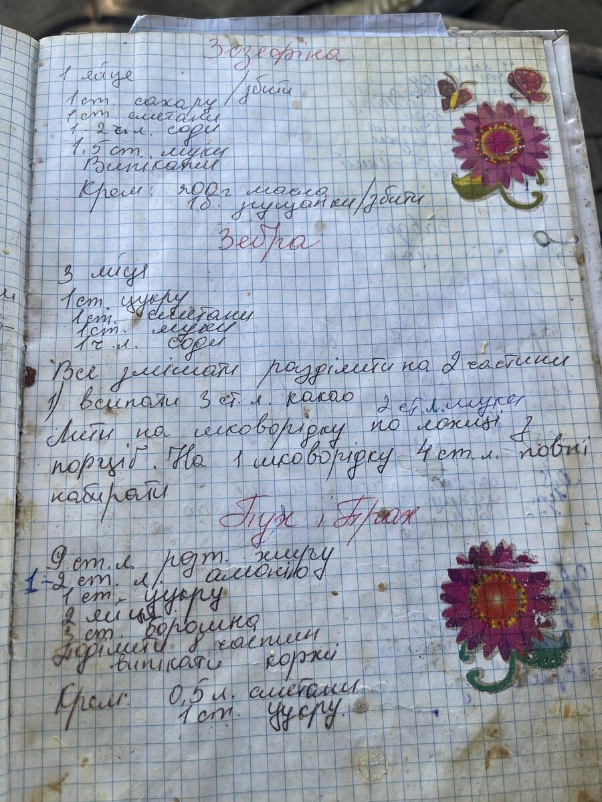

- [ ] замінити 116

<table><tr><th>Зараз</th><th>Пропозиція Claude</th></tr><tr><td>

```
## Інгредієнти
- яйце — 1 шт.
- цукор — 1 склянка
- сметана — 1 склянка
- сода — 1/2 чайні ложки
- мука — 1,5 склянки
- розпушувач

## Приготування
Все вимішати.

## Крем
- масло — 300 г
- згущене молоко — 1 б.
```

</td><td>

```
# Зефірка

<!-- ?? Claude: назва — червоним «Зозефіка»/«Зефірка», перевір -->

## Інгредієнти
- яйце — 1 шт.
- сахар — 1 ст.
(яйце з сахаром збити)
- сметана — 1 ст.
- сода — 1–2 ч. л.
- мука — 1,5 ст.

Випікати.

## Крем
- масло — 400 г <!-- ?? Claude: 400 чи 200 — перша цифра схожа на 4 -->
- згущонка — 1 б.

Збити.
```

</td></tr></table>

## 118. Пиріг «Палички» → Пиріжки закручені

📷 `IMG_1703.jpg` · ✅ на IMG_1703 немає «Паличок»; перший рецепт сторінки — «Пиріжки закручені». Якщо «Палички» знайдуться на іншому фото — відновлю окремо

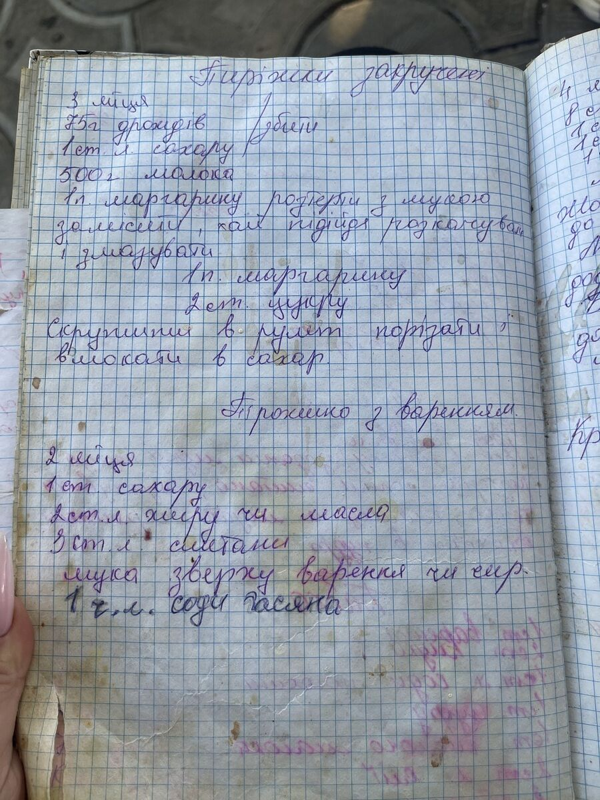

- [ ] замінити 118

<table><tr><th>Зараз</th><th>Пропозиція Claude</th></tr><tr><td>

```
## Інгредієнти
- яйця — 2 шт.
- цукор — 1 склянка
- мука — <!-- ?? -->
- маргарин — <!-- ?? -->

Запис блідий. <!-- ?? -->
```

</td><td>

```
# Пиріжки закручені

## Інгредієнти
- яйця — 3 шт.
- дріжджі — 75 г
- сахар — 1 ст. л.
(збити)
- молоко — 500 г
- маргарин — 1 п., розтерти з мукою

## Приготування
Замісити, коли підійде — розкачувати і змазувати:
- маргарин — 1 п.
- цукор — 2 ст.

Скрутити в рулет, порізати, вмокати в сахар.
```

</td></tr></table>

## 119. Пиріг «Тертий» → Пироженко з варенням

📷 `IMG_1703.jpg` · ⚠️ на IMG_1703 немає «Пирога тертого»; другий рецепт сторінки — з варенням. Якщо «Тертий» знайдеться на іншому фото — відновлю окремо


- [ ] замінити 119

<table><tr><th>Зараз</th><th>Пропозиція Claude</th></tr><tr><td>

```
## Інгредієнти
- маргарин — 1 пачка
- цукор — 1 склянка
- яйця — 3 шт. <!-- ?? -->
- мука — <!-- ?? -->
- сода — <!-- ?? -->

## Приготування
Частину тіста охолодити / заморозити, потім натерти поверх начинки. <!-- ?? -->
```

</td><td>

```
# Пироженко з варенням

<!-- ?? Claude: назва — «Пироженко»/«Пирожено з варенням» -->

## Інгредієнти
- яйця — 2 шт.
- сахар — 1 ст.
- жир чи масло — 2 ст. л.
- сметана — 3 ст. л.
- мука
- сода гасяна — 1 ч. л.

Зверху варення чи сир.
```

</td></tr></table>

## 120. Пиріжки з варенням → Мед з кульбаби

📷 `IMG_1702.jpg` · ✅ на фото першим — «Мед» (з цвіту кульбаби); «Троянди» на сторінці немає

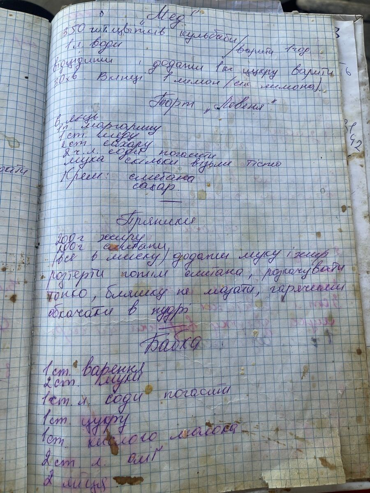

- [ ] замінити 120

<table><tr><th>Зараз</th><th>Пропозиція Claude</th></tr><tr><td>

```
## Інгредієнти
- яйця — 2 шт.
- цукор — 1 склянка
- мед або масло — 2 столові ложки <!-- ?? слово невиразне -->
- сметана — 3 столові ложки
- мука
- сода погашена — 1 чайна ложка

## Приготування
У тісто покласти варення або сир, сформувати пиріжки та випікати.
```

</td><td>

```
# Мед з кульбаби

<!-- ?? Claude: назва — у блокноті просто «Мед» -->

## Інгредієнти
- цвіт кульбаби — 350 шт.
- вода — 1 л
- цукор — 1 кг
- лимон — 1 шт. (сік лимона)

## Приготування
Квіти з водою варити 1 год. Відцідити і додати цукор, варити 30 хв. Вкінці — лимон.
```

</td></tr></table>

## 121. Ромашка → Нутела

📷 `IMG_1695.jpg` · ✅ на фото першим — «Нутела»; «Ромашки» на сторінці немає

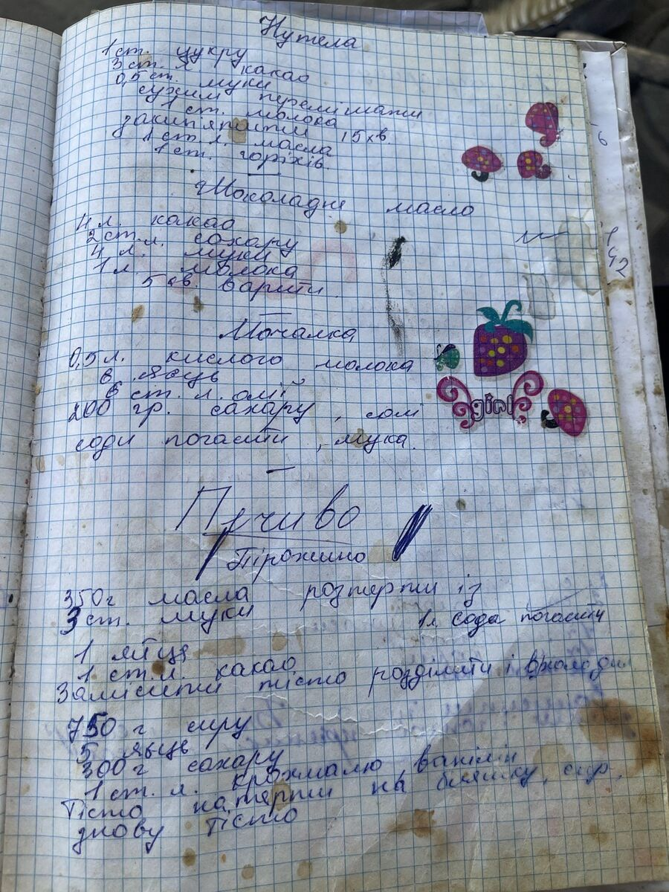

- [ ] замінити 121

<table><tr><th>Зараз</th><th>Пропозиція Claude</th></tr><tr><td>

```
## Інгредієнти
- масло — 250 г
- яйця — 2
- цукор — 200 г
- мука — 250 г
- молоко — 1 склянка
- сметана — 3 столові ложки

## Приготування
Додати компоненти, замісити тісто та випікати.
```

</td><td>

```
# Нутела

## Інгредієнти
- цукор — 1 ст.
- какао — 3 ст. л.
- мука — 0,5 ст.
(сухим перемішати)
- молоко — 1 ст.
- масло — 1 ст. л.
- горіхи — 1 ст.

## Приготування
Закип'ятити 15 хв.
```

</td></tr></table>

## 122. Торт / пиріг із яблуками → Пташине молоко

📷 `IMG_1700.jpg` · ✅ другий рецепт сторінки — «Пташине молоко» (желатин, сметана); яблук на фото немає


- [ ] замінити 122

<table><tr><th>Зараз</th><th>Пропозиція Claude</th></tr><tr><td>

```
## Інгредієнти
- яйця — <!-- ?? -->
- цукор — <!-- ?? -->
- яблука — <!-- ?? -->
- мука — <!-- ?? -->
```

</td><td>

```
# Пташине молоко

<!-- ?? Claude: зліва біля рецепта позначка «Б/М» — що означає? -->

## Інгредієнти
- желатин — 2 ст. л., залити
- вода — 1 ст.
- сметана — 500 г
- сахар — 1 ст.

## Приготування
Сметану змішати, сахар додати, 2/3 ст. желатину вбити і в холод.

## Шоколадна
- какао — 5 ч. л.
- вода — 1 ст. л.
- масло — 70 г
- сахар — 100 г
- желатин — остальний

Розмішати.
```

</td></tr></table>

## 123. Туз і грах → Гуж і Браж

📷 `IMG_1693.jpg` · ⚠️ старий запис вигаданий (маргарин, ванілін 2 пачки — на фото їх немає)


- [ ] замінити 123

<table><tr><th>Зараз</th><th>Пропозиція Claude</th></tr><tr><td>

```
## Інгредієнти
- яйця — 2 шт. <!-- ?? -->
- маргарин / масло — 1–2 столові ложки <!-- ?? -->
- цукор — 1 склянка
- ванілін — 2 пачки <!-- ?? -->
- мука — 3 склянки

## Крем
- сметана — 0,5 л
- цукор — 1 склянка

Назва рецепта читається нечітко. <!-- ?? -->
```

</td><td>

```
# Гуж і Браж

<!-- ?? Claude: назва — червоним «Гуж і Браж», перша літера нечітка -->

## Інгредієнти
- рідкий жир — 9 ст. л. <!-- ?? Claude: «рдт. жиру» — «рідк.»? -->
- амоній — 1–2 ст. л.
- цукор — 1 ст.
- яйця — 2 шт.
- борошно — 3 ст.

## Приготування
Поділити на 8 частин, випікати коржі.

## Крем
- сметана — 0,5 л
- цукор — 1 ст.
```

</td></tr></table>

## 126. Вафлі по-домашньому → Вафлі по-домашньому

📷 `IMG_1692.jpg` · ✅ це начинка для готових вафель (масло, мед, горіхи, печиво), а не тісто для вафельниці


- [ ] замінити 126

<table><tr><th>Зараз</th><th>Пропозиція Claude</th></tr><tr><td>

```
## Інгредієнти
- масло — 400 г
- мед — 1 склянка
- горіхи — 1,5 склянки
- сухе печиво — 200 г

## Приготування
Масло розтопити, горіхи й сухе печиво пропустити через м'ясорубку. Перемішати та змастити вафлі.
```

</td><td>

```
# Вафлі по-домашньому

## Інгредієнти
- масло — 400 г
- мед — 1 ст.
- горіхи — 1,5 ст. (через м'ясорубку)
- печиво сухе — 200 г (через м'ясорубку)

## Приготування
Масло і мед розтопити, помішуючи. Закипить — всипати горіхи і печиво. Перемішати. Змазувати вафлю.
```

</td></tr></table>

## 127. Кокосанки → Лимонник

📷 `IMG_1708.jpg` · ✅ на IMG_1708 — «Лимонник» (усе по 12 ст. л.); «Кокосанок» немає

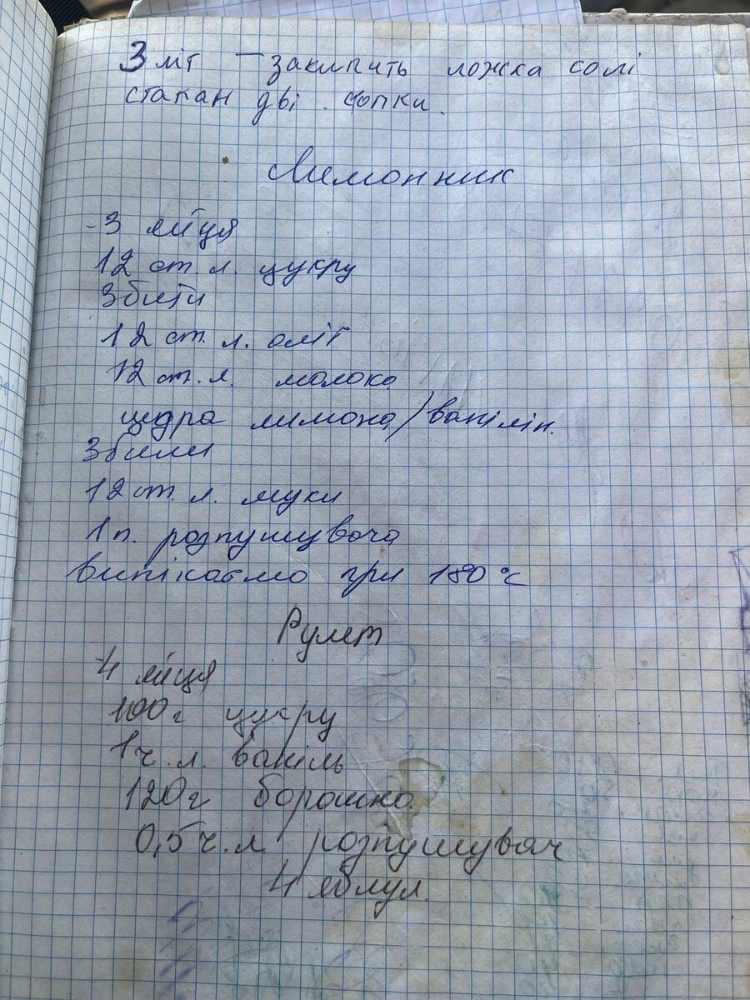

- [ ] замінити 127

<table><tr><th>Зараз</th><th>Пропозиція Claude</th></tr><tr><td>

```
## Інгредієнти
- білки — 3 шт.
- цукор — 1,5 склянки
- кокосова стружка — 3 склянки

## Приготування
Збити білки з цукром, додати кокосову стружку, сформувати та випікати.
```

</td><td>

```
# Лимонник

## Інгредієнти
- яйця — 3 шт.
- цукор — 12 ст. л.

Збити.

- олія — 12 ст. л.
- молоко — 12 ст. л.
- цедра лимона / ванілін

Збити.

- мука — 12 ст. л.
- розпушувач — 1 п.

## Приготування
Випікаємо при 180 °C.
```

</td></tr></table>

## 128. Косачки → Коханий

📷 `IMG_1709.jpg` · ✅ на IMG_1709 — «Коханий»; «Косичок» немає

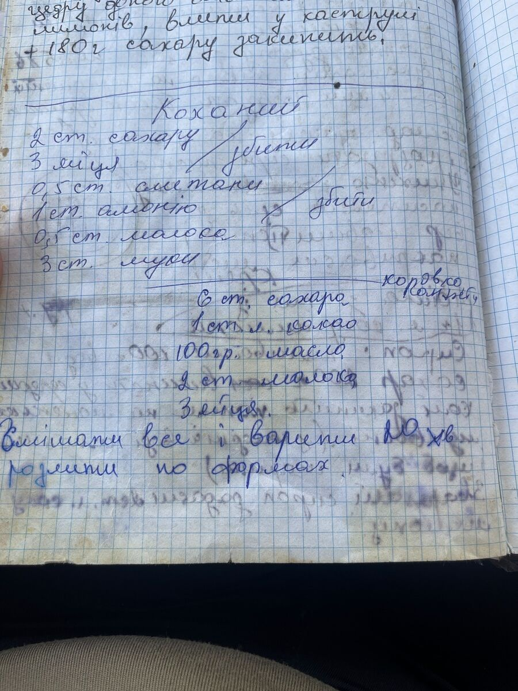

- [ ] замінити 128

<table><tr><th>Зараз</th><th>Пропозиція Claude</th></tr><tr><td>

```
## Інгредієнти
- яйця — 3 шт.
- цукор — 2 склянки
- сметана — 0,5 склянки
- амоній — 1 чайна ложка
- масло — 0,5 склянки
- мука — 3 склянки

Замісити тісто, сформувати косачки та випікати.
```

</td><td>

```
# Коханий

## Інгредієнти
- сахар — 2 ст.
- яйця — 3 шт.

Збити.

- сметана — 0,5 ст.
- амоній — 1 ст. <!-- ?? Claude: так написано — «1 ст. амонію»; можливо, ложка -->

Збити.

- молоко — 0,5 ст.
- мука — 3 ст.
```

</td></tr></table>

## 129. Печиво з варенням — варіант 2 → Торт «Левеня»

📷 `IMG_1702.jpg` · ⚠️ другий рецепт сторінки; назва читається як «Левеня»


- [ ] замінити 129

<table><tr><th>Зараз</th><th>Пропозиція Claude</th></tr><tr><td>

```
## Інгредієнти
- мука — 1 склянка <!-- ?? -->
- маргарин — 1 пачка
- цукор — 0,5 склянки
- яйця — 2 шт.
- сода — 1 чайна ложка <!-- ?? -->

## Приготування
Замісити тісто, додати начинку й випікати.
```

</td><td>

```
# Торт «Левеня»

<!-- ?? Claude: назва — «Левеня»? -->

## Інгредієнти
- яйця — 6 шт. <!-- ?? Claude: 6 чи 8 -->
- маргарин — 1 п.
- мед — 1 ст.
- сахар — 1 ст.
- сода — 2 ч. л. (погасити)
- мука — скільки візьме тісто

## Крем
Сметана, сахар.
```

</td></tr></table>

## 130. Печиво з глазур'ю → Без назви (з маком, продовження)

📷 `IMG_1697.jpg` · ⚠️ угорі IMG_1697 — кінець рецепта з попередньої сторінки блокнота, назва там; глазурі на фото немає

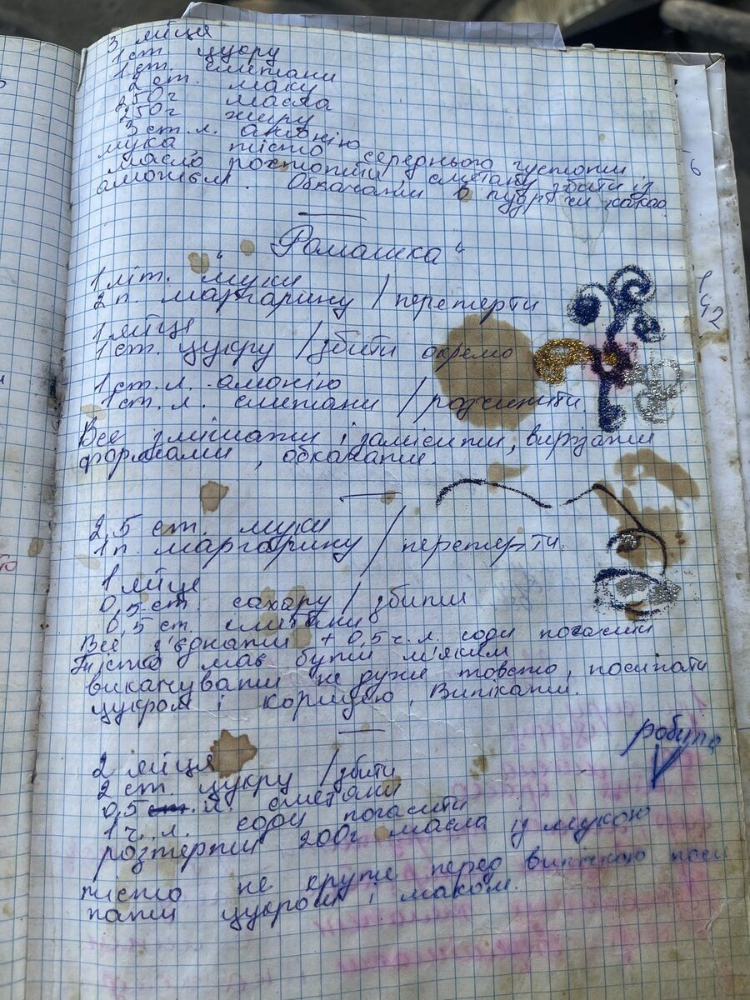

- [ ] замінити 130

<table><tr><th>Зараз</th><th>Пропозиція Claude</th></tr><tr><td>

```
## Інгредієнти
- масло — 150 г
- сметана — 0,5 л <!-- ?? -->
- цукор — 100 г
- мука — 4 склянки
- сода — <!-- ?? -->

## Глазур
- цукор — 1 склянка
- какао — 3 столові ложки
- масло — 2 столові ложки
- молоко — <!-- ?? -->

Точні значення частково нечіткі.
```

</td><td>

```
# Без назви (з маком, продовження)

<!-- ?? Claude: назва — рецепт починається на попередній сторінці, назва не видна -->

## Інгредієнти
- яйця — 3 шт.
- цукор — 1 ст.
- сметана — 1 ст.
- мак — 2 ст.
- масло — 250 г
- жир — 250 г
- амоній — 3 ст. л.
- мука — тісто середньої густоти

## Приготування
Масло розтопити, сметану збити із амонієм. Обкачати в пудрі чи какао.
```

</td></tr></table>

## 131. Печиво з повидлом → Ромашка

📷 `IMG_1697.jpg` · ✅ «Ромашка» — на цьому фото (старий запис 121 «Ромашка» був помилково прив'язаний до IMG_1695); повидла на фото немає


- [ ] замінити 131

<table><tr><th>Зараз</th><th>Пропозиція Claude</th></tr><tr><td>

```
## Інгредієнти
- масло / маргарин — 250 г
- сметана — 1 п. <!-- ?? -->
- мука — 2 склянки

## Приготування
Розкачати тісто, покласти повидло, сформувати та випікати.
```

</td><td>

```
# Ромашка

## Інгредієнти
- мука — 1 літ. <!-- ?? Claude: «1 літ.» — літр/літрова банка? -->
- маргарин — 2 п. (перетерти)
- яйце — 1 шт.
- цукор — 1 ст. (збити окремо)
- амоній — 1 ст. л.
- сметана — 1 ст. л. (розчинити)

## Приготування
Все змішати і замісити, вирізати формами, обкачати.
```

</td></tr></table>

## 132. Печиво з сиром → Творожной пирог

📷 `IMG_1706.jpg` · ✅ першим на IMG_1706 — «Творожной пирог» (записано російською, так і лишаю)

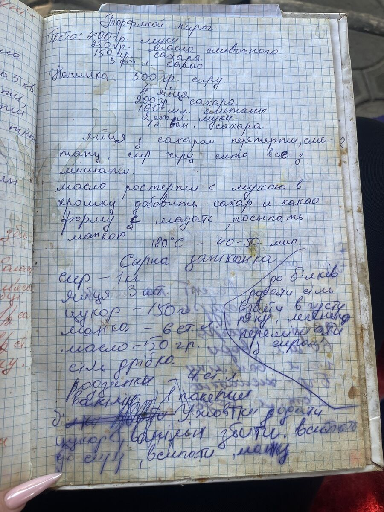

- [ ] замінити 132

<table><tr><th>Зараз</th><th>Пропозиція Claude</th></tr><tr><td>

```
## Інгредієнти
- сир — 400 г <!-- ?? -->
- масло / маргарин — 250 г <!-- ?? -->
- мука — <!-- ?? -->
- сода — <!-- ?? -->

## Приготування
Замісити тісто та випікати печиво. <!-- ?? -->
```

</td><td>

```
# Творожной пирог

## Тесто
- мука — 400 гр.
- масло сливочное — 250 гр.
- сахар — 150 гр.
- какао — 3 ст. л.

## Начинка
- сир — 500 гр.
- яйця — 4 шт.
- сахар — 200 гр.
- сметана — 100 мл
- мука — 2 ст. л.
- ван. сахар — 1 п.

## Приготування
Яйця з сахаром перетерти, сметану, сир через сито, все змішати.
Масло ростерти с мукою в крошку, добавить сахар и какао. Форму смазать, посыпать манкою.

180 °C — 40–50 мин.
```

</td></tr></table>

## 133. Торт / печиво з горіхами → Рулет з яблуками

📷 `IMG_1708.jpg` · ✅ другий рецепт — «Рулет» (4 яйця, 4 яблука)


- [ ] замінити 133

<table><tr><th>Зараз</th><th>Пропозиція Claude</th></tr><tr><td>

```
## Інгредієнти
- мука — 1 склянка
- цукор — 100 г
- масло — 50 г
- яйця — 3 шт. <!-- ?? -->
- горіхи — <!-- ?? -->

## Приготування
Замісити та випікати. <!-- ?? -->
```

</td><td>

```
# Рулет з яблуками

<!-- ?? Claude: назва — у блокноті просто «Рулет», «з яблуками» додано для розрізнення -->

## Інгредієнти
- яйця — 4 шт.
- цукор — 100 г
- ваніль — 1 ч. л.
- борошно — 120 г
- розпушувач — 0,5 ч. л.
- яблука — 4 шт.
```

</td></tr></table>

## 134. Тістечка «Горішки» → Пряники

📷 `IMG_1702.jpg` · ✅ третій рецепт — «Пряники»; «Горішки» — на IMG_1696 (там окрема пропозиція)


- [ ] замінити 134

<table><tr><th>Зараз</th><th>Пропозиція Claude</th></tr><tr><td>

```
## Інгредієнти
- яйця — 4 шт.
- цукор — 1 склянка
- мука — 1,5 склянки <!-- ?? -->
- сода — 1 чайна ложка

## Крем
- масло — 200 г
- згущене молоко — 1 банка

Випікати у формі для «горішків».
```

</td><td>

```
# Пряники

## Інгредієнти
- жир — 200 г
- сметана — 200 г
- мука

## Приготування
Все в миску: додати муку і жир розтерти, потім сметана. Розкачувати тонко, бляшку не мазати, гарячими обкачати в пудрі.
```

</td></tr></table>

## 135. Тістечка з варенням → Шоколадне масло

📷 `IMG_1695.jpg` · ✅ другий рецепт сторінки


- [ ] замінити 135

<table><tr><th>Зараз</th><th>Пропозиція Claude</th></tr><tr><td>

```
## Інгредієнти
- мука — 1 склянка
- сметана — 1 столова ложка
- цукор — 2 столові ложки
- маргарин — 1 п.
- сода — <!-- ?? -->

## Приготування
Розкачати, додати варення та випікати. <!-- ?? -->
```

</td><td>

```
# Шоколадне масло

## Інгредієнти
- какао — 4 л.
- сахар — 2 ст. л.
- мука — 4 л.
- молоко — 1 л. <!-- ?? Claude: «л.» тут, ймовірно, ложка, а не літр -->

## Приготування
5 хв варити.
```

</td></tr></table>

## 136. Рулет → Коровка

📷 `IMG_1709.jpg` · ⚠️ другий запис — збоку «Коровка / Конфета» (цукерки-ірис), «Рум'яних» немає


- [ ] замінити 136

<table><tr><th>Зараз</th><th>Пропозиція Claude</th></tr><tr><td>

```
## Інгредієнти
- яйця — 4 шт.
- цукор — 100 г
- ванілін — 1 чайна ложка
- мука — 120 г
- розпушувач — 0,5 чайної ложки
- білки — 4 шт.

Випікати корж 10 хвилин, змастити начинкою й скрутити рулет.
```

</td><td>

```
# Коровка

<!-- ?? Claude: назва — збоку дописано «Коровка» і «Конфета» -->

## Інгредієнти
- сахар — 6 ст.
- какао — 1 ст. л.
- масло — 100 гр.
- молоко — 2 ст.
- яйця — 3 шт.

## Приготування
Змішати все і варити 20 хв. Розлити по формах.
```

</td></tr></table>

## 137. Тістечко «Любо» → Пироженко

📷 `IMG_1695.jpg` · ✅ розділ «Печиво» → «Пироженко» (тертий пиріг із сиром); у старому записі лише «мука 350 г»


- [ ] замінити 137

<table><tr><th>Зараз</th><th>Пропозиція Claude</th></tr><tr><td>

```
## Інгредієнти
- мука — 350 г
```

</td><td>

```
# Пироженко

## Тісто
- масло — 350 г, розтерти із
- мука — 3 ст.
- сода — 1 л. (погасити)
- яйце — 1 шт.
- какао — 1 ст. л.

Замісити тісто, розділити і в холод.

## Начинка
- сир — 750 г
- яйця — 5 шт.
- сахар — 300 г
- крохмаль — 1 ст. л.
- ванілін

## Приготування
Тісто натерти на бляшку, сир, знову тісто.
```

</td></tr></table>

## 138. Вергуни звичайні → Хрустики

📷 `IMG_1696.jpg` · ✅ на фото першим — «Хрустики» (тісто через м'ясорубку); «Цветочків» немає

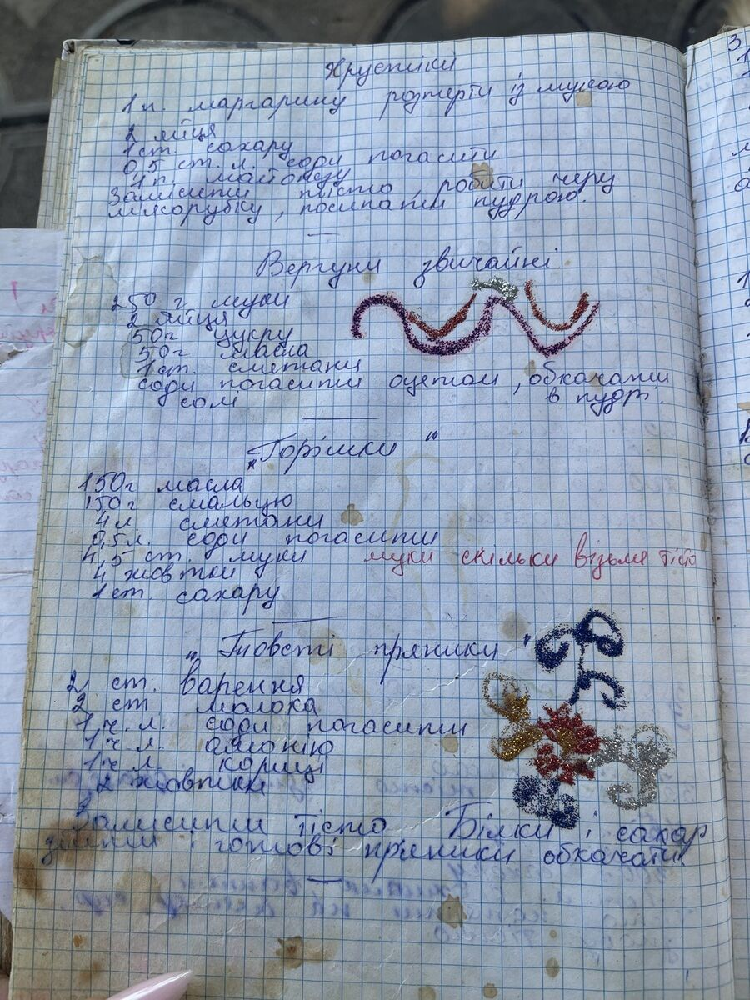

- [ ] замінити 138

<table><tr><th>Зараз</th><th>Пропозиція Claude</th></tr><tr><td>

```
## Інгредієнти
- мука — 250 г
- яйця — 2 шт.
- цукор — 0,5 склянки
- масло — 50 г
- сметана — 1 столова ложка
- сода погашена — 1 чайна ложка

## Приготування
Замісити тісто, розкачати й смажити в олії. Обкачати в цукрі.
```

</td><td>

```
# Хрустики

## Інгредієнти
- маргарин — 1 п., розтерти із мукою
- яйця — 2 шт.
- сахар — 1 ст.
- сода — 0,5 ст. л. (погасити)
- майонез — 1 п.

## Приготування
Замісити тісто, робити через м'ясорубку, посипати пудрою.
```

</td></tr></table>

## 139. Палички → Класний

📷 `IMG_1694.jpg` · ✅ на фото першим іде «Класний» (жовтим), «Паличок» на сторінці немає

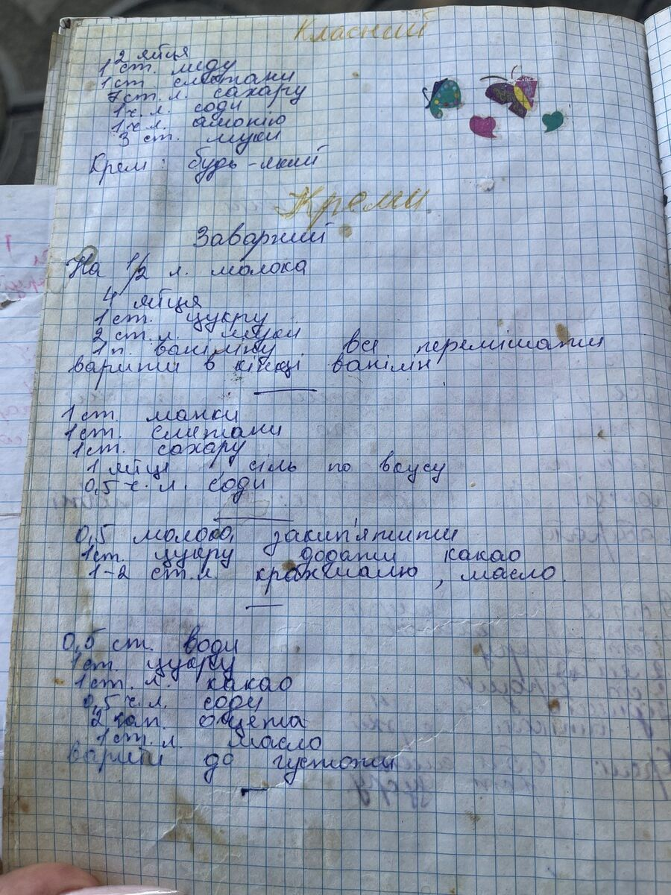

- [ ] замінити 139

<table><tr><th>Зараз</th><th>Пропозиція Claude</th></tr><tr><td>

```
## Інгредієнти
- масло / маргарин — 1 п.
- сметана — 1 склянка
- сода — 1 чайна ложка
- мука — 4–5 склянок <!-- ?? -->

## Приготування
Замісити тісто, сформувати палички та випікати.
```

</td><td>

```
# Класний

## Інгредієнти
- яйця — 2 шт. <!-- ?? Claude: над «1» дописано «2» — виправлено з 1 на 2? -->
- мед — 1 ст.
- сметана — 1 ст.
- сахар — 7 ст. л.
- сода — 1 ч. л.
- амоній — 1 ч. л.
- мука — 3 ст.

## Крем
Будь-який.
```

</td></tr></table>

## 140. Палички з кокосом → Вергуни звичайні

📷 `IMG_1696.jpg` · ✅ другий рецепт сторінки; кокосу на фото немає


- [ ] замінити 140

<table><tr><th>Зараз</th><th>Пропозиція Claude</th></tr><tr><td>

```
## Інгредієнти
- масло — 150 г
- сметана — 100 г
- цукор — 1 склянка
- сода — 1 чайна ложка
- мука — 4–5 склянок

## Приготування
Замісити тісто, сформувати палички й посипати кокосом.
```

</td><td>

```
# Вергуни звичайні

## Інгредієнти
- мука — 250 г
- яйця — 2 шт.
- цукор — 50 г
- масло — 50 г
- сметана — 1 ст.
- сода (погасити оцтом)
- сіль

## Приготування
Обкачати в пудрі.
```

</td></tr></table>

## 141. Печиво / тістечка → Без назви (з манкою)

📷 `IMG_1694.jpg` · ✅ третій запис сторінки, без назви; у старому записі масло 0,5 кг / какао — на фото немає


- [ ] замінити 141

<table><tr><th>Зараз</th><th>Пропозиція Claude</th></tr><tr><td>

```
## Інгредієнти
- масло — 0,5 кг
- цукор — 1 склянка
- яйця — <!-- ?? -->
- какао — <!-- ?? -->

Нижня частина сторінки нечітка. <!-- ?? -->
```

</td><td>

```
# Без назви (з манкою)

<!-- ?? Claude: назва — у блокноті без назви, дай свою або залиш -->

## Інгредієнти
- манка — 1 ст.
- сметана — 1 ст.
- сахар — 1 ст.
- яйце — 1 шт.
- сіль — по вкусу
- сода — 0,5 ч. л.
```

</td></tr></table>

## 142. Жучки → Мочалка

📷 `IMG_1695.jpg` · ⚠️ третій рецепт сторінки; назва читається як «Мочалка»


- [ ] замінити 142

<table><tr><th>Зараз</th><th>Пропозиція Claude</th></tr><tr><td>

```
## Інгредієнти
- дріжджі — 3/4 пачки <!-- ?? -->
- сметана — 3 столові ложки
- мука — 1 склянка <!-- ?? -->
- маргарин — 0,5 пачки <!-- ?? -->

## Приготування
Замісити тісто, сформувати та випікати.
```

</td><td>

```
# Мочалка

<!-- ?? Claude: назва — «Мочалка»? -->

## Інгредієнти
- кисле молоко — 0,5 л
- яйця — 8 шт. <!-- ?? Claude: цифра схожа на 8 -->
- олія — 6 ст. л. <!-- ?? Claude: цифра виправлена, 6 чи 8 -->
- сахар — 200 гр.
- сіль
- сода (погасити)
- мука
```

</td></tr></table>

## 143. Верхній крем до випічки → Горішки

📷 `IMG_1696.jpg` · ✅ третій рецепт сторінки — «Горішки» (тісто); крему на сторінці немає


- [ ] замінити 143

<table><tr><th>Зараз</th><th>Пропозиція Claude</th></tr><tr><td>

```
## Інгредієнти
- масло — 250 г
- згущене молоко — 200 г

Верхній крем.
```

</td><td>

```
# Горішки

## Інгредієнти
- масло — 150 г
- смалець — 150 г
- сметана — 4 л.
- сода — 0,5 л. (погасити)
- мука — 4,5 ст. (червоним дописано: «муки скільки візьме тісто»)
- жовтки — 4 шт.
- сахар — 1 ст.
```

</td></tr></table>

## 144. Заварний крем → Заварний крем

📷 `IMG_1694.jpg` · ✅ розділ «Креми» → «Заварний»; у старому записі невірні яйця/цукор/мука, «масло» на фото немає


- [ ] замінити 144

<table><tr><th>Зараз</th><th>Пропозиція Claude</th></tr><tr><td>

```
## Інгредієнти
- молоко — 1/2 л
- яйця — 4 шт.
- цукор — 1 склянка
- мука — 2 столові ложки
- ванілін

## Приготування
Усе перемішати й варити в каструлі.
```

</td><td>

```
# Заварний крем

## Інгредієнти (на 1/2 л молока)
- яйця — 4 шт.
- цукор — 1 ст.
- мука — 2 ст. л.
- ванілін — 1 п.

## Приготування
Все перемішати, варити, в кінці — ванілін.
```

</td></tr></table>

## 145. Масляний крем → Крем з какао

📷 `IMG_1694.jpg` · ✅ четвертий запис (розділ «Креми»), без назви; згущенки на фото немає


- [ ] замінити 145

<table><tr><th>Зараз</th><th>Пропозиція Claude</th></tr><tr><td>

```
## Інгредієнти
- масло — 1 п.
- згущене молоко — 1 б.
- цукор / пудра — 1 склянка <!-- ?? -->
- ванілін <!-- ?? -->

Збити до однорідної маси.
```

</td><td>

```
# Крем з какао

<!-- ?? Claude: назва — у блокноті без назви -->

## Інгредієнти
- молоко — 0,5 <!-- ?? Claude: одиниця не вказана (л?) -->
- цукор — 1 ст.
- какао
- крохмаль — 1–2 ст. л.
- масло

## Приготування
Молоко закип'ятити, додати какао, крохмаль, масло.
```

</td></tr></table>

## 146. Шоколадна глазур → Шоколадна глазур

📷 `IMG_1700.jpg` · ✅ назва правильна, склад у старому записі невірний


- [ ] замінити 146

<table><tr><th>Зараз</th><th>Пропозиція Claude</th></tr><tr><td>

```
## Інгредієнти
- вода — 1 столова ложка
- масло — 1 столова ложка
- цукор — 3 столові ложки
- какао — 3 столові ложки

Варити до кипіння, додати какао, перемішати.
```

</td><td>

```
# Шоколадна глазур

## Інгредієнти
- вода — 1 лж.
- масло — 1 лж.
- пудра — 3 ст. л.
- какао — 3 ст. л.

## Приготування
Змішати воду, масло, пудру. Довести до кипіння і додати какао. Загусне — знімати і поливати.
```

</td></tr></table>

## 147. Варення з груш і цитрусових → Варення з груш із цитрусовими

📷 `IMG_1662.jpg` · ✅ пропущено горіхи 200 г і родзинки 200 г; повний спосіб

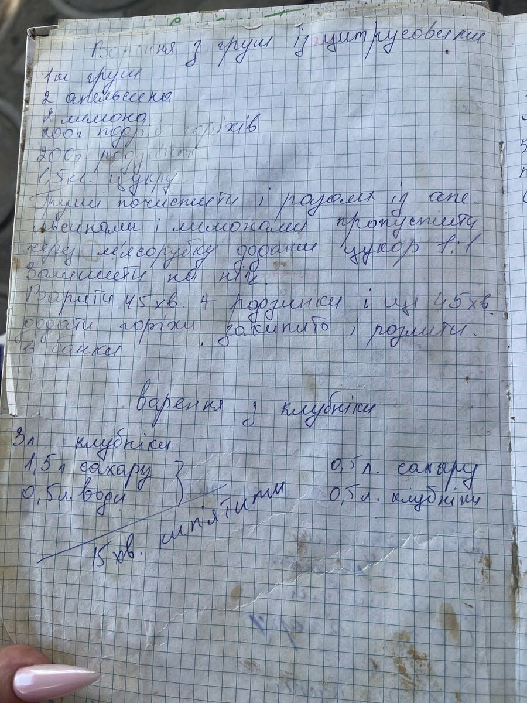

- [ ] замінити 147

<table><tr><th>Зараз</th><th>Пропозиція Claude</th></tr><tr><td>

```
## Інгредієнти
- груші — 1 кг
- апельсини — 2 шт.
- лимони — 2 шт.
- цукор — 1,5 кг
- <!-- ?? ще 2 позиції бліді -->

## Приготування
1. Груші порізати.
2. Апельсини й лимони пропустити через м'ясорубку.
3. Додати цукор 1:1.
4. Залишити на ніч.
5. Варити приблизно 45 хв.
```

</td><td>

```
# Варення з груш із цитрусовими

## Інгредієнти
- груші — 1 кг
- апельсини — 2 шт.
- лимони — 2 шт.
- подрібнені горіхи — 200 г <!-- ?? Claude: 200 чи 100 — цифра нечітка -->
- родзинки — 200 г
- цукор — 1,5 кг

## Приготування
Груші почистити і разом із апельсинами і лимонами пропустити через м'ясорубку, додати цукор 1:1. Залишити на ніч.
Варити 45 хв + родзинки і ще 45 хв. Додати горіхи, закипить — і розлити в банки.
```

</td></tr></table>

## 148. Варення з полуниці → Варення з клубніки

📷 `IMG_1662.jpg` · ✅ назва — «з клубніки»; «лимонна кислота 0,5 л» насправді «0,5 л клубніки»


- [ ] замінити 148

<table><tr><th>Зараз</th><th>Пропозиція Claude</th></tr><tr><td>

```
## Інгредієнти
- полуниця — 3 л
- цукор — 1,5 л
- вода — 0,5 л

## Додатково
- цукор — 0,5 л
- лимонна кислота — 0,5 чайної ложки

## Приготування
Кип'ятити 5 хв.
```

</td><td>

```
# Варення з клубніки

## Інгредієнти
- клубніка — 3 л
- сахар — 1,5 л } кип'ятити 15 хв
- вода — 0,5 л }

## Додатково
- сахар — 0,5 л
- клубніка — 0,5 л
```

</td></tr></table>

## 149. Сирна запіканка → Сирна запіканка

📷 `IMG_1706.jpg` · ✅ назва правильна; у старому записі манка 3 ст. л. (на фото 6), бракує родзинок, ваніліну і способу


- [ ] замінити 149

<table><tr><th>Зараз</th><th>Пропозиція Claude</th></tr><tr><td>

```
## Інгредієнти
- сир — 1 кг
- яйця — 3 шт.
- цукор — 150 г
- масло — 50 г
- манка — 3 столові ложки

## Приготування
Все змішати, викласти у форму та випікати.
```

</td><td>

```
# Сирна запіканка

## Інгредієнти
- сир — 1 кг
- яйця — 3 шт.
- цукор — 150 г
- манка — 6 ст. л.
- масло — 50 гр.
- сіль — дрібка
- родзинки — 4 ст. л.
- ванілін — 1 пакетик

## Приготування
У жовтки додати цукор, ванілін, збити. Всипати до сиру, всипати манку.
До білків додати сіль, збити в густу піну, легенько перемішати з сиром.
```

</td></tr></table>

## 150. Пурсей / десерт → Пухкий

📷 `IMG_1692.jpg` · ✅ назва — «Пухкий» (бісквіт), 1 ст. л. амонію (не молока)


- [ ] замінити 150

<table><tr><th>Зараз</th><th>Пропозиція Claude</th></tr><tr><td>

```
## Інгредієнти
- яйця — 10 шт.
- цукор — 0,5 л
- мука — 0,5 л
- молоко — 1 столова ложка

Крем із желатином. <!-- ?? точна назва та спосіб -->
```

</td><td>

```
# Пухкий

## Інгредієнти
- яйця — 10 шт.
- цукор — 0,5 л

Збити.

- мука — 0,5 л
- амоній — 1 ст. л.

## Крем
Крем із желатином.
```

</td></tr></table>

## 151. Домашній коньяк → Коньяк

📷 `IMG_1669.jpg` · ✅ 6 шт. чорносливу, 10 шт. гвоздики, 2 ст. л. чорного сухого чаю; 3 дні в темному місці, помішувати


- [ ] замінити 151

<table><tr><th>Зараз</th><th>Пропозиція Claude</th></tr><tr><td>

```
## Інгредієнти
- горілка — 3 л
- коріандр — 6 шт.
- гвоздика — 10 шт.
- цукор — 100 г
- чорний чай — 2 столові ложки
- ванілін — 1 п.

## Приготування
Залишити на 3 дні в темному місці.
```

</td><td>

```
# Коньяк

## Інгредієнти
- горілка — 3 літри
- чорнослив — 6 шт.
- гвоздика — 10 шт.
- цукор — 100 гр.
- чорний сухий чай — 2 ст. л.
- ванілін — 1 п.

## Приготування
На 3 дні в темне місце і помішувати.
```

</td></tr></table>

## 152. Вишневий лікер → Вишневий лікер (на 3,5 л лікеру)

📷 `IMG_1665.jpg` · ✅ 100 вишень (не 700 г), 200 листя; варити 20 хв, настоювати 12 год. Той самий рецепт записаний ще на IMG_1707 (164) — там 100 листків


- [ ] замінити 152

<table><tr><th>Зараз</th><th>Пропозиція Claude</th></tr><tr><td>

```
## Інгредієнти
- вишні — 100 шт.
- листя вишні — 200 шт.
- цукор — 1 кг
- вода — 2 л
- лимонна кислота — 1 столова ложка
- горілка — 1 л

## Приготування
1. Проварити вишні та листя 20 хв.
2. Додати цукор, лимонну кислоту.
3. Остудити.
4. Додати горілку.
```

</td><td>

```
# Вишневий лікер (на 3,5 л лікеру)

## Інгредієнти (на 3,5 л лікеру)
- вишні — 100 шт.
- листя вишні — 200 шт.
- сахар — 1 кг
- вода — 2 л
- лимонна кислота — 1 ст. л.
- горілка — 1 л

## Приготування
Варити 20 хв, … як закипить <!-- ?? Claude: закреслене слово перед «як закипить» -->. Настоїть 12 год. <!-- ?? Claude: «Тепло/Стоїть 12 год» -->
Процідити, вкинути лимонну кислоту, горілку.
```

</td></tr></table>

---

# Немає на жодному з 60 фото

Постав `[x] видалити NNN` — файл рецепта переїде в `review/pass2/removed/` (не губиться) і зникне з каталогу.

- [ ] видалити 085 — **Салат із рисом** — «Салат із рисом» — немає на жодному фото. Схожий справжній — 083 «Рис і палочки» (IMG_1676) → видалити.
- [ ] видалити 124 — **Рулет** — «Рулет» (4 яйця, 1 ст. цукру, 1 ст. муки) — окремо немає; це копія рулету 110 (IMG_1701) → видалити.

## Обрізані / незрозумілі фрагменти — спитати маму

- Салат «Мадонна» — немає на жодному фото (на IMG_1686 «Ладки»). Після заміни 068 зникне сам.
- Внизу IMG_1655 обрізаний запис: «1 б. 3?? … том. пасти, тушк. 1 ?? кабачки перец» — частина відірвана. Спитай маму.
- Верх IMG_1667 — продовження рецепта з попередньої сторінки; додав у пропозицію «Сацебелі» (102).
- Угорі IMG_1708: «3 літ — закип'ятить, ложка солі, стакан …» — кінець рецепта, початку не знайшов на жодному фото. Спитай маму.
- Угорі IMG_1709: «…цедру … лимонів, влити у каструлю + 180 г сахару закип'ятить» — кінець рецепта, початку не знайшов. Спитай маму.

---

# Перенести в інший розділ (зроблю на етапі групування)

- **019** — Консервація/Перець → Випічка/Торти (торт «Мішка»)
- **020** — Консервація/Перець → Випічка/Торти («Лебідь-1»)
- **021** — Консервація/Перець → Випічка/Торти («Лебідь-2»)
- **068** — Салати → Основні страви (м'ясні «Ладки»)
- **092** — Основні страви → Соуси (майонез, поруч із 101)
- **098** — Закуски → Десерти/Сирні або Закуски (домашній сир «голандський»)
- **103** — Соуси → Випічка («Пташки»)
- **107** — Випічка/Торти → Випічка/Печиво (сирні кульки)
- **108** — Торти → Рулети
- **110** — Торти → Рулети
- **112** — Випічка/Торти → Основні страви/Випічка (піца)
- **120** — Випічка → Десерти/Варення (мед з кульбаби)
- **121** — Випічка → Десерти (нутела)
- **122** — Випічка → Десерти/Креми («Пташине молоко»)
- **132** — Випічка/Печиво → Випічка/Пироги (творожний пирог)
- **133** — Печиво → Рулети
- **135** — Випічка → Десерти/Креми (шоколадне масло)
- **136** — Випічка → Десерти (цукерки «Коровка»)
- **144** — ОК, Десерти/Креми
