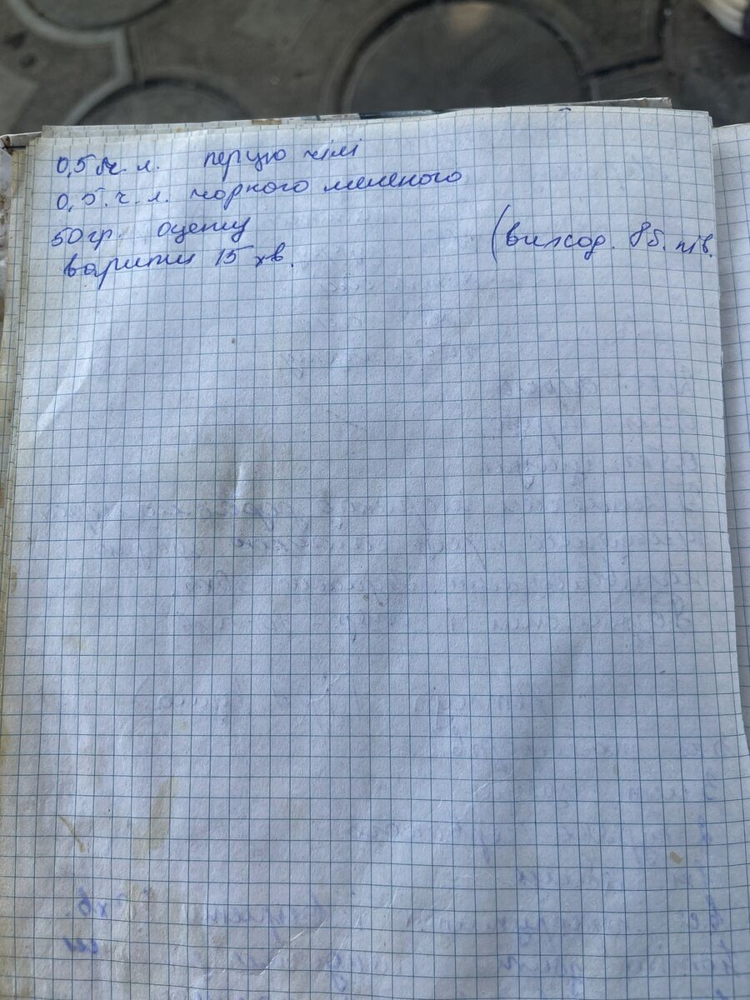

# Перевірити з мамою

Відкрито: **59** питань у **49** рецептах · закрито: **3** · позначено нечитабельними: **0**

## Як заповнювати

Під кожним питанням є рядок `Відповідь:`. Порожня відповідь = питання лишається відкритим.

| Пишеш у відповідь | Що станеться з рядком |
|---|---|
| `ОК` | поточний текст правильний, маркер прибирається |
| `1 ст. => 1 склянка` | заміна фрагмента в рядку (кілька — через `;`) |
| `- сіль — 1 склянка` | рядок повністю замінюється цим текстом |
| `НЕ ВДАЛОСЯ ПРОЧИТАТИ` | лишається з позначкою ✗, більше не питається |
| `ВИДАЛИТИ` | рядок видаляється (для службових приміток типу «частина списку бліда») |
| `НАЗВА: Зебра` | змінює назву рецепта, рядок-питання прибирається |

**Claude:** — пропозиція з другого читання фото. ✅ = прочитано впевнено, ⚠️ = варіант, звір із фото.
Щоб прийняти — скопіюй її у `Відповідь:` (у HTML — кнопка «Прийняти» або `Alt+4`).

`[ ]` / `[x]` ставити не обов'язково — скрипт орієнтується на заповнену відповідь.
Нічого не змінюється, поки не запустиш `python3 review/apply_review.py --write`.

---

# Консервація

## 001. Зеленці з соусом

📷 `IMG_1660.jpg` · 📄 `recipes/01-konservatsiya/ohirky/001-zelentsi-z-sousom.md` · confidence: `medium`

- [ ] **Q0431** — у зошиті «грибá відварити»; середина рядка бліда
  Зараз: `Цибулю обсмажити і моркву, зеленці відварити, … тушкувати.`
  Claude: ⚠️ `Цибулю й моркву обсмажити, зеленці відварити, усе разом тушкувати.` — логіка: середина рядка вицвіла; «гриби» в зошиті — описка (рецепт про зеленці)
  Відповідь: 

## 003. Огірки в томаті

📷 `IMG_1673.jpg` · 📄 `recipes/01-konservatsiya/ohirky/003-ohirky-v-tomati.md` · confidence: `high`

- [ ] **Q0432** — друга цифра нечітка — 120 чи 180?
  Зараз: `- олія — 120 г`
  Claude: ⚠️ `ОК` — на фото частіше читається 120; 180 теж можливо
  Відповідь: 

## 015. Помідори дольками — варіант 2

📷 `IMG_1651.jpg` · 📄 `recipes/01-konservatsiya/pomidory/015-pomidory-dolkamy-variant-2.md` · confidence: `medium`

- [ ] **Q0433** — кількість олії («… ст. л.») — на відірваному краю сторінки
  Зараз: `1. Маринад прокип'ятити й охолодити, додати 5 столових ложок оцту і олію.`
  Claude: ✅ `1. Маринад прокип'ятити й охолодити, додати 5 столових ложок оцту й по 1 столовій ложці олії в кожну банку.` — у сусідньому рецепті 014 (та сама страва) — «1 ст. л. олії в кожну банку»
  Відповідь: 

## 022. Перець — варіант 3

📷 `IMG_1659.jpg` · 📄 `recipes/01-konservatsiya/perets/022-perets-variant-3.md` · confidence: `high`

- [ ] **Q0434** — на фото той самий рецепт, що 023 «З перцю», записаний удруге — лишити обидва чи видалити цей?
  Зараз: `(порожньо)`
  Claude: ✅ `_У зошиті цей рецепт записано двічі (див. 023)._` — лишаю обидва, як у зошиті; якщо хочеш один — натисни «Ні» і скажи мені
  Відповідь: 

## 026. Перець з баклажанами

📷 `IMG_1658.jpg` · 📄 `recipes/01-konservatsiya/perets/026-perets-z-baklazhanamy.md` · confidence: `medium`

- [ ] **Q0435** — перша цифра на відірваному краю
  Зараз: `- олія — ?00 г`
  Claude: ⚠️ `- олія — 200 г` — типово для маминих консервацій на 4 кг овочів (027, 030, 052 — 200 г)
  Відповідь: 

- [ ] **Q0436** — наступний рядок частково відірваний: «…помідори …ати в соку»
  Зараз: `Варити 20 хв; як закипить — закривати. Вихід: 18 баночок.`
  Claude: ✅ `Варити 20 хв; як закипить — закривати. Вихід: 18 баночок.` — прибираю нечитабельний обривок — на рецепт він не впливає
  Відповідь: 

## 028. Перець у томатах

📷 `IMG_1659.jpg` · 📄 `recipes/01-konservatsiya/perets/028-perets-u-tomatakh.md` · confidence: `medium`

- [ ] **Q0437** — олівець блідий, частина слів не читається
  Зараз: `Помідори перекрутити, хай закипить, … все, хай покипить, потім перець.`
  Claude: ⚠️ `Помідори перекрутити, хай закипить, додати все, хай покипить, потім перець.` — логіка: пропущене слово — найімовірніше «додати»
  Відповідь: 

- [ ] **Q0438** — останній рядок блідий: «перець чорний, гіркий»?
  Зараз: `Перець чорний, гіркий.`
  Claude: ⚠️ `Перець чорний, гіркий — за смаком.` — логіка: приписка в кінці — приправи
  Відповідь: 

## 029. Перець із зеленцями

📷 `IMG_1659.jpg` · 📄 `recipes/01-konservatsiya/perets/029-perets-iz-zelentsyamy.md` · confidence: `high`

- [ ] **Q0439** — «зеленці» — зелені помідори чи огірки? кількість не вказана
  Зараз: `- зеленці варені`
  Claude: ⚠️ `- зеленці варені — за смаком` — що таке «зеленці» (зелені помідори чи огірочки) і скільки — знає тільки мама
  Відповідь: 

## 032. Салат «Перець і гриби»

📷 `IMG_1658.jpg` · 📄 `recipes/01-konservatsiya/perets/032-salat-perets-i-hryby.md` · confidence: `high`

- [ ] **Q0440** — перша цифра стерта — схоже на 2
  Зараз: `- томатна паста — 200 г`
  Claude: ✅ `ОК` — 200 г — як і решта компонентів маринаду (по 200 г)
  Відповідь: 

## 035. Кабачки «Салат»

📷 `IMG_1656.jpg` · 📄 `recipes/01-konservatsiya/kabachky/035-kabachky-salat.md` · confidence: `high`

- [ ] **Q0441** — «33 помід.» — що це означає?
  Зараз: `На подвійну порцію (приписка в рамці): 0,5 л пасти, 0,5 л води, «33 помід.»`
  Claude: ⚠️ `На подвійну порцію (приписка в рамці): 0,5 л пасти, 0,5 л води, «33 помід.».` — «33 помідори» трапляється і в рецепті 042 — схоже на назву томатної пасти; в інтернеті такої марки не знайшов
  Відповідь: 

## 036. Кабачки із морквою

📷 `IMG_1667.jpg` · 📄 `recipes/01-konservatsiya/kabachky/036-kabachky-iz-morkvoyu.md` · confidence: `medium`

- [ ] **Q0442** — перша цифра бліда
  Зараз: `- соус — 1 столова ложка`
  Claude: ⚠️ `- соус — 2 столові ложки` — друге читання фото: перша цифра схожа на 2
  Відповідь: 

- [ ] **Q0443** — цифра бліда
  Зараз: `- оцет — 100 г`
  Claude: ⚠️ `ОК` — 100 г видно, хоч і бліде
  Відповідь: 

## 038. Кабачкові ананаси

📷 `IMG_1664.jpg` · 📄 `recipes/01-konservatsiya/kabachky/038-kabachkovi-ananasy.md` · confidence: `medium`

- [ ] **Q0444** — кількість перед «есенції» не читається
  Зараз: `- есенція ананасова`
  Claude: ⚠️ `- есенція ананасова — 1 пляшечка` — на фото «1 б.» — найімовірніше бутилочка/пляшечка
  Відповідь: 

- [ ] **Q0445** — останній рядок вицвілий
  Зараз: `5. Варити 5 хв, щоб були твердуваті, … хв.`
  Claude: ⚠️ `5. Варити 5 хв, щоб були твердуваті, і закривати в банки.` — логіка: кінець консерваційного рецепта
  Відповідь: 

## 041. Ікра з кабачків з майонезом

📷 `IMG_1656.jpg` · 📄 `recipes/01-konservatsiya/kabachky/041-ikra-z-kabachkiv-z-mayonezom.md` · confidence: `medium`

- [ ] **Q0446** — через рецепт проведені навскісні лінії й приписка «не… р.» — можливо, мама позначила, що не робити; лишати в книзі?
  Зараз: `(порожньо)`
  Claude: ✅ `_У зошиті цей рецепт перекреслено — можливо, мама його не радить._` — лишаю рецепт з позначкою; якщо треба прибрати — натисни «Ні» і скажи
  Відповідь: 

## 042. Ікра з кабачків — варіант 2

📷 `IMG_1664.jpg` · 📄 `recipes/01-konservatsiya/kabachky/042-ikra-z-kabachkiv-variant-2.md` · confidence: `high`

- [ ] **Q0447** — «33 помідоро» — назва пасти чи щось інше?
  Зараз: `- томатна паста — 1 баночка («33 помідоро»)`
  Claude: ⚠️ `- томатна паста — 1 баночка («33 помідори»)` — схоже на назву пасти (так само в 035); бренд в інтернеті не підтвердився
  Відповідь: 

## 047. З капусти

📷 `IMG_1661.jpg` · 📄 `recipes/01-konservatsiya/kapusta/047-z-kapusty.md` · confidence: `medium`

- [ ] **Q0448** — перша цифра виправлена — 150 чи 450?
  Зараз: `- цукор — 150 г`
  Claude: ⚠️ `ОК` — 150 г логічніше для 2,5 кг капусти (450 г — дуже солодко)
  Відповідь: 

- [ ] **Q0449** — час стерилізації на загнутому куті сторінки
  Зараз: `Дати постояти 3–4 години. Стерилізувати 1…`
  Claude: ⚠️ `Дати постояти 3–4 години. Стерилізувати 15 хв.` — типово для таких салатів 15 хв; на фото видно лише «1…»
  Відповідь: 

## 054. Салат «Помідори з рисом»

📷 `IMG_1650.jpg` · 📄 `recipes/01-konservatsiya/salaty-na-zymu/054-salat-pomidory-z-rysom.md` · confidence: `medium`

- [ ] **Q0450** — час дописано блідо на полі — «20» чи «10»?
  Зараз: `1. Варити 20 хв, потім додати рис і варити ще 20 хв.`
  Claude: ⚠️ `ОК` — 20 хв — звичайний час для рису в салаті
  Відповідь: 

## 055. Борщова приправа

📷 `IMG_1672.jpg` · 📄 `recipes/01-konservatsiya/borshchovi-zapravky/055-borshchova-pryprava.md` · confidence: `high`

- [ ] **Q0451** — цифра переписана — 1,5 чи 1,6?
  Зараз: `- помідори — 1,5 кг`
  Claude: ✅ `ОК` — 1,5 кг — читається краще
  Відповідь: 

---

# Салати

## 058. Салат «Горошок»

📷 `IMG_1677.jpg` · 📄 `recipes/02-salaty/ovochevi-salaty/058-salat-horoshok.md` · confidence: `high`

- [ ] **Q0452** — поруч із назвою червоним «На рудо»/«На руду» і галочка — що це означає?
  Зараз: `(порожньо)`
  Відповідь: 

## 062. Салат «Гніздечко»

📷 `IMG_1679.jpg` · 📄 `recipes/02-salaty/zmishani-salaty/062-salat-hnizdechko.md` · confidence: `high`

- [ ] **Q0453** — кінець рядка блідий — «викласти навколо»?
  Зараз: `2. Усе інше порізати соломкою, полити майонезом, посолити й викласти навколо.`
  Claude: ✅ `ОК` — логіка: кульки в середині, решта навколо
  Відповідь: 

## 063. Салат «Любимый»

📷 `IMG_1684.jpg` · 📄 `recipes/02-salaty/zmishani-salaty/063-salat-lyubymyy.md` · confidence: `high`

- [ ] **Q0454** — цифра виправлена — 1 чи 2 пачки?
  Зараз: `- майонез — 1 пачка`
  Claude: ⚠️ `ОК` — 1 пачки вистачає на 6 шарів; цифру виправлено, тож може бути 2
  Відповідь: 

## 064. Салат «Нежность»

📷 `IMG_1683.jpg` · 📄 `recipes/02-salaty/zmishani-salaty/064-salat-nezhnost.md` · confidence: `high`

- [ ] **Q0455** — перша цифра нечітка — 140 чи 240?
  Зараз: `- крабові палички — 140 г`
  Claude: ⚠️ `ОК` — 140 г читається краще; 240 — теж можливо
  Відповідь: 

## 067. Салат «Гранатовый браслет»

📷 `IMG_1685.jpg` · 📄 `recipes/02-salaty/salaty-z-kurkoyu/067-salat-hranatovyy-braslet.md` · confidence: `high`

- [ ] **Q0456** — перша цифра нечітка — 200 чи 400?
  Зараз: `- куряче стегно — 200 г`
  Claude: ⚠️ `- куряче стегно — 400 г` — у типових рецептах «Гранатового браслета» — 300–400 г курки на 700 г буряка
  Відповідь: 

## 069. Салат «З граната»

📷 `IMG_1688.jpg` · 📄 `recipes/02-salaty/m-yasni-salaty/069-salat-z-hranata.md` · confidence: `high`

- [ ] **Q0457** — біля назви червоним підпис «Н. Журба»? — чий рецепт
  Зараз: `(порожньо)`
  Claude: ⚠️ `_Біля назви підпис: «Н. Журба»._` — читаю як підпис людини, від якої рецепт — уточни в мами
  Відповідь: 

## 070. Салат «З сардин»

📷 `IMG_1676.jpg` · 📄 `recipes/02-salaty/rybni-salaty/070-salat-z-sardyn.md` · confidence: `high`

- [ ] **Q0458** — слово в дужках після «сардини» вицвіло
  Зараз: `1. сардини`
  Claude: ⚠️ `1. сардини (консервовані, розім'яти)` — як у «Мімозі» (080) з тієї самої тетради
  Відповідь: 

## 078. Салат «Солнышко»

📷 `IMG_1686.jpg` · 📄 `recipes/02-salaty/salaty-z-kurkoyu/078-salat-solnyshko.md` · confidence: `high`

- [ ] **Q0459** — слово бліде — «білки яєць»?
  Зараз: `5. білки`
  Claude: ✅ `ОК` — «білки» читається
  Відповідь: 

## 083. Салат «Рис і палочки»

📷 `IMG_1676.jpg` · 📄 `recipes/02-salaty/krabovi-salaty/083-salat-rys-i-palochky.md` · confidence: `medium`

- [ ] **Q0460** — кількість у дужках бліда — «5 шт.»?
  Зараз: `- яйця`
  Claude: ⚠️ `- яйця — 5 шт.` — кількість у дужках схожа на 5
  Відповідь: 

## 084. Салат «Морская загадка»

📷 `IMG_1682.jpg` · 📄 `recipes/02-salaty/moreprodukty/084-salat-morskaya-zahadka.md` · confidence: `medium`

- [ ] **Q0461** — кількість бліда
  Зараз: `- морква варена`
  Claude: ⚠️ `- морква варена — 2 шт.` — друге читання фото: схоже на 2
  Відповідь: 

- [ ] **Q0462** — останні рядки вицвілі
  Зараз: `- 250 г …`
  Claude: ⚠️ `- кальмари — 250 г` — здогадка за назвою «Морская загадка» — у зошиті рядок вицвів, перевір обов'язково
  Відповідь: 

---

# Основні страви

## 089. Їжаки

📷 `IMG_1687.jpg` · 📄 `recipes/03-osnovni-stravy/m-yasni-stravy/089-yizhaky.md` · confidence: `high`

- [ ] **Q0488** — слово нечітке — «мівіни»?
  Зараз: `- мівіна (локшина швидкого приготування) — 5 пачок`
  Claude: ✅ `ОК` — «їжачки з мівіною» — відомий рецепт, мівіна тут логічна
  Відповідь: 

---

# Риба та морепродукти

## 095. Сільотка

📷 `IMG_1680.jpg` · 📄 `recipes/04-ryba-ta-moreprodukty/oseledets/095-silotka.md` · confidence: `medium`

- [ ] **Q0464** — одиниця після «1» вицвіла
  Зараз: `- риба морожена — 1 кг`
  Claude: ✅ `ОК` — 1 кг — як у сусідньому рецепті 094
  Відповідь: 

- [ ] **Q0465** — друга цифра нечітка — 150 чи 170?
  Зараз: `- оцет — 150 г + 50 г води`
  Claude: ⚠️ `ОК` — 150 г читається краще
  Відповідь: 

## 096. Копчена риба

📷 `IMG_1680.jpg` · 📄 `recipes/04-ryba-ta-moreprodukty/rybni-stravy/096-kopchena-ryba.md` · confidence: `low`

- [ ] **Q0466** — нижня частина сторінки вицвіла, далі «25 … оцту?» — прочитати не вдалося
  Зараз: `300 г води, жменя цибулевого лушпиння… змішати обидва розчини…`
  Claude: ⚠️ `Дві жмені цибулевого лушпиння залити 300 г води, прокип'ятити, змішати обидва розчини, охолодити й залити рибу.` — логіка + рецепт 097 і типові рецепти «копченої» скумбрії в лушпинні
  Відповідь: 

---

# Закуски

## 098. Сир голландський

📷 `IMG_1688.jpg` · 📄 `recipes/05-zakusky/syrni-zakusky/098-syr-hollandskyy.md` · confidence: `medium`

- [ ] **Q0467** — цифра виправлена — 2 чи 3?
  Зараз: `- яйця — 2 шт.`
  Claude: ⚠️ `ОК` — 2 читається краще
  Відповідь: 

- [ ] **Q0468** — час під плямою — «3 хв»?
  Зараз: `2. Додати яйця, соду, сіль, олію й масло, кип'ятити ще 3 хв.`
  Claude: ⚠️ `ОК` — «3 хв» під плямою, але схоже
  Відповідь: 

---

# Соуси та приправи

## 092. Майонез

📷 `IMG_1681.jpg` · 📄 `recipes/06-sousy-ta-prypravy/sousy/092-mayonez.md` · confidence: `high`

- [ ] **Q0463** — останнє слово вицвіле — «однієї температури»?
  Зараз: `Усі інгредієнти повинні бути однієї температури.`
  Claude: ✅ `ОК` — так і пишуть у рецептах майонезу
  Відповідь: 

## 104. Кетчуп

📷 `IMG_1673.jpg` · `IMG_1674.jpg` · 📄 `recipes/06-sousy-ta-prypravy/sousy-ketchupy-ta-adzhyky/104-ketchup.md` · confidence: `high`

- [ ] **Q0471** — у дужках після назви «ірн кума» — чий це рецепт?
  Зараз: `(порожньо)`
  Відповідь: 

- [ ] **Q0472** — перша цифра бліда — 40 чи 10?
  Зараз: `1. Помідори, цибулю, буряк і яблука перекрутити й варити 40 хв.`
  Claude: ⚠️ `ОК` — 40 хв — звичайно для кетчупу перед блендером
  Відповідь: 

---

# Випічка

## 021. Торт «Лебідь-2»

📷 `IMG_1691.jpg` · 📄 `recipes/07-vypichka/torty/021-tort-lebid-2.md` · confidence: `low`

- [ ] **Q0429** — Рецепт продовжується на наступній сторінці.
  Зараз: `(порожньо)`
  Claude: ⚠️ `_Кінець рецепта — на наступній сторінці зошита, її немає серед фото. Імовірно: борошно — скільки візьме тісто; крем — сметана з цукром, як у «Лебідь-1»._` — логіка: «Лебідь-1» на тій самій сторінці має такий самий склад і крем
  Відповідь: 

## 100. Пиріжки

📷 `IMG_1698.jpg` · 📄 `recipes/07-vypichka/pyrohy-ta-keksy/100-pyrizhky.md` · confidence: `high`

- [ ] **Q0470** — далі в зошиті нічого не записано
  Зараз: `Розчинити дріжджі, усе змішати.`
  Claude: ⚠️ `Розчинити дріжджі в теплому молоці, додати решту, замісити тісто й дати підійти. Начинка — будь-яка.` — у зошиті далі нічого не написано — це типовий спосіб для дріжджових пиріжків
  Відповідь: 

## 106. Медовик

📷 `IMG_1692.jpg` · 📄 `recipes/07-vypichka/torty/106-medovyk.md` · confidence: `medium`

- [ ] **Q0473** — цифри в цьому рядку й нижче бліді
  Зараз: `- борошно — 3 склянки`
  Claude: ⚠️ `ОК` — 3 склянки борошна на 1 склянку меду — звичайна пропорція для медових коржів
  Відповідь: 

## 110. Бісквітний рулет

📷 `IMG_1701.jpg` · 📄 `recipes/07-vypichka/rulety/110-biskvitnyy-rulet.md` · confidence: `high`

- [ ] **Q0474** — що мама мала на увазі під «сода — ?»
  Зараз: `Збоку дописано: «сода — ?»`
  Claude: ⚠️ `Збоку дописано: «сода — ?» (можливо, мама сумнівалась, чи додавати соду замість розпушувача).` — логіка
  Відповідь: 

## 113. Торт «Кручений»

📷 `IMG_1704.jpg` · 📄 `recipes/07-vypichka/torty/113-tort-kruchenyy.md` · confidence: `high`

- [ ] **Q0475** — перша цифра нечітка — 200 чи 700 г?
  Зараз: `- масло — 200 г`
  Claude: ⚠️ `- масло — 200 г` — на 0,5 л молока звичайно 200 г масла; 700 г — забагато
  Відповідь: 

## 116. Жозефіна

📷 `IMG_1693.jpg` · 📄 `recipes/07-vypichka/torty/116-zhozefina.md` · confidence: `medium`

- [ ] **Q0476** — назва червоним — «Жозефіна» чи «Зозефіна»?
  Зараз: `(порожньо)`
  Claude: ✅ `ОК` — «Жозефіна» — відома назва торта, «Зозефіна» — ні
  Відповідь: 

- [ ] **Q0477** — перша цифра нечітка — 200 чи 400?
  Зараз: `- масло — 200 г`
  Claude: ✅ `- масло — 200 г` — класичний крем: 200 г масла на банку згущонки
  Відповідь: 

## 123. Гуж і Браж

📷 `IMG_1693.jpg` · 📄 `recipes/07-vypichka/torty/123-huzh-i-brazh.md` · confidence: `medium`

- [ ] **Q0479** — назва червоним — «Гуж і Браж»? перша літера нечітка
  Зараз: `(порожньо)`
  Відповідь: 

## 128. Коханий

📷 `IMG_1709.jpg` · 📄 `recipes/07-vypichka/torty/128-kokhanyy.md` · confidence: `high`

- [ ] **Q0480** — так записано — «1 ст. амонію»; склянка чи ложка?
  Зараз: `- амоній — 1 ст.`
  Claude: ✅ `- амоній — 1 столова ложка` — склянка амонію неможлива — 1 ложка, як в інших рецептах
  Відповідь: 

## 130. Печиво з маком (без назви)

📷 `IMG_1697.jpg` · 📄 `recipes/07-vypichka/pechyvo-ta-tistechka/130-pechyvo-z-makom-bez-nazvy.md` · confidence: `high`

- [ ] **Q0481** — початок рецепта й назва — на попередній сторінці зошита, якої немає серед фото
  Зараз: `(порожньо)`
  Claude: ✅ `_Початок рецепта й назва — на сторінці зошита, якої немає серед фото._` — просто примітка
  Відповідь: 

## 141. Без назви (з манкою)

📷 `IMG_1694.jpg` · 📄 `recipes/07-vypichka/pechyvo-ta-palychky/141-bez-nazvy-z-mankoyu.md` · confidence: `high`

- [ ] **Q0483** — у зошиті без назви (записано під заголовком «Креми», але з содою — схоже на тісто)
  Зараз: `(порожньо)`
  Claude: ✅ `НАЗВА: Манник` — склянка манки + склянка сметани + склянка цукру + яйце + сода — це класичний манник «3 склянки»
  Відповідь: 

## 142. Мочалка

📷 `IMG_1695.jpg` · 📄 `recipes/07-vypichka/pechyvo-ta-rohalyky/142-mochalka.md` · confidence: `high`

- [ ] **Q0484** — цифра виправлена — 6 чи 8?
  Зараз: `- олія — 6 столових ложок`
  Claude: ⚠️ `ОК` — 6 читається краще
  Відповідь: 

---

# Десерти

## 099. Халва

📷 `IMG_1698.jpg` · 📄 `recipes/08-deserty/inshi-deserty/099-khalva.md` · confidence: `medium`

- [ ] **Q0469** — «зернят» — соняшникового насіння?
  Зараз: `1. Підсмажити 2 склянки зерняток (насіння) і 3 склянки борошна.`
  Claude: ✅ `1. Підсмажити 2 склянки соняшникового насіння і 3 склянки борошна.` — домашня халва — з соняшникового насіння й підсмаженого борошна
  Відповідь: 

## 122. Пташине молоко

📷 `IMG_1700.jpg` · 📄 `recipes/08-deserty/kremy/122-ptashyne-moloko.md` · confidence: `high`

- [ ] **Q0478** — зліва біля рецепта позначка «Б/М» — що означає?
  Зараз: `(порожньо)`
  Відповідь: 

## 135. Шоколадне масло

📷 `IMG_1695.jpg` · 📄 `recipes/08-deserty/kremy/135-shokoladne-maslo.md` · confidence: `high`

- [ ] **Q0482** — «1 л.» — ложка чи літр?
  Зараз: `- молоко — 1 ложка`
  Відповідь: 

## 147. Варення з груш із цитрусовими

📷 `IMG_1662.jpg` · 📄 `recipes/08-deserty/varennya/147-varennya-z-hrush-iz-tsytrusovymy.md` · confidence: `high`

- [ ] **Q0485** — перша цифра нечітка — 200 чи 100?
  Зараз: `- горіхи подрібнені — 200 г`
  Claude: ⚠️ `ОК` — 200 г — так само, як родзинки
  Відповідь: 

## 148. Варення з полуниці

📷 `IMG_1662.jpg` · 📄 `recipes/08-deserty/varennya/148-varennya-z-polunytsi.md` · confidence: `high`

- [ ] **Q0486** — як саме використати «0,5 л цукру + 0,5 л полуниці» — у зошиті не написано
  Зараз: `Цукор із водою кип'ятити 15 хв.`
  Claude: ⚠️ `Цукор із водою кип'ятити 15 хв, всипати полуницю, наприкінці додати ще 0,5 л цукру й 0,5 л полуниці.` — логіка; у зошиті способу немає
  Відповідь: 

---

# Напої

## 152. Вишневий лікер

📷 `IMG_1665.jpg` · 📄 `recipes/09-napoyi/likery/152-vyshnevyy-liker.md` · confidence: `high`

- [ ] **Q0487** — слово перед «як закипить» закреслене
  Зараз: `1. Вишні, листя, цукор і воду варити 20 хв (від закипання).`
  Claude: ✅ `1. Вишні, листя, цукор і воду варити 20 хв від закипання.` — закреслене слово неважливе — прибираю позначку
  Відповідь: 
